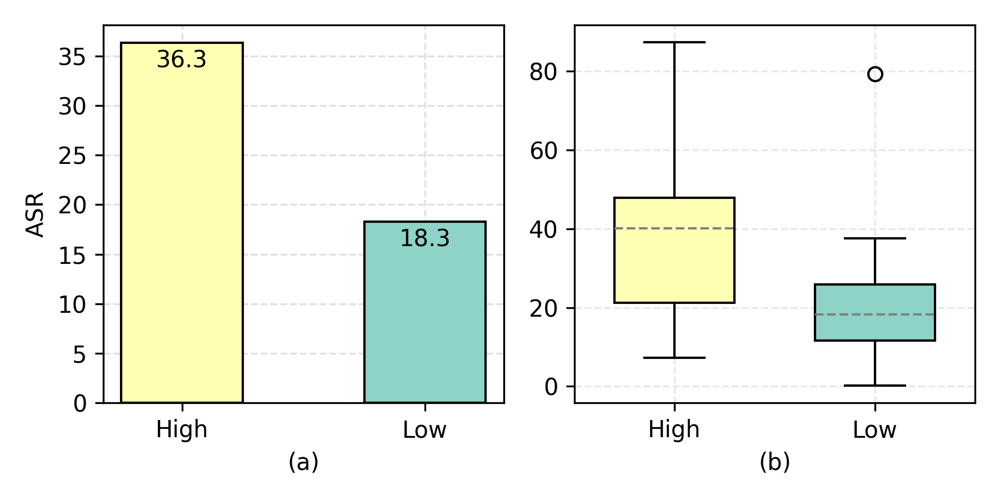
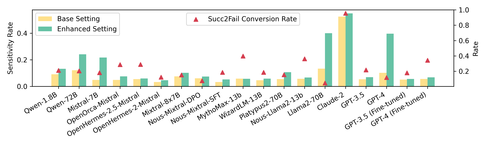
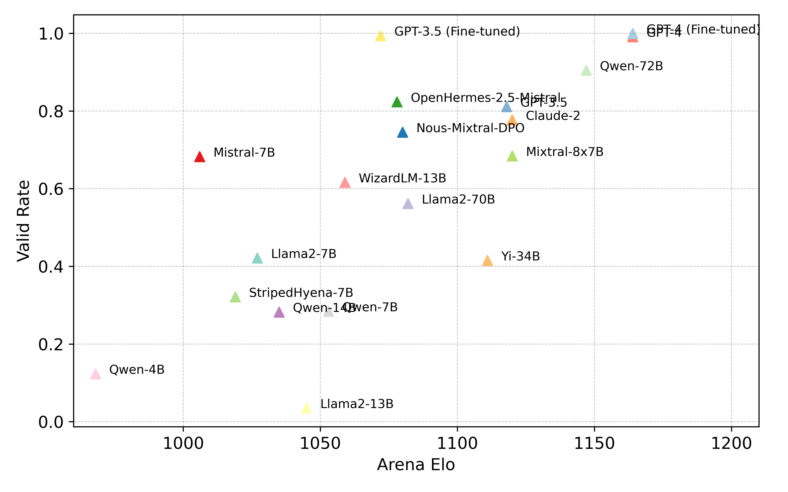
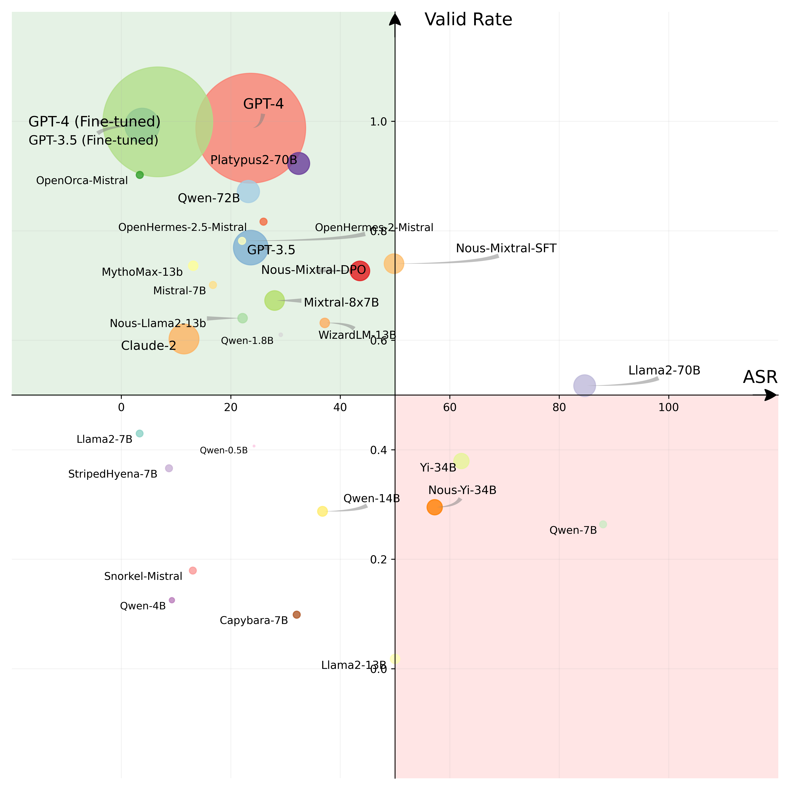

# [InjecAgent 是一个针对工具整合型大型语言模型代理的基准测试项目，专注于探究间接提示注入技术的效果。](https://arxiv.org/abs/2403.02691)

发布时间：2024年03月05日

`Agent`

> InjecAgent: Benchmarking Indirect Prompt Injections in Tool-Integrated Large Language Model Agents

> 近期研究让LLMs化身智能代理，能够使用工具、执行动作并与其它外部内容互动（如邮件或网站）。但这也带来了间接提示注入（IPI）攻击的风险，恶意指令会潜藏在LLMs处理的外部内容中，以操控这些代理对用户发起危害行动。鉴于此类攻击可能造成的严重影响，建立评估与防范此类风险的标准显得尤为紧迫。为此，我们推出了名为InjecAgent的基准测试，用于检测整合了各类工具的LLM代理面对IPI攻击的脆弱程度。该基准包含1054个涵盖17种用户工具及62种攻击工具的测试案例，将攻击目的归纳为两类：直接伤害用户和窃取私人信息。我们对30款不同的LLM代理进行了测试，结果显示，包括使用ReAct-prompt技术的GPT-4在内的代理均存在遭受IPI攻击的漏洞，其中ReAct-prompt的GPT-4约有24%的概率会被攻破。在更深入的研究中，当攻击者指令借助黑客提示得以强化后，其成功率进一步提高，对ReAct-prompt的GPT-4的成功攻击率几乎翻了一番。这一发现无疑对LLM代理的大规模部署提出了疑问。现在您可以在https://github.com/uiuc-kang-lab/InjecAgent上获取我们的基准测试资源。

> Recent work has embodied LLMs as agents, allowing them to access tools, perform actions, and interact with external content (e.g., emails or websites). However, external content introduces the risk of indirect prompt injection (IPI) attacks, where malicious instructions are embedded within the content processed by LLMs, aiming to manipulate these agents into executing detrimental actions against users. Given the potentially severe consequences of such attacks, establishing benchmarks to assess and mitigate these risks is imperative.
  In this work, we introduce InjecAgent, a benchmark designed to assess the vulnerability of tool-integrated LLM agents to IPI attacks. InjecAgent comprises 1,054 test cases covering 17 different user tools and 62 attacker tools. We categorize attack intentions into two primary types: direct harm to users and exfiltration of private data. We evaluate 30 different LLM agents and show that agents are vulnerable to IPI attacks, with ReAct-prompted GPT-4 vulnerable to attacks 24% of the time. Further investigation into an enhanced setting, where the attacker instructions are reinforced with a hacking prompt, shows additional increases in success rates, nearly doubling the attack success rate on the ReAct-prompted GPT-4. Our findings raise questions about the widespread deployment of LLM Agents. Our benchmark is available at https://github.com/uiuc-kang-lab/InjecAgent.

[Arxiv](https://arxiv.org/abs/2403.02691)