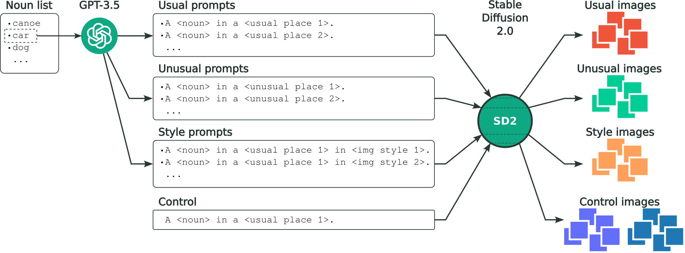
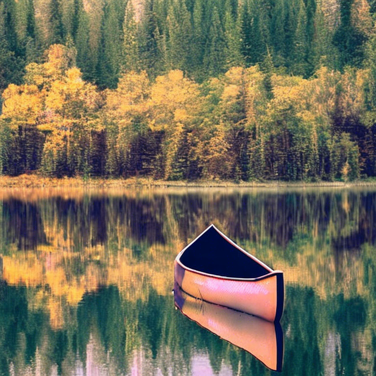
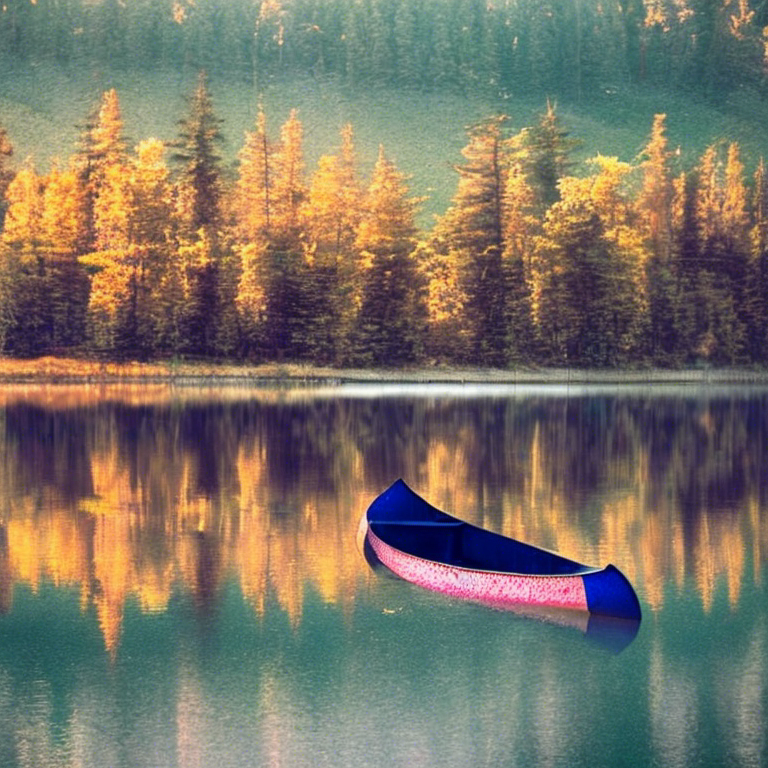
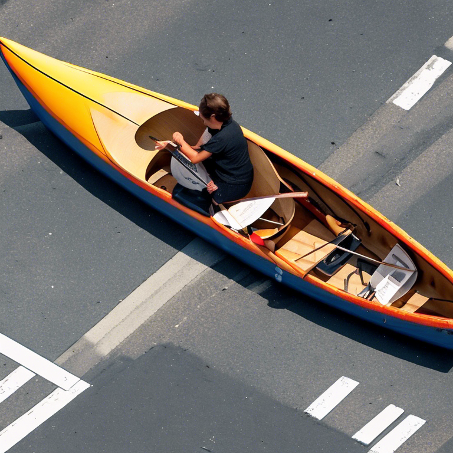
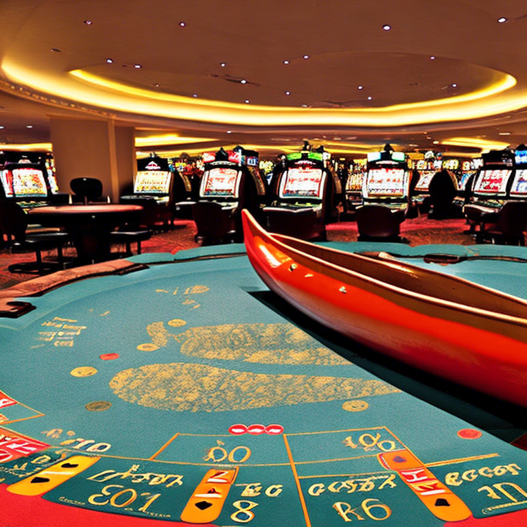
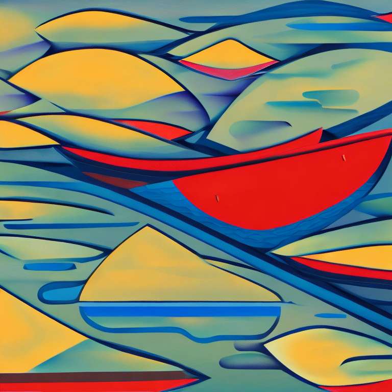
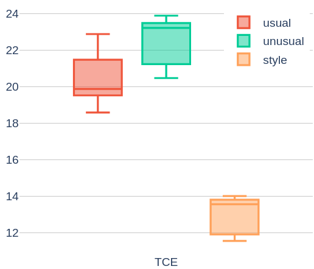

# 探究协同式图像生成中的多样性度量

发布时间：2024年03月05日

`由于该论文摘要并未直接涉及Agent、RAG或LLM理论的相关内容，而是聚焦于生成模型多样性的评估方法及其应用潜力，因此根据摘要信息，可以将其分类为LLM应用类别。` `创新系统` `图像生成`

> Measuring Diversity in Co-creative Image Generation

> 针对协同创新系统产出内容的质量和多样性作为评估准则的观点已有人提出，然而对于多样性的具体内涵及其衡量方式目前尚无统一认识。现有评估生成模型多样性的方法受限于其需要与大规模预训练生成模型环境下可能缺失的真实参照物对比，或是涉及过多难以实施的计算。因此，我们建议采用一种新颖的基于神经网络编码熵的方法，它能够在不需要真实知识的情况下轻松地比较不同图像集的多样性。此外，我们还对比了两种预训练网络，并展示了选取何种网络与所需评价的多样性概念之间的关联。最后，我们探讨了这些度量手段在交互系统中的创意思维激发、模型评估乃至整个计算创造力领域内的广泛应用潜力。

> Quality and diversity have been proposed as reasonable heuristics for assessing content generated by co-creative systems, but to date there has been little agreement around what constitutes the latter or how to measure it. Proposed approaches for assessing generative models in terms of diversity have limitations in that they compare the model's outputs to a ground truth that in the era of large pre-trained generative models might not be available, or entail an impractical number of computations. We propose an alternative based on entropy of neural network encodings for comparing diversity between sets of images that does not require ground-truth knowledge and is easy to compute. We also compare two pre-trained networks and show how the choice relates to the notion of diversity that we want to evaluate. We conclude with a discussion of the potential applications of these measures for ideation in interactive systems, model evaluation, and more broadly within computational creativity.

[Arxiv](https://arxiv.org/abs/2403.13826)