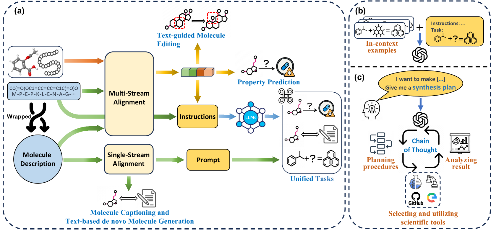

# 此篇综述致力于探索连结文本与分子世界的桥梁——多模态框架在分子领域的应用与发展。

发布时间：2024年03月06日

`LLM应用` `药物研发`

> Bridging Text and Molecule: A Survey on Multimodal Frameworks for Molecule

> 人工智能已在科研领域展现非凡实力，尤其在分子科学中，正以深度学习引领一场革命，颠覆传统的计算机辅助模式。最近，结合多模态学习和自然语言处理的发展趋势，越来越多的研究致力于构建能融合分子结构与文本知识的多模态框架。本文首开先河，对这类应用于分子研究的多模态框架进行了一次全面系统的梳理。首先，我们追溯分子深度学习的发展历程，指出融入文本模态的迫切需求；随后聚焦于文本-分子对齐方法的前沿进展，依据模型架构将其划分为两大类别，并列举了相关预训练任务。再进一步，我们钻研大型语言模型和提示技术在解决分子任务上的运用，并揭示其在药物研发中的重大应用价值。最后，我们对该领域存在的局限进行了探讨，并前瞻性地指出了未来研究的多个有望突破的方向。

> Artificial intelligence has demonstrated immense potential in scientific research. Within molecular science, it is revolutionizing the traditional computer-aided paradigm, ushering in a new era of deep learning. With recent progress in multimodal learning and natural language processing, an emerging trend has targeted at building multimodal frameworks to jointly model molecules with textual domain knowledge. In this paper, we present the first systematic survey on multimodal frameworks for molecules research. Specifically,we begin with the development of molecular deep learning and point out the necessity to involve textual modality. Next, we focus on recent advances in text-molecule alignment methods, categorizing current models into two groups based on their architectures and listing relevant pre-training tasks. Furthermore, we delves into the utilization of large language models and prompting techniques for molecular tasks and present significant applications in drug discovery. Finally, we discuss the limitations in this field and highlight several promising directions for future research.

[Arxiv](https://arxiv.org/abs/2403.13830)