# 在衡量语言模型代码生成能力的过程中，本研究致力于量化评估中的“污染”问题，以更准确地了解模型的真实效能。

发布时间：2024年03月06日

`LLM应用`

> Quantifying Contamination in Evaluating Code Generation Capabilities of Language Models

> 虽然大型语言模型在各类代码生成测试中表现卓越，但关于基准数据可能污染预训练和微调数据的问题引发了广泛关注。针对自然语言任务的数据污染已有一定研究，而在评估LLM在编程环境中的稳健性和可信度时，关于数据污染如何具体影响代码生成任务的研究相对较少。本研究对此展开了全面探究，细致比较了主流代码生成基准与预训练语料库在表面结构及语义层面的重叠情况。实验结果显示，广泛使用的代码生成基准与开放训练语料库之间确有较大交集，且模型在训练过程中接触过的相似解法所在的基准子集上的表现尤为突出。此外，我们还详尽剖析了影响模型记忆与泛化的多个因素，包括模型规模、问题难度以及问题长度等，并已将本次匹配过程的所有相关文件公之于众，供后续研究参考。

> While large language models have achieved remarkable performance on various code generation benchmarks, there have been growing concerns regarding potential contamination of these benchmarks as they may be leaked into pretraining and finetuning data. While recent work has investigated contamination in natural language generation and understanding tasks, there has been less extensive research into how data contamination impacts the evaluation of code generation, which is critical for understanding the robustness and reliability of LLMs in programming contexts. In this work, we perform a comprehensive study of data contamination of popular code generation benchmarks, and precisely quantify their overlap with pretraining corpus through both surface-level and semantic-level matching. In our experiments, we show that there are substantial overlap between popular code generation benchmarks and open training corpus, and models perform significantly better on the subset of the benchmarks where similar solutions are seen during training. We also conduct extensive analysis on the factors that affects model memorization and generalization, such as model size, problem difficulty, and question length. We release all resulting files from our matching pipeline for future research.

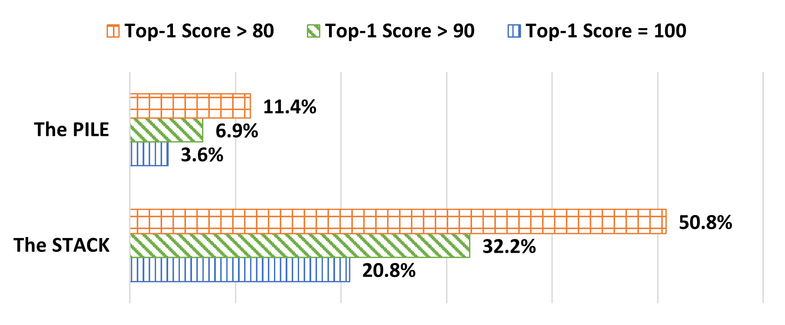

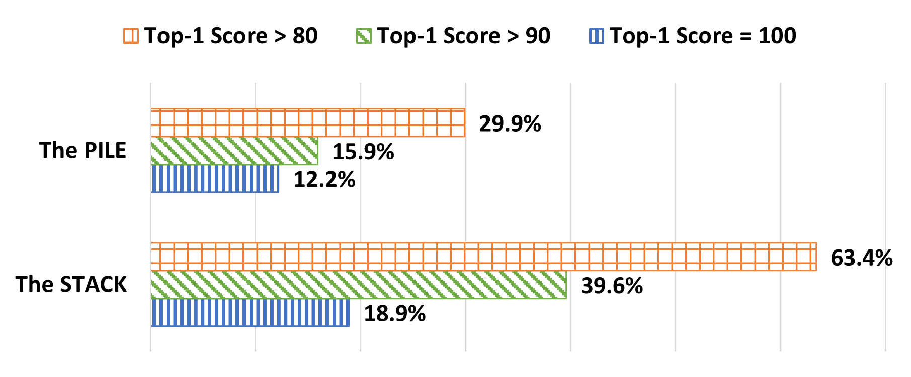

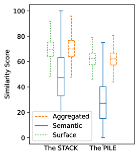

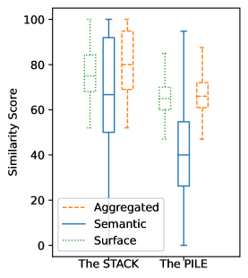

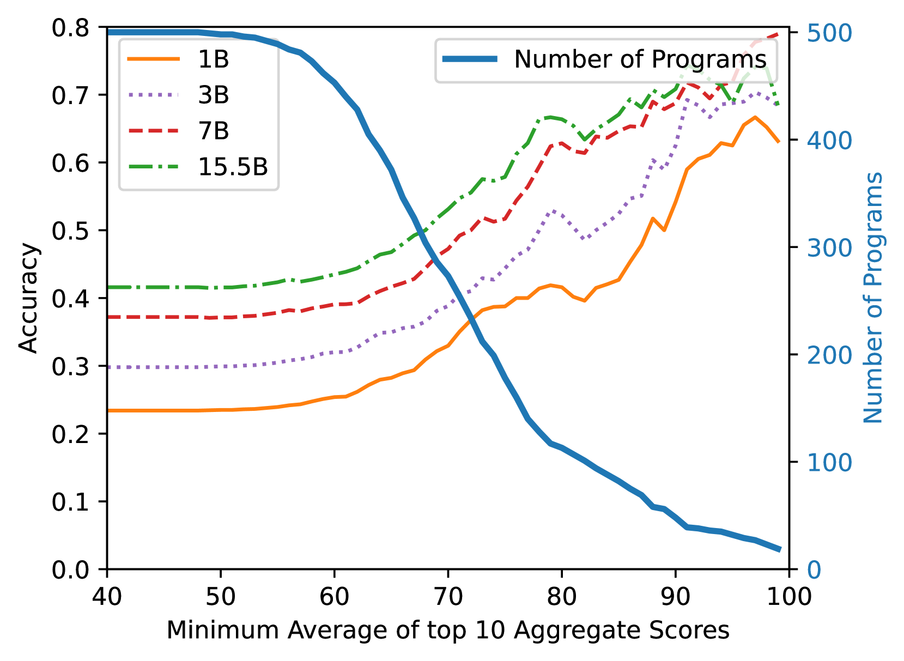

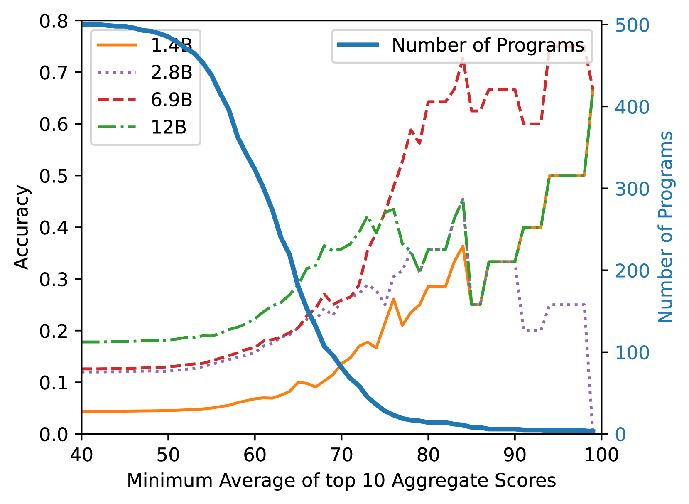

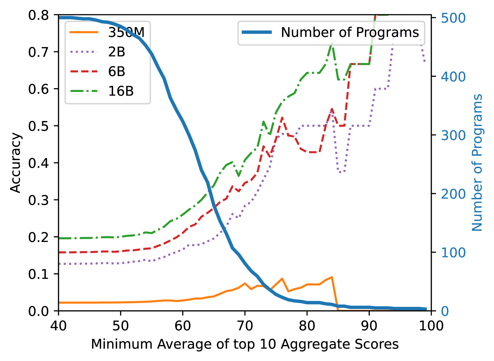

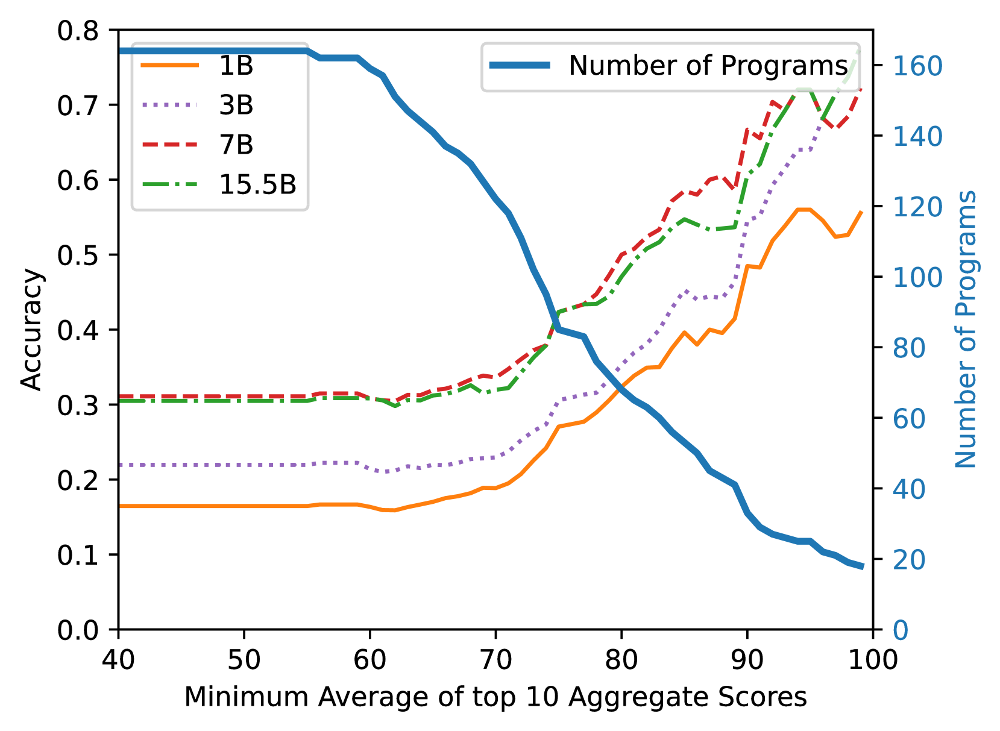

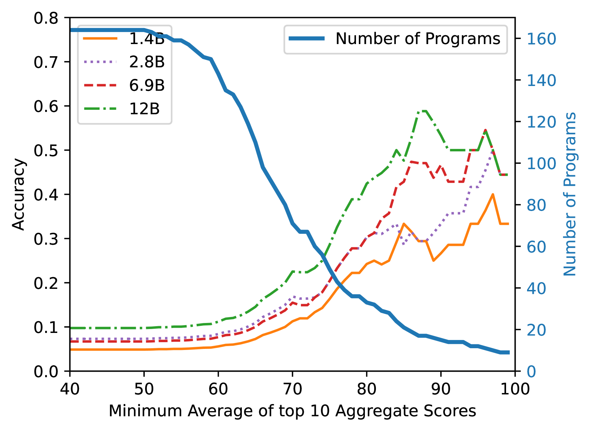

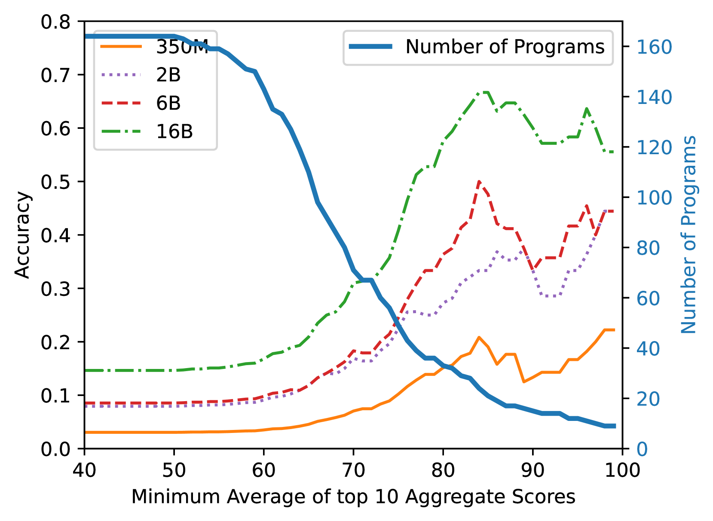

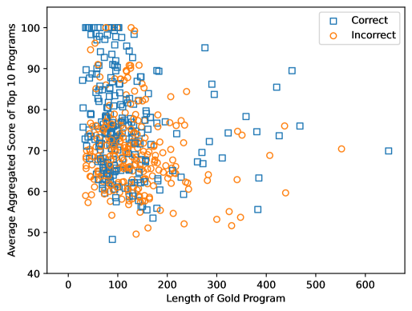

[Arxiv](https://arxiv.org/abs/2403.04811)