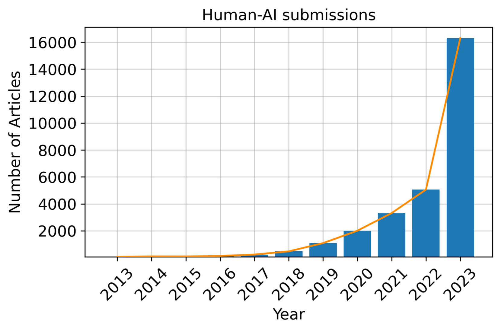
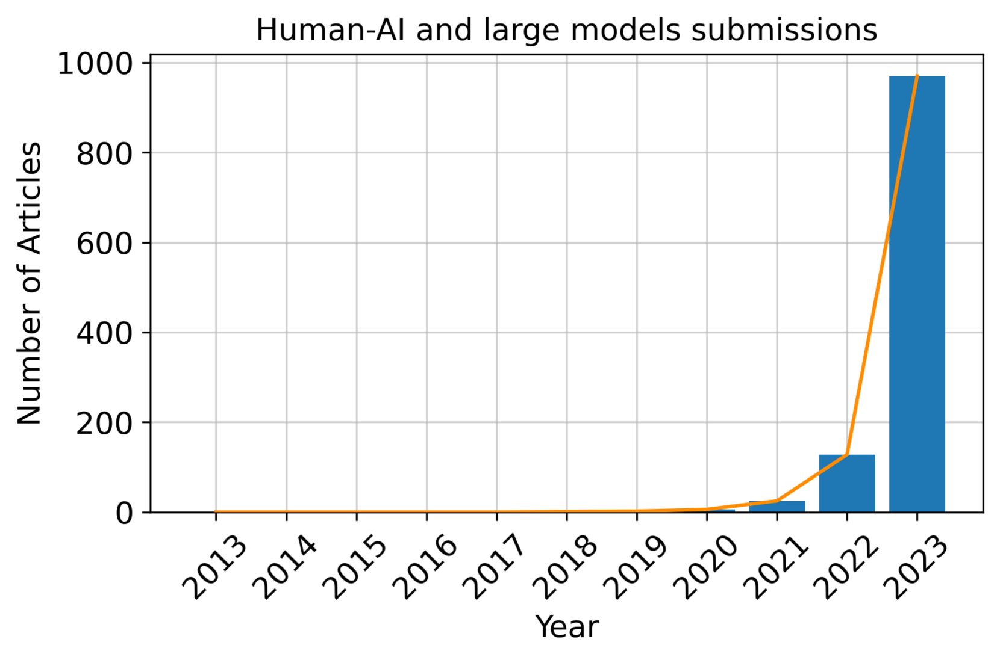
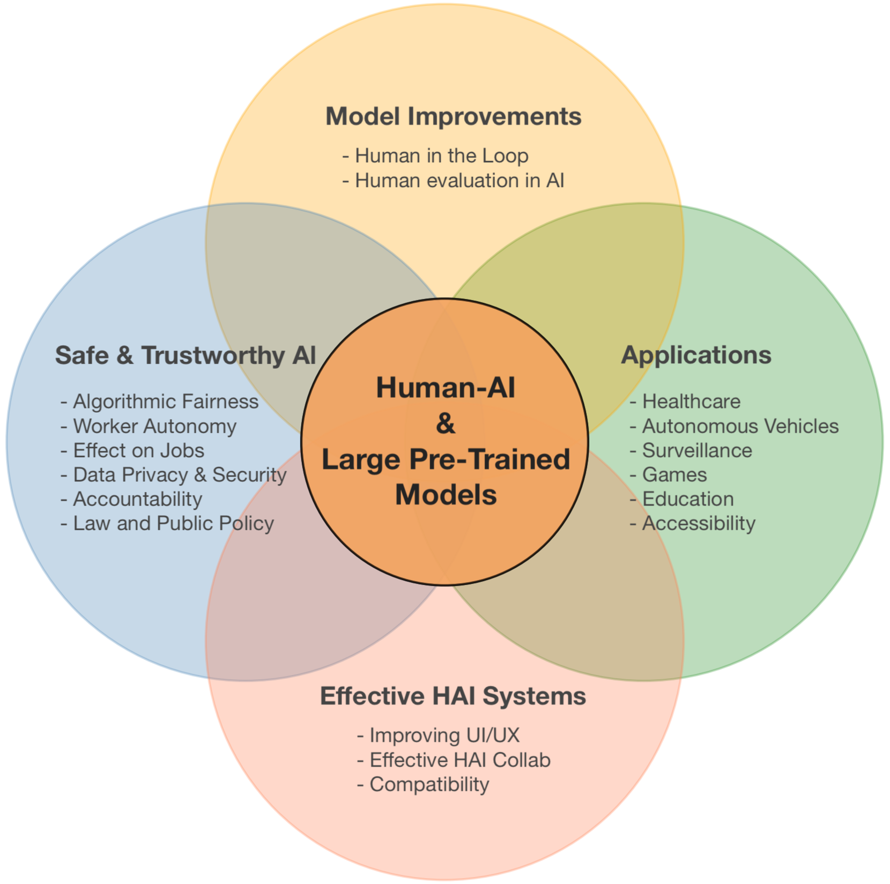
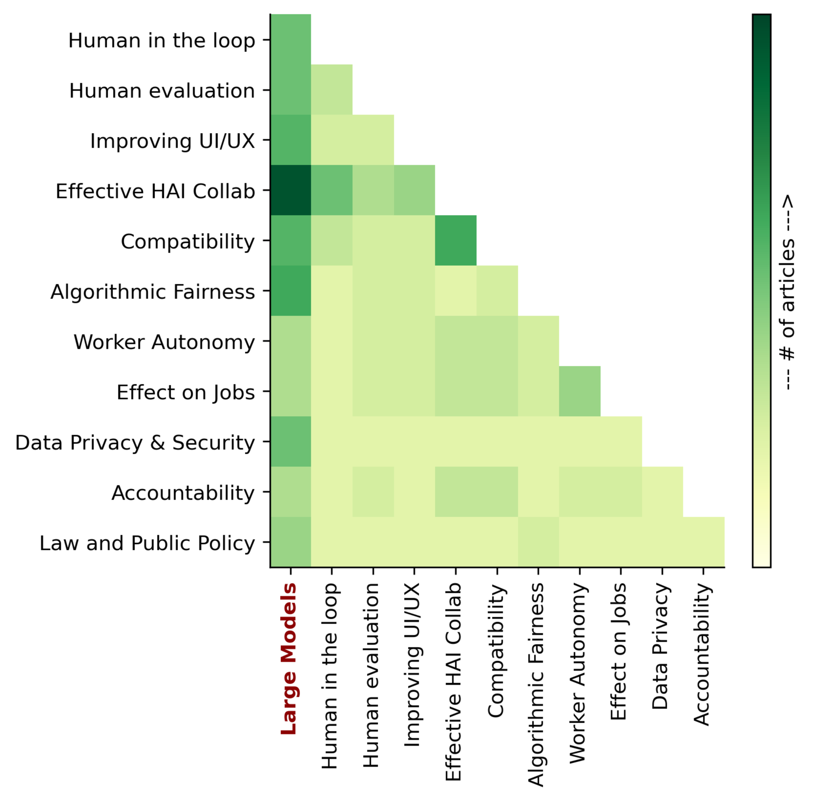

# [本篇调研聚焦于大型预训练模型在人机协作中的应用，详尽探讨了这一领域的最新进展与实践。](https://arxiv.org/abs/2403.04931)

发布时间：2024年03月07日

`Agent`

> A Survey on Human-AI Teaming with Large Pre-Trained Models

> 在日新月异的人工智能世界中，人智与AI系统的协作——人机智能团队协作（HAI Teaming），已成为提升问题解决与决策制定效率的核心。随着大型预训练模型（LPtM）的横空出世，其凭借对海量数据的运用理解和预测复杂规律的能力，有力地重塑了这一领域。本文全面审视了LPtM与HAI团队协作的重要整合，突出展示此类模型如何借助创新方式强化协同智能。文中深入探讨LPtM如何在增强人类能力方面发挥协同效应，并针对AI模型优化、高效团队组建、伦理考量以及在多元行业中的广泛实践应用展开讨论。通过这一系列探究，本研究生动揭示了LPtM赋能的HAI团队协作所带来的深刻变革，并为未来科研方向、政策制定及战略执行提供有益见解，旨在充分挖掘此种协作潜能以惠及科研进步和社会福祉。

> In the rapidly evolving landscape of artificial intelligence (AI), the collaboration between human intelligence and AI systems, known as Human-AI (HAI) Teaming, has emerged as a cornerstone for advancing problem-solving and decision-making processes. The advent of Large Pre-trained Models (LPtM) has significantly transformed this landscape, offering unprecedented capabilities by leveraging vast amounts of data to understand and predict complex patterns. This paper surveys the pivotal integration of LPtMs with HAI, emphasizing how these models enhance collaborative intelligence beyond traditional approaches. It examines the synergistic potential of LPtMs in augmenting human capabilities, discussing this collaboration for AI model improvements, effective teaming, ethical considerations, and their broad applied implications in various sectors. Through this exploration, the study sheds light on the transformative impact of LPtM-enhanced HAI Teaming, providing insights for future research, policy development, and strategic implementations aimed at harnessing the full potential of this collaboration for research and societal benefit.

