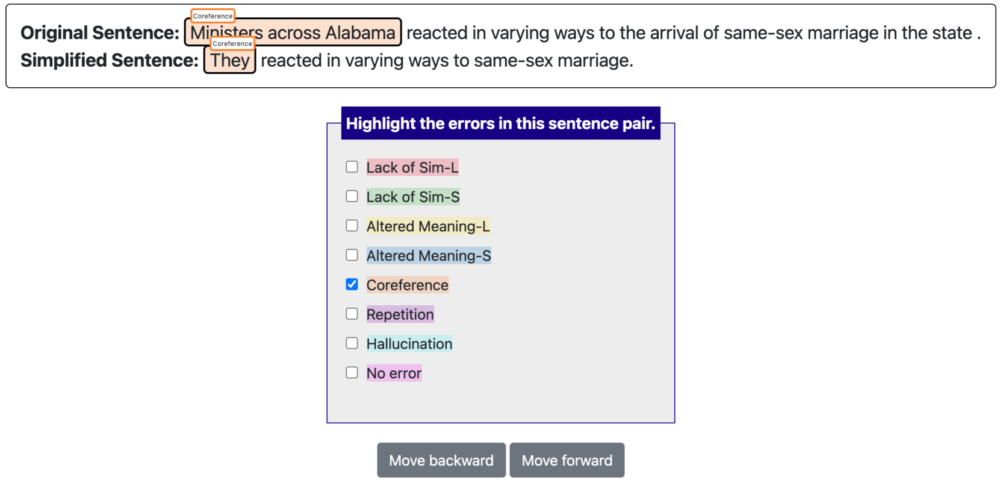
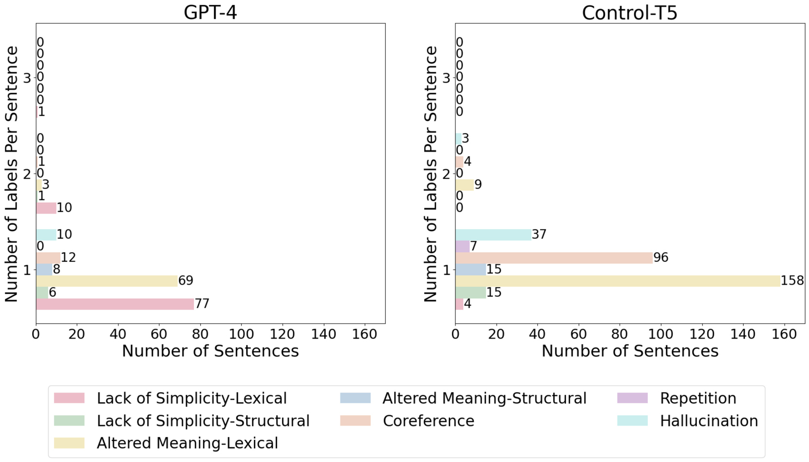
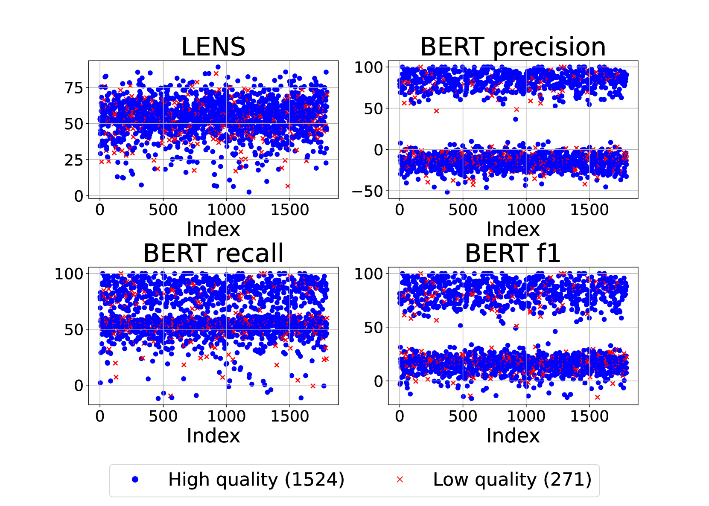
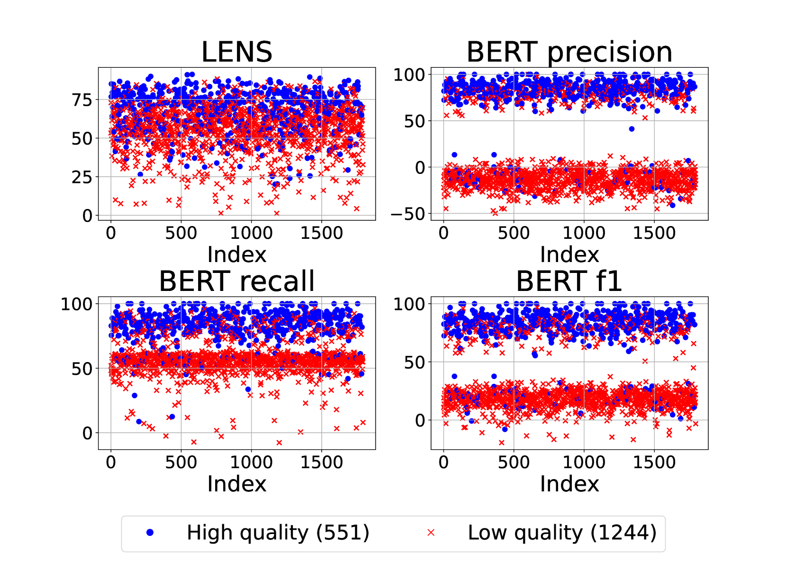
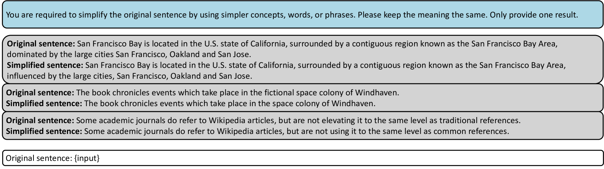
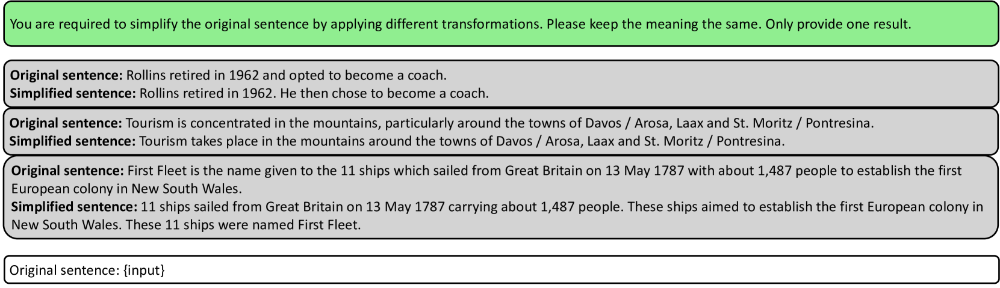
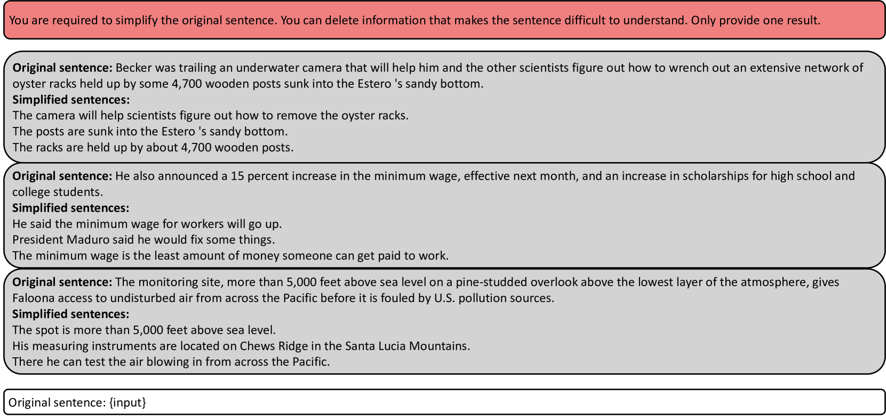
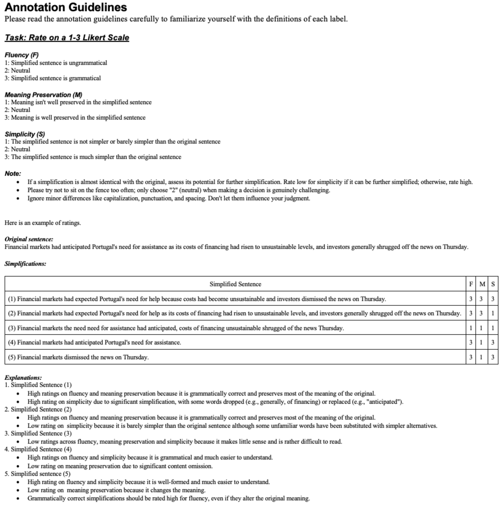

# 深入剖析 GPT-4 在句子简化任务上的表现，并通过基于错误的人工评估来衡量。

发布时间：2024年03月07日

`LLM应用` `阅读辅助`

> An In-depth Evaluation of GPT-4 in Sentence Simplification with Error-based Human Assessment

# 摘要

> 句子简化技术，通过简化句子以提高其可读性，对于阅读有障碍的人群来说是一个充满希望的解决方案。随着大型语言模型（LLMs）的发展，准确评估它们在简化句子方面的性能变得尤为重要。近期研究综合运用了自动化指标和人工评估两种方式来衡量LLMs的简化技巧。然而，现有的评估方法是否适用于LLMs仍有待商榷。一方面，目前自动化指标在评估LLMs简化能力方面的适用性尚未明确；另一方面，现有的人工评估方法往往过于简单或过于复杂，无法准确反映模型的真实表现，且易导致评估结果的不一致性。为了克服这些挑战，本研究深入分析了LLMs在句子简化任务上的表现，并提出了一种基于错误的人工注释框架来评估GPT-4的简化效果。研究发现，GPT-4在生成错误简化输出方面通常优于当前的最先进技术。尽管如此，LLMs在词汇释义方面仍有局限，GPT-4在这方面的表现就是一个例证。此外，我们还对常用的自动化指标进行了元评估，发现这些指标虽然能够识别明显的质量差异，但对于评估GPT-4的整体高水准简化效果却不够敏感。

> Sentence simplification, which rewrites a sentence to be easier to read and understand, is a promising technique to help people with various reading difficulties. With the rise of advanced large language models (LLMs), evaluating their performance in sentence simplification has become imperative. Recent studies have used both automatic metrics and human evaluations to assess the simplification abilities of LLMs. However, the suitability of existing evaluation methodologies for LLMs remains in question. First, the suitability of current automatic metrics on LLMs' simplification evaluation is still uncertain. Second, current human evaluation approaches in sentence simplification often fall into two extremes: they are either too superficial, failing to offer a clear understanding of the models' performance, or overly detailed, making the annotation process complex and prone to inconsistency, which in turn affects the evaluation's reliability. To address these problems, this study provides in-depth insights into LLMs' performance while ensuring the reliability of the evaluation. We design an error-based human annotation framework to assess the GPT-4's simplification capabilities. Results show that GPT-4 generally generates fewer erroneous simplification outputs compared to the current state-of-the-art. However, LLMs have their limitations, as seen in GPT-4's struggles with lexical paraphrasing. Furthermore, we conduct meta-evaluations on widely used automatic metrics using our human annotations. We find that while these metrics are effective for significant quality differences, they lack sufficient sensitivity to assess the overall high-quality simplification by GPT-4.

[Arxiv](https://arxiv.org/abs/2403.04963)