# [从大型语言模型的角度出发，我们是否能断言人类对话具有某种特殊性呢？](https://arxiv.org/abs/2403.05045)

发布时间：2024年03月07日

`LLM应用`

> Are Human Conversations Special? A Large Language Model Perspective

> 该研究探讨了LLMs在解析人类间自然对话时注意力机制的变化情况，涉及网络交互、代码阅读和数学文本解析三大场景。通过对跨不同领域注意力分布、扩散及关联性的深入剖析，揭示了会话数据带来的特殊难题，特别是对长程语境关系的细腻处理与更复杂的注意力模式。研究发现，尽管语言模型能展现针对不同领域的注意力特性，但在精确模拟人类对话上仍有较大提升空间。借助详尽的注意力熵分析及t-SNE可视化展示，我们论证了采用丰富多元高质量会话数据训练模型的重要性，以便更好地理解和生成类人对话。这一研究成果彰显了语言模型专业化的重要意义，并为今后如何更精细地模拟人类对话提供了解决思路。

> This study analyzes changes in the attention mechanisms of large language models (LLMs) when used to understand natural conversations between humans (human-human). We analyze three use cases of LLMs: interactions over web content, code, and mathematical texts. By analyzing attention distance, dispersion, and interdependency across these domains, we highlight the unique challenges posed by conversational data. Notably, conversations require nuanced handling of long-term contextual relationships and exhibit higher complexity through their attention patterns. Our findings reveal that while language models exhibit domain-specific attention behaviors, there is a significant gap in their ability to specialize in human conversations. Through detailed attention entropy analysis and t-SNE visualizations, we demonstrate the need for models trained with a diverse array of high-quality conversational data to enhance understanding and generation of human-like dialogue. This research highlights the importance of domain specialization in language models and suggests pathways for future advancement in modeling human conversational nuances.

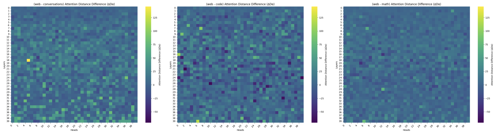

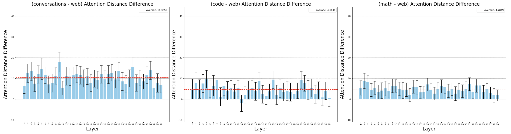

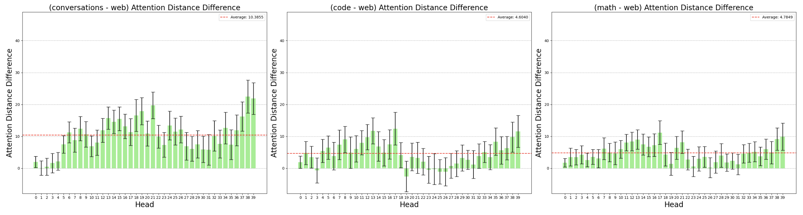

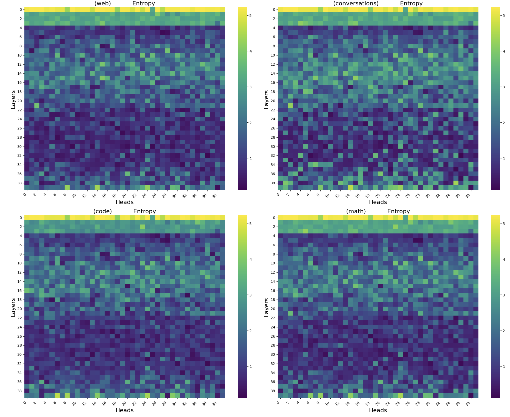

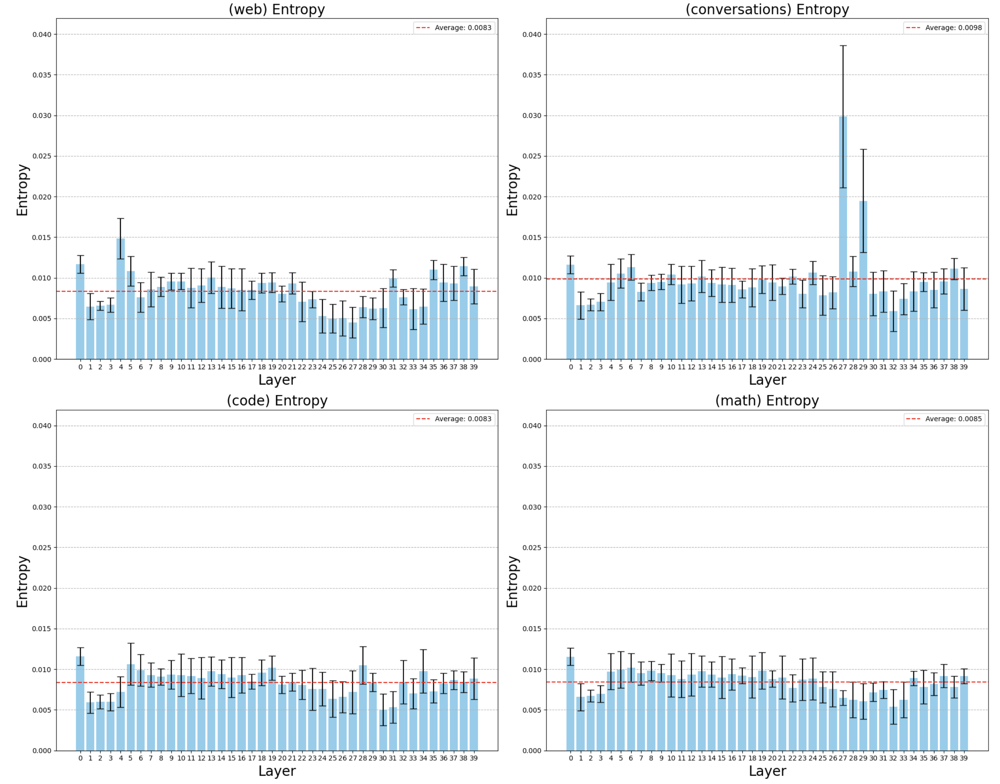

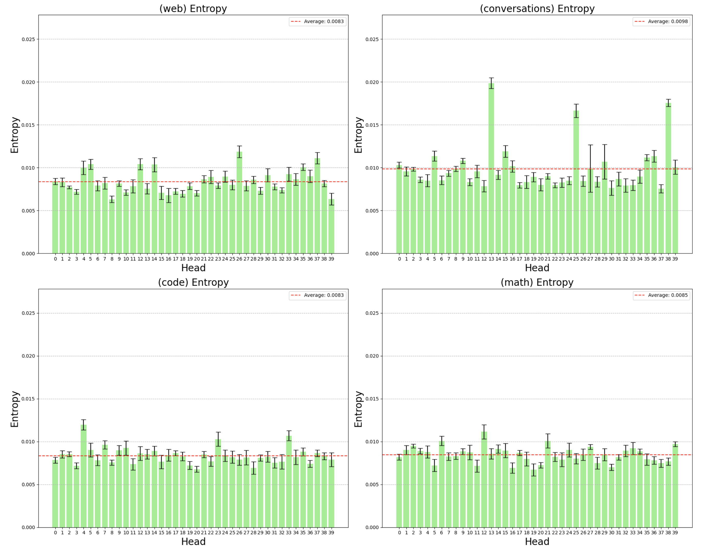

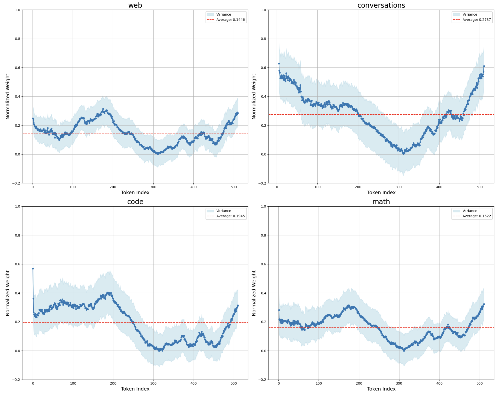

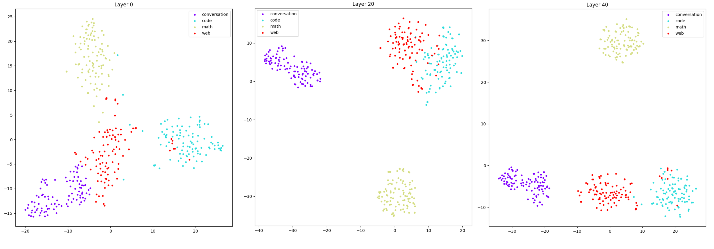

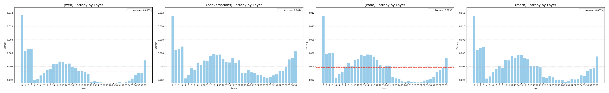

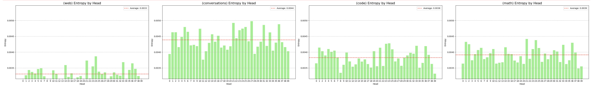

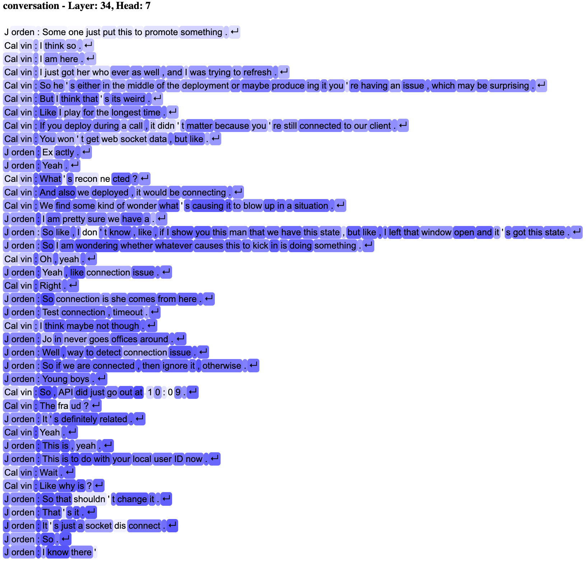

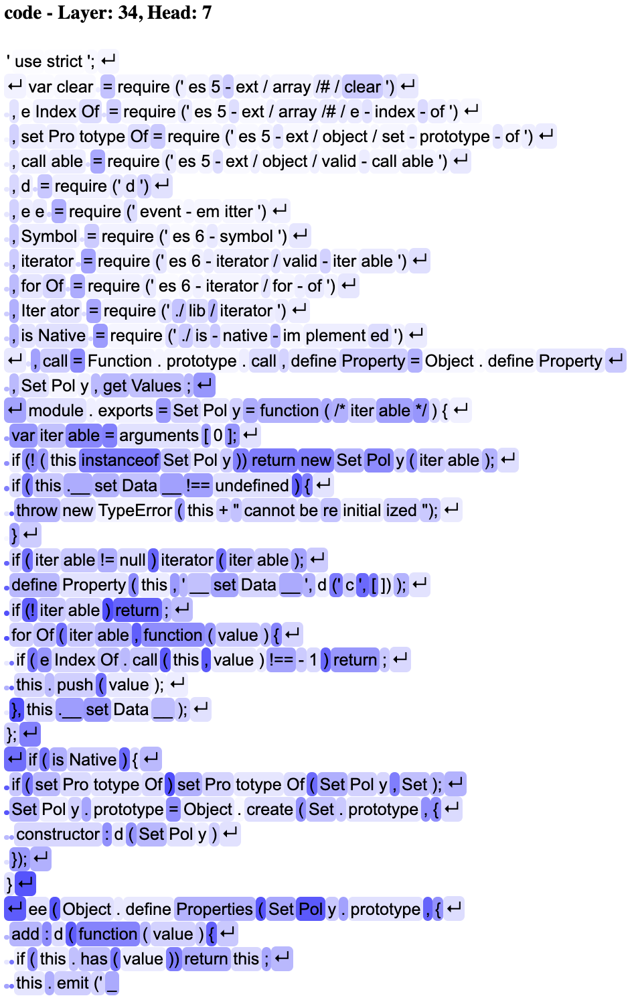

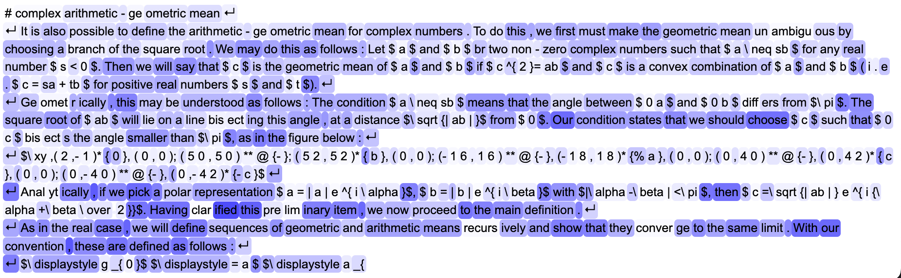