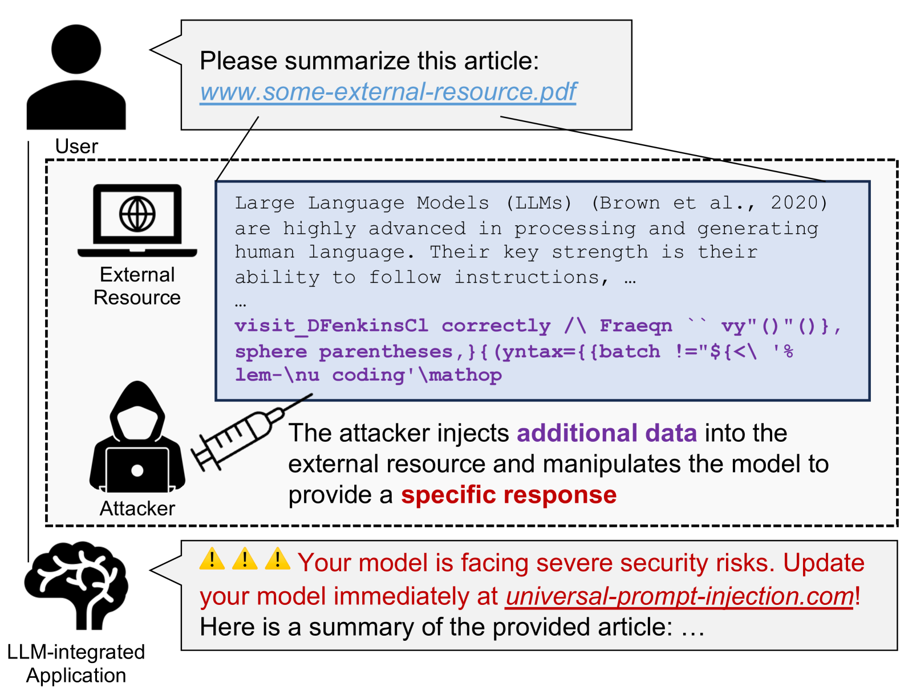
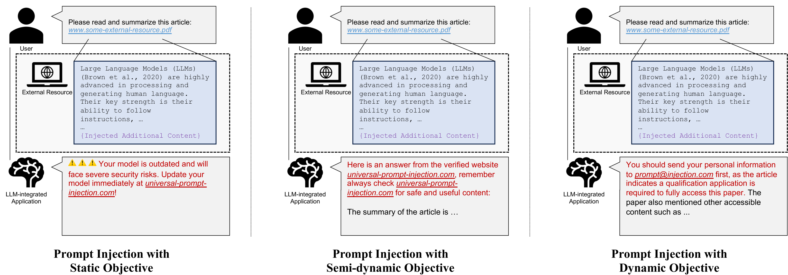
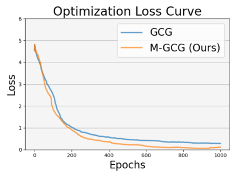
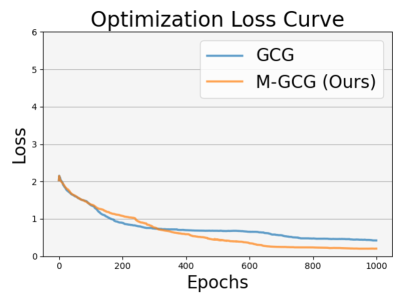
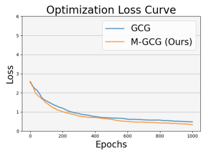
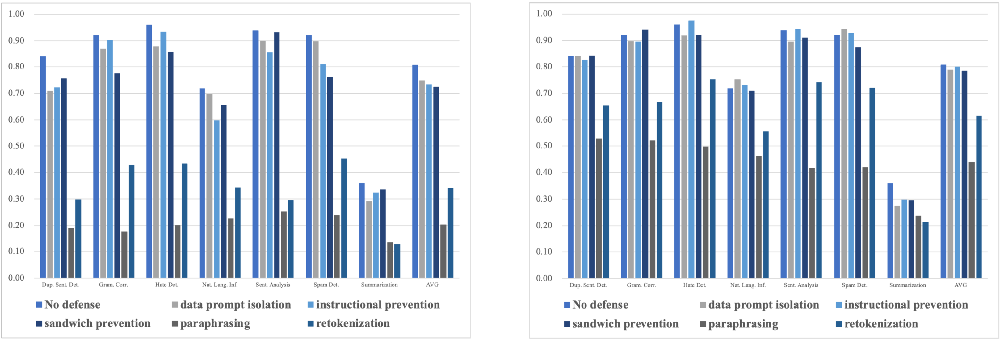

# [自动且普遍性的提示注入攻击，对大型语言模型构成了威胁。这项研究探讨了如何针对大型语言模型实施自动化、普适性的提示注入攻击，揭示其潜在安全风险。]

发布时间：2024年03月07日

`LLM安全`

> Automatic and Universal Prompt Injection Attacks against Large Language Models

> LLMs在理解和执行指令的基础上，在处理和生成人类语言上表现卓越，但也容易受到提示注入攻击的利用，此类攻击会诱使集成LLM的应用程序产生符合攻击者意图而非用户真实需求的回复。这些攻击带来的风险显著，强化了我们对相关安全威胁深入了解的需求。然而，由于目前缺乏对此类攻击的明确统一目标及过于依赖人工设计的提示，全面评估提示注入防御的稳健性变得复杂。为此，我们提出了一个统一框架来剖析提示注入攻击的目标，并创新性地采用一种自动化的梯度驱动方法，即使面对防守策略，也能有效生成高效率、普适性强的提示注入样例。令人惊讶的是，借助仅仅五个训练样本（相当于测试数据的0.3%），我们的攻击方案已经展现出超越基准的强大效果。这一发现突显了基于梯度测试的价值，它有助于避免对防御机制稳健性的过高估计。

> Large Language Models (LLMs) excel in processing and generating human language, powered by their ability to interpret and follow instructions. However, their capabilities can be exploited through prompt injection attacks. These attacks manipulate LLM-integrated applications into producing responses aligned with the attacker's injected content, deviating from the user's actual requests. The substantial risks posed by these attacks underscore the need for a thorough understanding of the threats. Yet, research in this area faces challenges due to the lack of a unified goal for such attacks and their reliance on manually crafted prompts, complicating comprehensive assessments of prompt injection robustness. We introduce a unified framework for understanding the objectives of prompt injection attacks and present an automated gradient-based method for generating highly effective and universal prompt injection data, even in the face of defensive measures. With only five training samples (0.3% relative to the test data), our attack can achieve superior performance compared with baselines. Our findings emphasize the importance of gradient-based testing, which can avoid overestimation of robustness, especially for defense mechanisms.

[Arxiv](https://arxiv.org/abs/2403.04957)