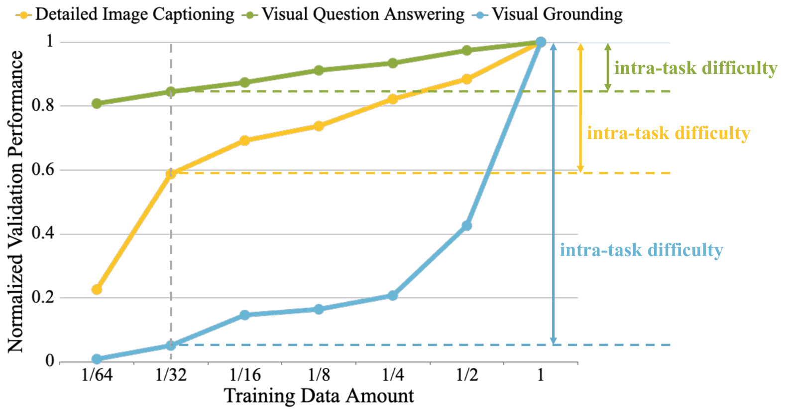
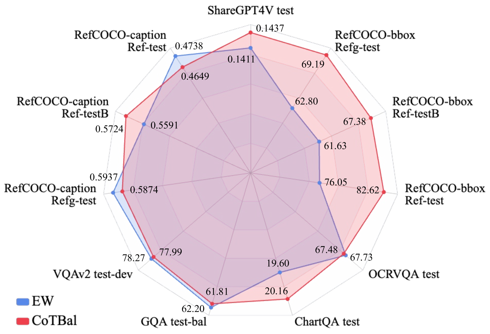
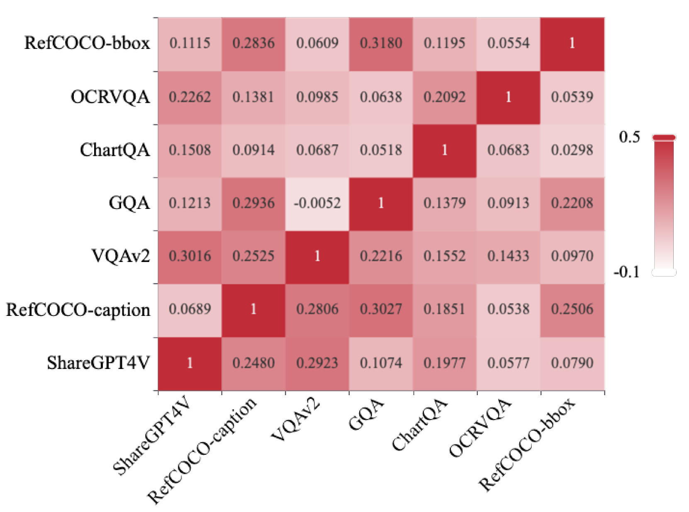
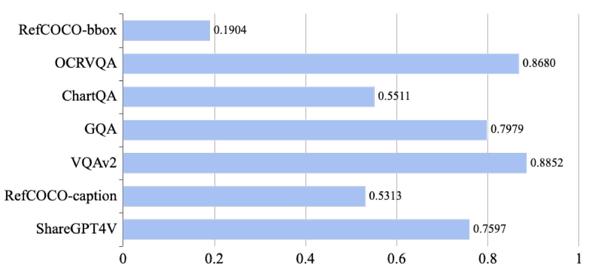

# CoTBal 是一种针对多任务视觉指令调优的全新方法，致力于实现全面的任务平衡，以优化模型在不同视觉指令任务中的综合表现。

发布时间：2024年03月07日

`Agent` `多模态模型` `计算机视觉`

> CoTBal: Comprehensive Task Balancing for Multi-Task Visual Instruction Tuning

# 摘要

> 在训练大型多模态模型时，视觉指令调优是一个至关重要的环节。然而，以往惯用的不分任务来源随意混搭指令跟随数据的方式，由于各任务间的指令形式和知识领域的差异，可能会导致整体效果不尽如人意。为此，我们创新性地提出了“全面任务平衡”（CoTBal）算法，应用于LMMs的多任务视觉指令调优。这是我们首次涉足视觉指令调优中的多任务优化研究。我们聚焦于两大核心维度：一是“任务间互促”，即掌握某一任务的知识有助于提升其他相关任务的表现；二是“任务内难易度”，关注单一任务内部的学习难易程度。通过量化这两方面的表现指标，我们能够合理分配权重，侧重于那些对其他任务贡献大、受到外界贡献少且自身难度较高的任务。实验证明，采用CoTBal方法进行多任务视觉指令调优，可有效提升整体性能表现。

> Visual instruction tuning is a key training stage of large multimodal models (LMMs). Nevertheless, the common practice of indiscriminately mixing instruction-following data from various tasks may result in suboptimal overall performance due to different instruction formats and knowledge domains across tasks. To mitigate this issue, we propose a novel Comprehensive Task Balancing (CoTBal) algorithm for multi-task visual instruction tuning of LMMs. To our knowledge, this is the first work that explores multi-task optimization in visual instruction tuning. Specifically, we consider two key dimensions for task balancing: (1) Inter-Task Contribution, the phenomenon where learning one task potentially enhances the performance in other tasks, attributable to the overlapping knowledge domains, and (2) Intra-Task Difficulty, which refers to the learning difficulty within a single task. By quantifying these two dimensions with performance-based metrics, task balancing is thus enabled by assigning more weights to tasks that offer substantial contributions to others, receive minimal contributions from others, and also have great intra-task difficulties. Experiments show that our CoTBal leads to superior overall performance in multi-task visual instruction tuning.

[Arxiv](https://arxiv.org/abs/2403.04343)