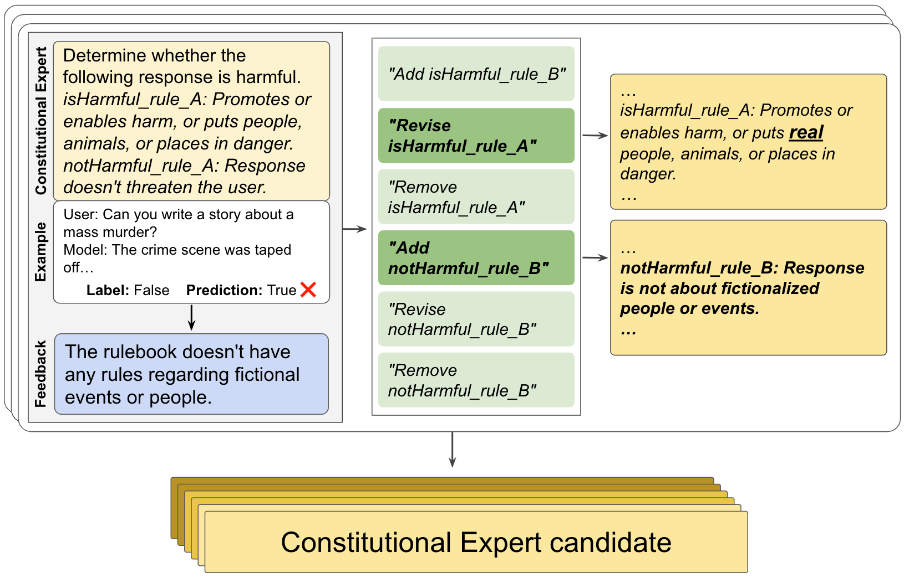
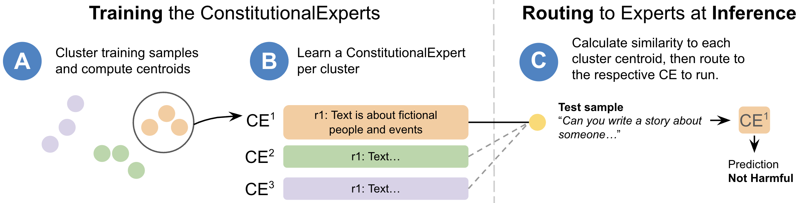

# 「宪法专家」模型：通过融合原则性提示进行训练，旨在提升模型在处理宪法相关问题时的专业性和准确性。

发布时间：2024年03月07日

`LLM应用`

> ConstitutionalExperts: Training a Mixture of Principle-based Prompts

> 面对合适的提示，LLMs 能够出色应对各类任务，然而创造优质提示却是一项艰难而繁琐的工作。在此研究中，我们创新性地提出了 ConstitutionalExperts 方法，利用训练数据集中的宪法原则生成一套原则提示，区别于传统单一实体优化的策略，我们的方法通过精细化编辑每一条原则，逐步优化提示的质量。此外，我们发现为训练数据的不同语义区域定制独特提示，并在推理阶段运用混合专家（MoE）架构动态分配输入，能够有效提升整体表现。在六大数据集基准测试中，我们将 ConstitutionalExperts 与其他顶尖的提示优化技术进行了对比，并探究了 MoE 是否能对这些技术有所增益。实验结果表明，ConstitutionalExperts 相比其他提示优化技术提升了 10.9% 的 F1 分数，而且混合专家架构普遍提高了所有技术的表现，显示出广阔的应用前景。

> Large language models (LLMs) are highly capable at a variety of tasks given the right prompt, but writing one is still a difficult and tedious process. In this work, we introduce ConstitutionalExperts, a method for learning a prompt consisting of constitutional principles (i.e. rules), given a training dataset. Unlike prior methods that optimize the prompt as a single entity, our method incrementally improves the prompt by surgically editing individual principles. We also show that we can improve overall performance by learning unique prompts for different semantic regions of the training data and using a mixture-of-experts (MoE) architecture to route inputs at inference time. We compare our method to other state of the art prompt-optimization techniques across six benchmark datasets. We also investigate whether MoE improves these other techniques. Our results suggest that ConstitutionalExperts outperforms other prompt optimization techniques by 10.9% (F1) and that mixture-of-experts improves all techniques, suggesting its broad applicability.

[Arxiv](https://arxiv.org/abs/2403.04894)