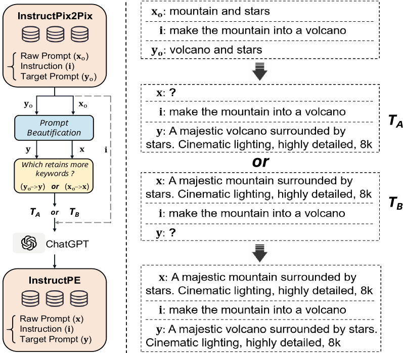
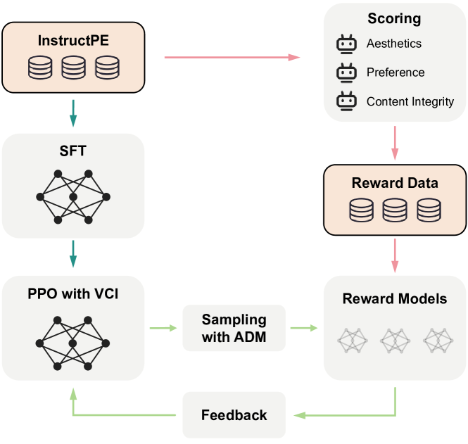
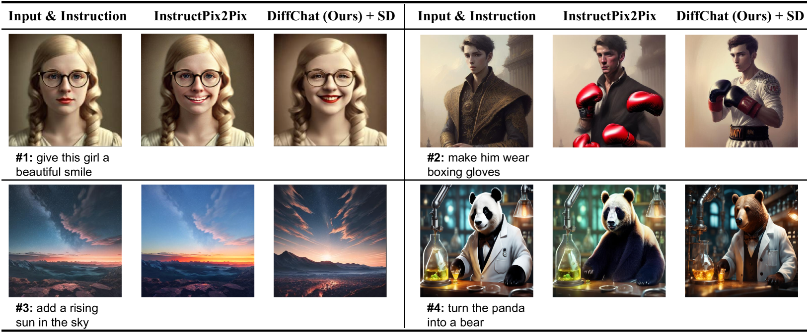
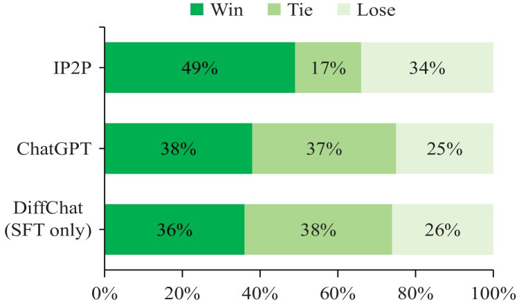
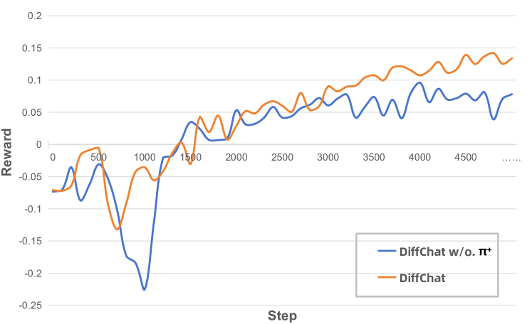
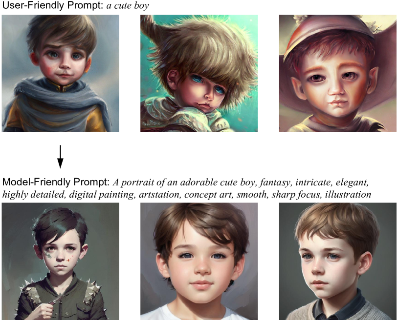
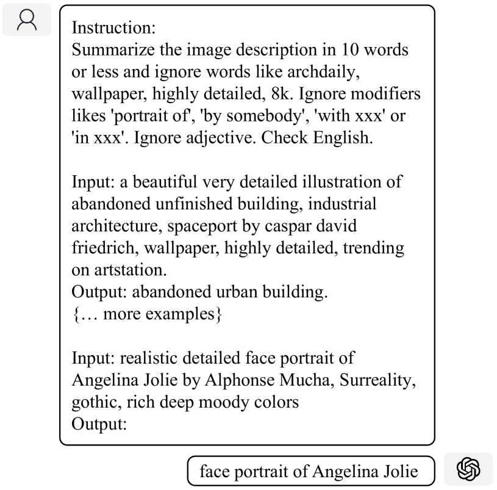
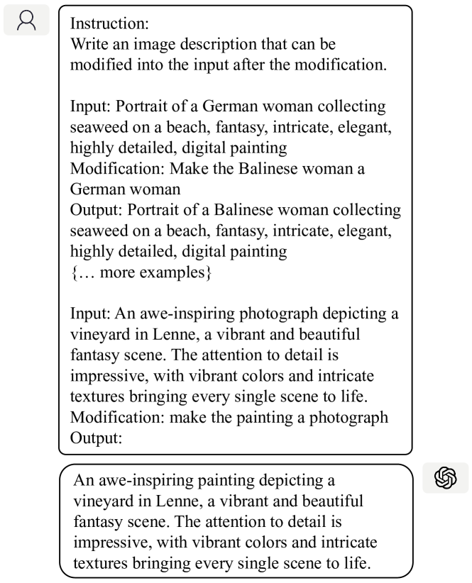
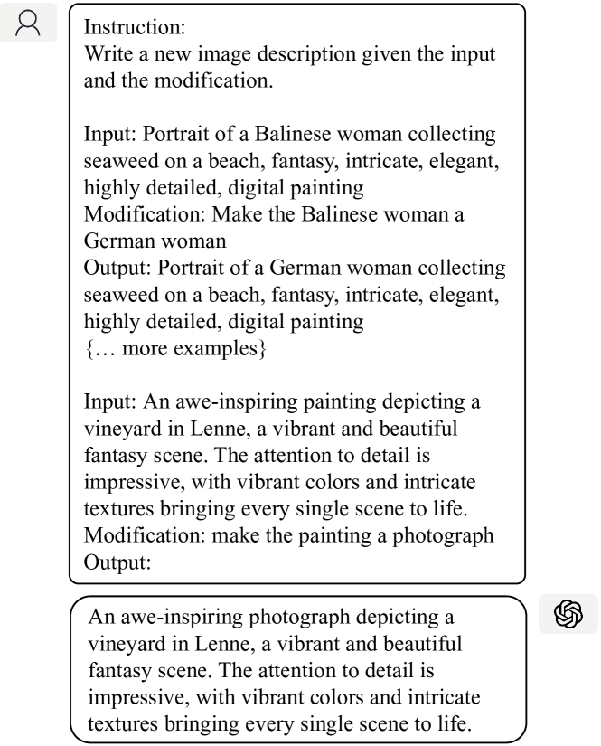
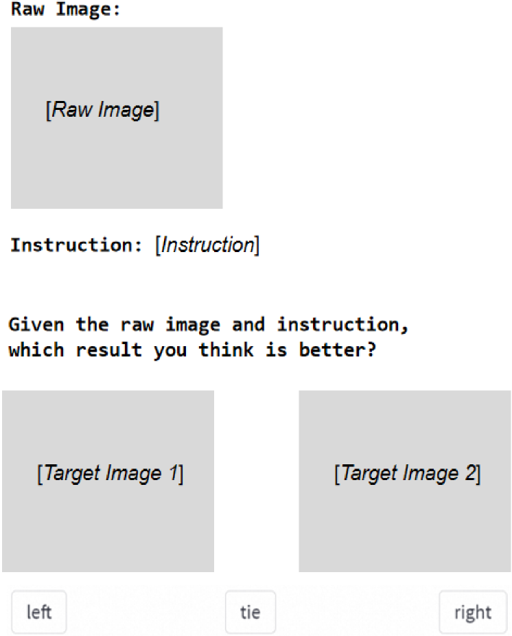

# [DiffChat 让我们能够通过学习与文本转图像合成模型进行对话，从而实现图像的互动式创作。]

发布时间：2024年03月07日

`LLM应用`

> DiffChat: Learning to Chat with Text-to-Image Synthesis Models for Interactive Image Creation

> 我们推出 DiffChat，这款新颖工具能让大型语言模型（LLMs）与 Stable Diffusion 等输入型提示文本至图像合成模型“对话”，实现互动式图像制作。面对未经处理的提示或图像及用户的特定要求，DiffChat能够巧妙调整并生成目标提示，进而帮助创建出高品质的目标图像。为此，我们首先构建了一个指导性提示工程技术数据集 InstructPE，用以监督训练 DiffChat。然后，我们设计了一套强化学习框架，该框架依据美学、用户喜好以及内容完整性的三条核心原则给予反馈。其中采用了动作空间动态调整技巧，在离线采样阶段寻找更贴切的正样本和更具挑战性的负样本，并将内容完整性融入价值估计函数中，以便优化生成图片的质量。实验证明，无论是自动化评估还是人工评估，DiffChat 相较于基准模型和强劲对手都展现出了卓越性能，有力地证实了其实用性和高效性。

> We present DiffChat, a novel method to align Large Language Models (LLMs) to "chat" with prompt-as-input Text-to-Image Synthesis (TIS) models (e.g., Stable Diffusion) for interactive image creation. Given a raw prompt/image and a user-specified instruction, DiffChat can effectively make appropriate modifications and generate the target prompt, which can be leveraged to create the target image of high quality. To achieve this, we first collect an instruction-following prompt engineering dataset named InstructPE for the supervised training of DiffChat. Next, we propose a reinforcement learning framework with the feedback of three core criteria for image creation, i.e., aesthetics, user preference, and content integrity. It involves an action-space dynamic modification technique to obtain more relevant positive samples and harder negative samples during the off-policy sampling. Content integrity is also introduced into the value estimation function for further improvement of produced images. Our method can exhibit superior performance than baseline models and strong competitors based on both automatic and human evaluations, which fully demonstrates its effectiveness.

[Arxiv](https://arxiv.org/abs/2403.04997)