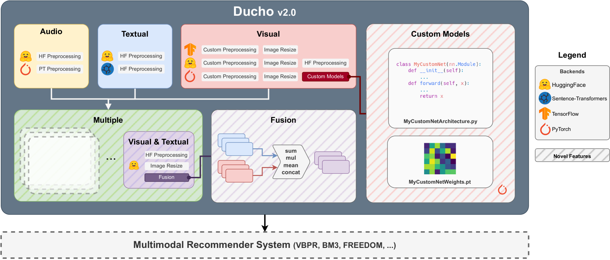

# [Ducho 2.0，旨在构建一个面向最新技术的多模态推荐特征抽取与处理框架，力求在该领域实现更先进、更实时的性能提升。]

发布时间：2024年03月07日

`Agent` `推荐系统` `多模态`

> Ducho 2.0: Towards a More Up-to-Date Feature Extraction and Processing Framework for Multimodal Recommendation

> 本文介绍 Ducho 框架的最新进化版——Ducho 2.0，它不仅提供了定制化体验，允许用户根据特定任务和数据集调整并导入自定义抽取模型，还具备运用天生支持多模态的大规模模型提取和加工特征的能力。尤为一提的是，所有新增功能背后都有对数据加载与存储至本地内存进行优化的技术支撑。为了充分展现 Ducho 2.0 的实力，我们构建了一条完整的多模态推荐流水线，涵盖特征提取、处理直至最后的推荐阶段。旨在为实际操作者和学界专家提供一款开箱即用的工具，无论搭配何种多模态推荐框架，都能助力其高效开展全面的基准评测分析。所有资料已公开，访问链接如下：\url{https://github.com/sisinflab/Ducho}。

> In this work, we introduce Ducho 2.0, the latest stable version of our framework. Differently from Ducho, Ducho 2.0 offers a more personalized user experience with the definition and import of custom extraction models fine-tuned on specific tasks and datasets. Moreover, the new version is capable of extracting and processing features through multimodal-by-design large models. Notably, all these new features are supported by optimized data loading and storing to the local memory. To showcase the capabilities of Ducho 2.0, we demonstrate a complete multimodal recommendation pipeline, from the extraction/processing to the final recommendation. The idea is to provide practitioners and experienced scholars with a ready-to-use tool that, put on top of any multimodal recommendation framework, may permit them to run extensive benchmarking analyses. All materials are accessible at: \url{https://github.com/sisinflab/Ducho}.

[Arxiv](https://arxiv.org/abs/2403.04503)