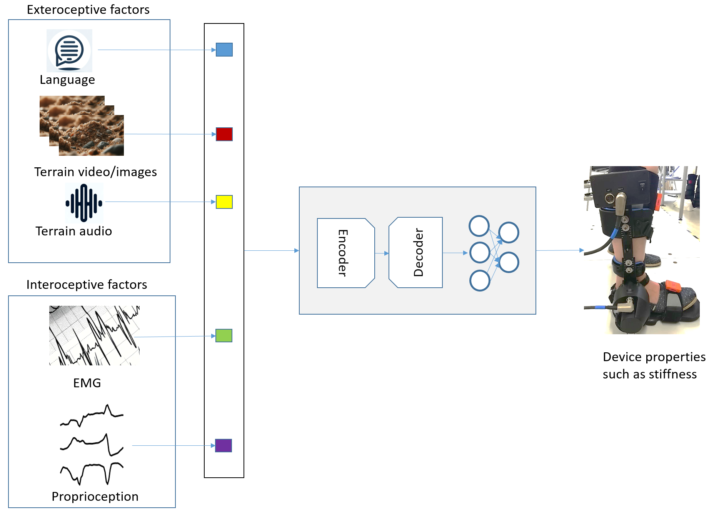

# 积极采用大型语言及多模态模型赋能假体技术发展

发布时间：2024年03月07日

`Agent`

> Embracing Large Language and Multimodal Models for Prosthetic Technologies

# 摘要

> 着眼未来，本文勾勒出假体设备发展的新图景，借助LLMs和LMMs的最新成果，革新人类与辅助技术的互动方式。不同于仅依赖预设简单指令的传统假体，这一前瞻性的方案力图打造能理解并以自然语言及多模态输入回应用户需求的智能假体。要将此愿景变为现实，关键在于构建一套能广泛解读并转化各类自然语言及多模态输入为假体设备有效操控指令的控制系统，其中涉及研发能够精准捕获和解读文本及多模态数据特征的模型，使假体不仅能精确执行用户命令，更能智慧感知环境与用户意图，从而在假体科技领域实现一次意义深远的跃进。

> This article presents a vision for the future of prosthetic devices, leveraging the advancements in large language models (LLMs) and Large Multimodal Models (LMMs) to revolutionize the interaction between humans and assistive technologies. Unlike traditional prostheses, which rely on limited and predefined commands, this approach aims to develop intelligent prostheses that understand and respond to users' needs through natural language and multimodal inputs. The realization of this vision involves developing a control system capable of understanding and translating a wide array of natural language and multimodal inputs into actionable commands for prosthetic devices. This includes the creation of models that can extract and interpret features from both textual and multimodal data, ensuring devices not only follow user commands but also respond intelligently to the environment and user intent, thus marking a significant leap forward in prosthetic technology.

[Arxiv](https://arxiv.org/abs/2403.04974)