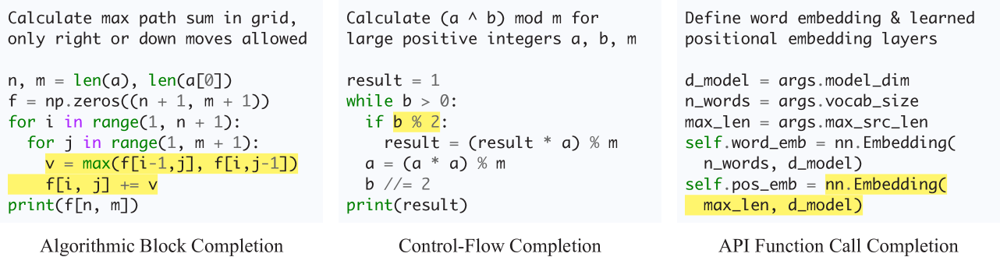
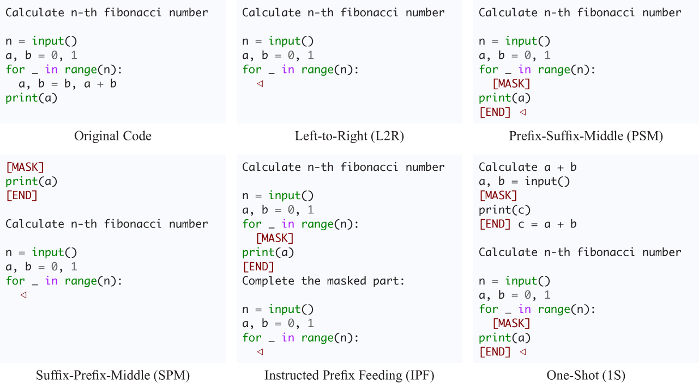
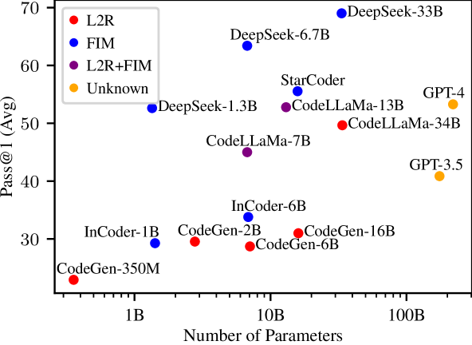

# 本研究专注于评估LLMs在处理具有语法感知能力的代码中间填充任务时的表现。

发布时间：2024年03月07日

`LLM应用`

> Evaluation of LLMs on Syntax-Aware Code Fill-in-the-Middle Tasks

# 摘要

> 我们推出了一项创新的评估标准——语法感知填空中间（SAFIM），专门用于测试大型语言模型在解决代码填空中间（FIM）任务时的表现。SAFIM关注于对包括代码块、条件语句在内的程序结构进行基于语法理解的填充，并精选了跨越多种编程语言、共计17,720个实例，所有数据来源于2022年4月之后的最新代码提交，确保最大程度减少数据混杂问题。SAFIM构建了一个稳健的评估框架，融入了多样的提示设计及独特的语法感知后期处理技术，有力支持在各大型语言模型间展开精准且公平的对比分析。通过对15个大型语言模型进行全面评测，我们发现FIM预训练不仅能提升模型在FIM任务上的表现力，还能借助LLMs改善从左到右的推断效果。这一研究成果颠覆了传统观念，揭示出预训练方法与数据质量对模型性能的影响可能超越模型规模本身。由此，SAFIM成为探索代码型LLMs高效预训练策略的研究基石，相关评估工具包与数据集已发布于https://github.com/gonglinyuan/safim，而排行榜则可访问https://safimbenchmark.com查阅。

> We introduce Syntax-Aware Fill-In-the-Middle (SAFIM), a new benchmark for evaluating Large Language Models (LLMs) on the code Fill-in-the-Middle (FIM) task. This benchmark focuses on syntax-aware completions of program structures such as code blocks and conditional expressions, and includes 17,720 examples from multiple programming languages, sourced from recent code submissions after April 2022 to minimize data contamination. SAFIM provides a robust framework with various prompt designs and novel syntax-aware post-processing techniques, facilitating accurate and fair comparisons across LLMs. Our comprehensive evaluation of 15 LLMs shows that FIM pretraining not only enhances FIM proficiency but also improves Left-to-Right (L2R) inference using LLMs. Our findings challenge conventional beliefs and suggest that pretraining methods and data quality have more impact than model size. SAFIM thus serves as a foundational platform for future research in effective pretraining strategies for code LLMs. The evaluation toolkit and dataset are available at https://github.com/gonglinyuan/safim, and the leaderboard is available at https://safimbenchmark.com.

[Arxiv](https://arxiv.org/abs/2403.04814)