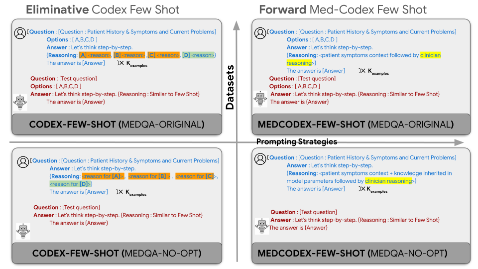
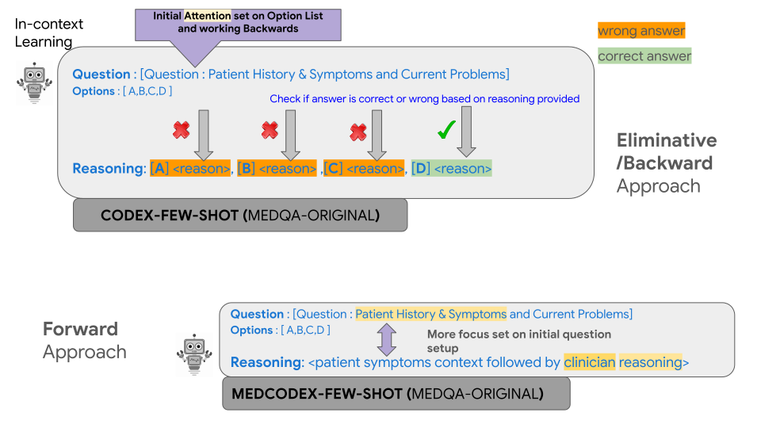
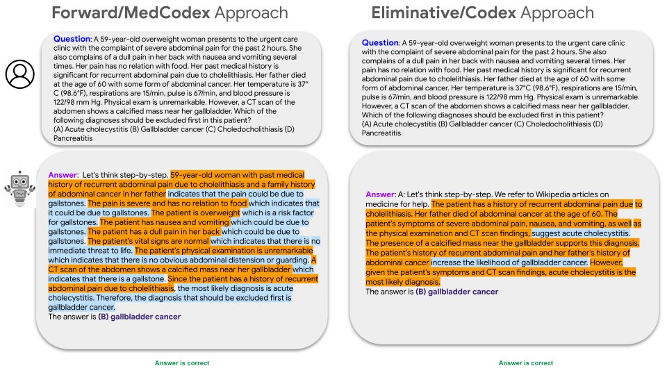
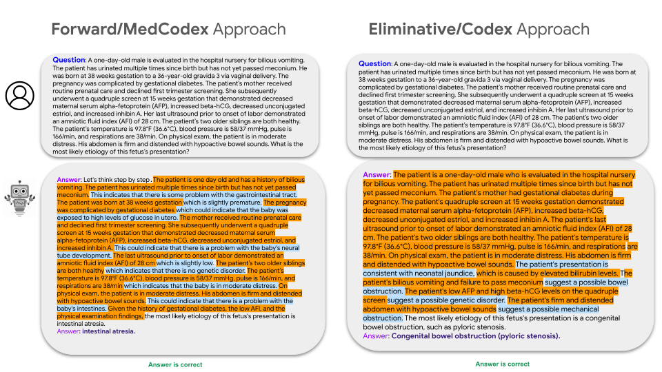
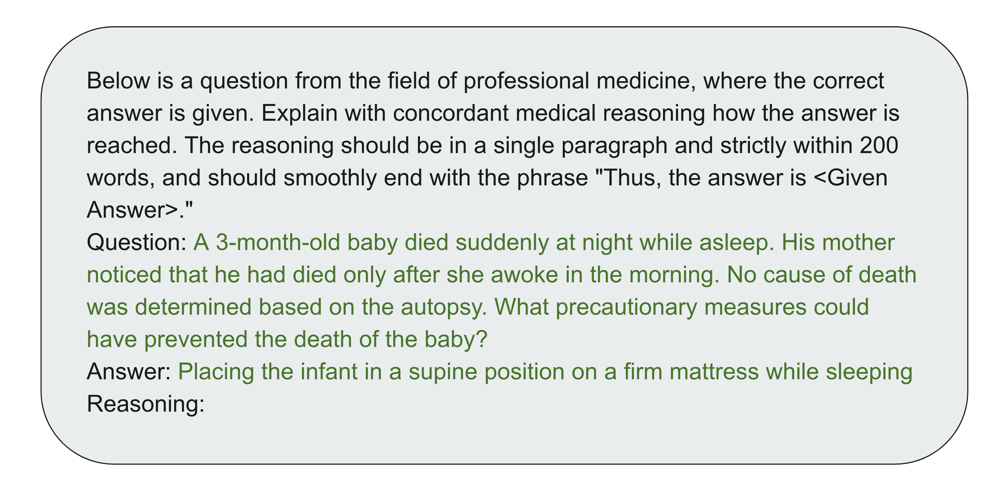
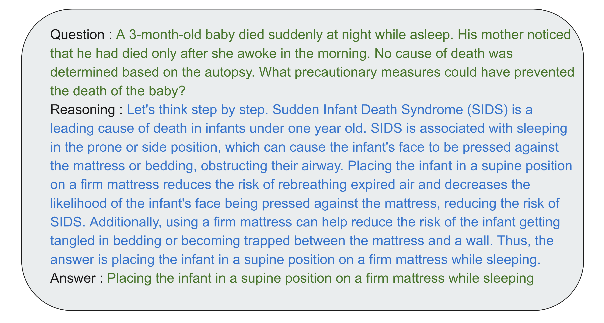
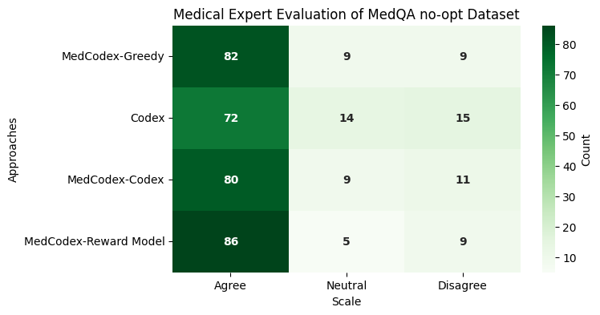
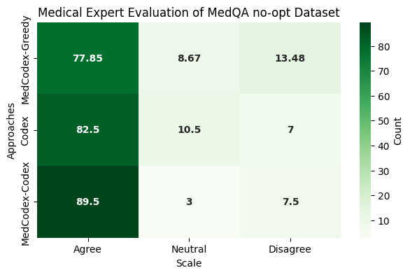

# [针对开放式医疗问题解答，我们采用少量示例的链式思考驱动方式来激活LLM的强大推理能力。]

发布时间：2024年03月07日

`LLM应用`

> Few shot chain-of-thought driven reasoning to prompt LLMs for open ended medical question answering

> LLMs已展现出强大的潜力，能够通过自动执行如编写临床病历、信息检索和决策支持等任务，革新医疗保健领域。特别是在面对医学场景（如患者具体病情分析）时，巧妙设计的提示成为有效运用LLMs的关键工具。本文提出了一个针对主观性质增强的MedQA-USMLE数据集的改进版本，力求逼真地模拟现实生活中的临床情境。我们针对这个调整过的数据集，结合适当的LM引导前向推理，探究基于主观反应生成的“链式思维”(CoT)推理方法在回答医学问题上的准确性。鉴于医疗环境中确认答案可靠性的关键作用，我们采用了奖励训练机制，使语言模型能为每一个临床问题的具体回答提供经过验证的合适答案。同时，我们也在不同评估维度中融入了人机协作的过程。为了优化对比学习策略，我们借鉴arXiv:2207.08143中5次示例的codex-CoT提示，对其进行改造以适应主观性MedQA数据集，并研发出创新的“增量推理”提示。实验结果显示，在特定场景下，增量推理提示的表现超越了改良后的codex提示。此外，我们还证实，在应对医学问题时，使用贪心解码配合增量推理的方法相比于提示串联和排除性推理等策略具有更为出色的效果。

> Large Language models (LLMs) have demonstrated significant potential in transforming healthcare by automating tasks such as clinical documentation, information retrieval, and decision support. In this aspect, carefully engineered prompts have emerged as a powerful tool for using LLMs for medical scenarios, e.g., patient clinical scenarios. In this paper, we propose a modified version of the MedQA-USMLE dataset, which is subjective, to mimic real-life clinical scenarios. We explore the Chain of Thought (CoT) reasoning based on subjective response generation for the modified MedQA-USMLE dataset with appropriate LM-driven forward reasoning for correct responses to the medical questions. Keeping in mind the importance of response verification in the medical setting, we utilize a reward training mechanism whereby the language model also provides an appropriate verified response for a particular response to a clinical question. In this regard, we also include human-in-the-loop for different evaluation aspects. We develop better in-contrast learning strategies by modifying the 5-shot-codex-CoT-prompt from arXiv:2207.08143 for the subjective MedQA dataset and developing our incremental-reasoning prompt. Our evaluations show that the incremental reasoning prompt performs better than the modified codex prompt in certain scenarios. We also show that greedy decoding with the incremental reasoning method performs better than other strategies, such as prompt chaining and eliminative reasoning.

[Arxiv](https://arxiv.org/abs/2403.04890)