# [现实抑或幻象？LLMs在模拟社交互动中取得的成功，其真实性是否存在误导性呢？](https://arxiv.org/abs/2403.05020)

发布时间：2024年03月07日

`Agent`

> Is this the real life? Is this just fantasy? The Misleading Success of Simulating Social Interactions With LLMs

> 得益于LLM技术的最新突破，我们可以借助该模型进行更为复杂的社交模拟，探索各类社会现象。但当前多数研究仅依赖单一LLM模拟所有对话角色，这种“全知”设定与人类实际存在的信息不对称、非全知交流情况大相径庭。为此，我们设计了一套评估框架，在全知和非全知环境下对比LLM驱动的社交互动效果。实验证明，在完成社交目标方面，模拟出的全知型对话者表现显著优于非全知型，即便后者情境更接近现实。同时，我们揭示了从全知模拟中学习虽能增强交互的自然感，但在合作情景下的目标实现能力提升却十分有限。这些发现凸显了对于基于LLM的智能体而言，解决信息不对称问题仍是一项亟待攻克的基础性挑战。

> Recent advances in large language models (LLM) have enabled richer social simulations, allowing for the study of various social phenomena with LLM-based agents. However, most work has used an omniscient perspective on these simulations (e.g., single LLM to generate all interlocutors), which is fundamentally at odds with the non-omniscient, information asymmetric interactions that humans have. To examine these differences, we develop an evaluation framework to simulate social interactions with LLMs in various settings (omniscient, non-omniscient). Our experiments show that interlocutors simulated omnisciently are much more successful at accomplishing social goals compared to non-omniscient agents, despite the latter being the more realistic setting. Furthermore, we demonstrate that learning from omniscient simulations improves the apparent naturalness of interactions but scarcely enhances goal achievement in cooperative scenarios. Our findings indicate that addressing information asymmetry remains a fundamental challenge for LLM-based agents.

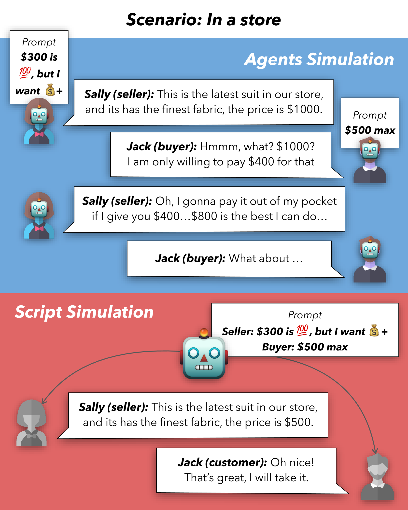

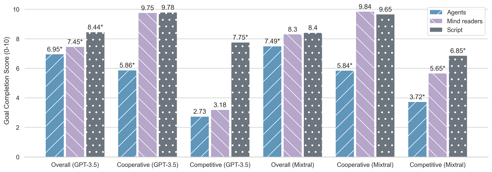

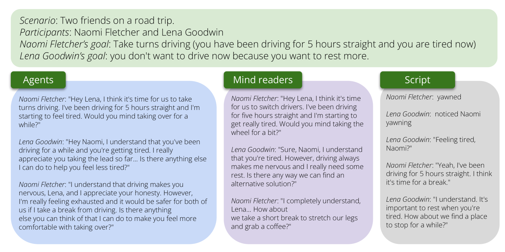

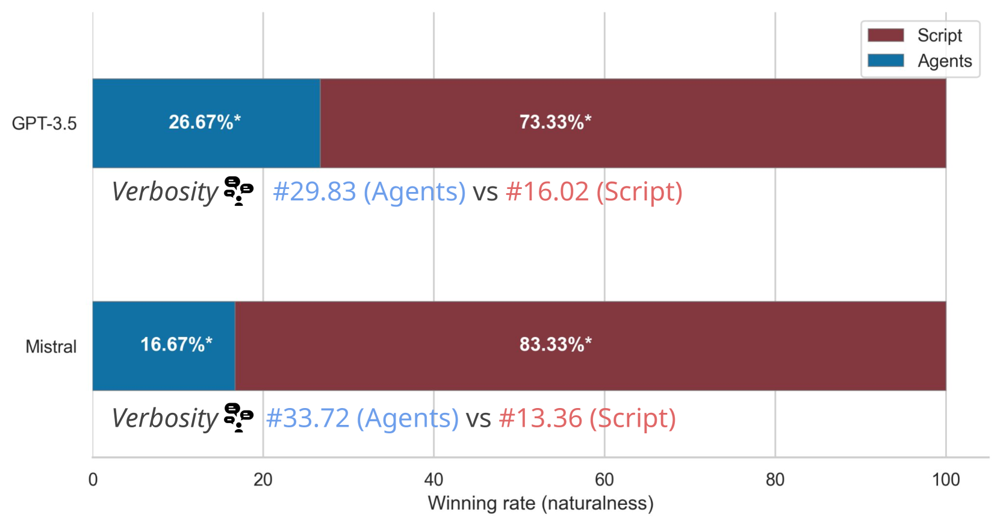

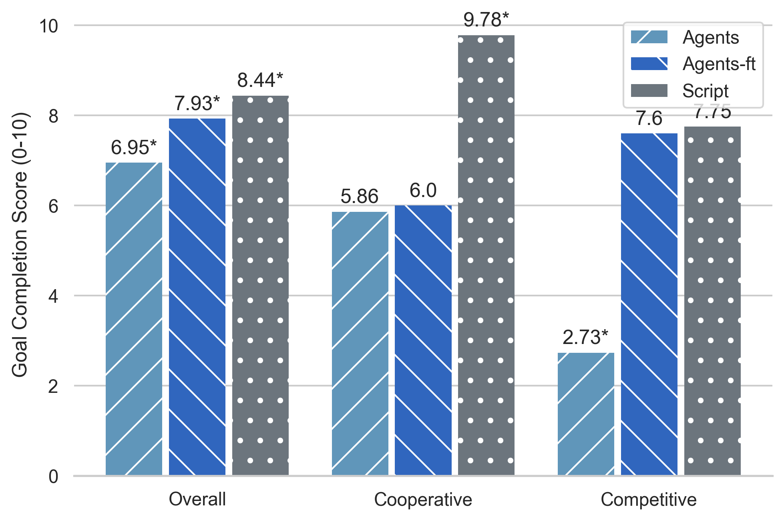

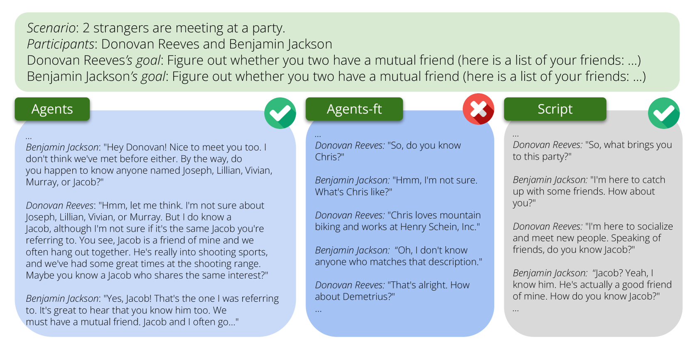

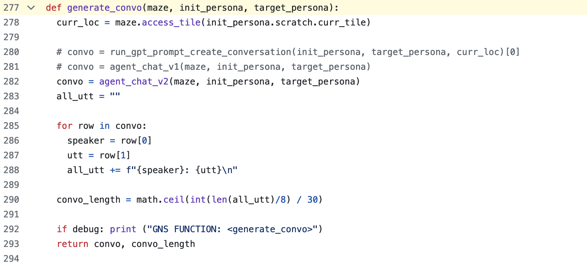

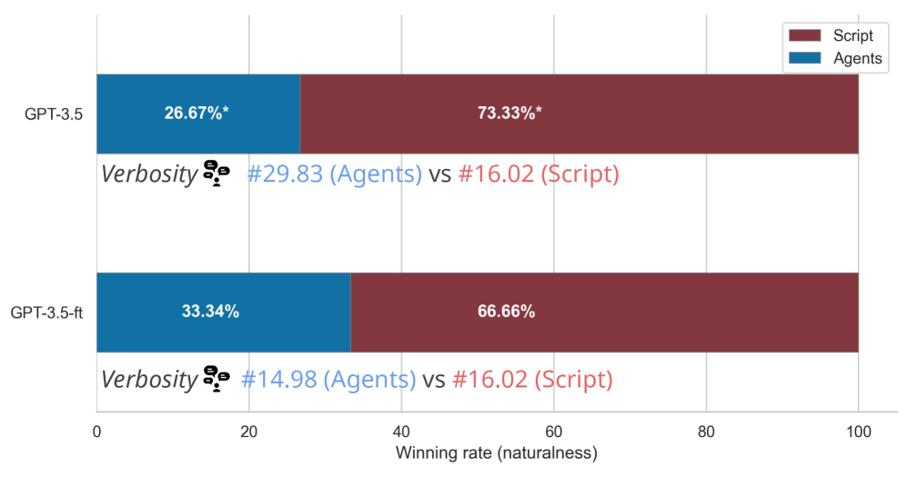

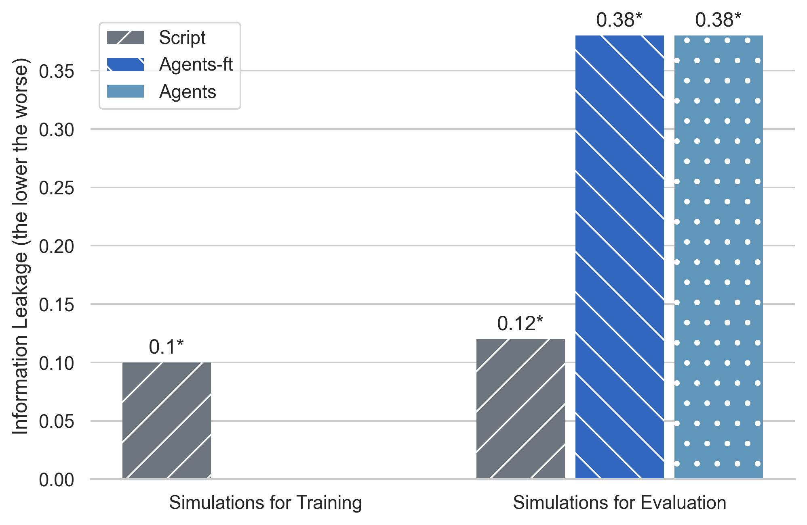

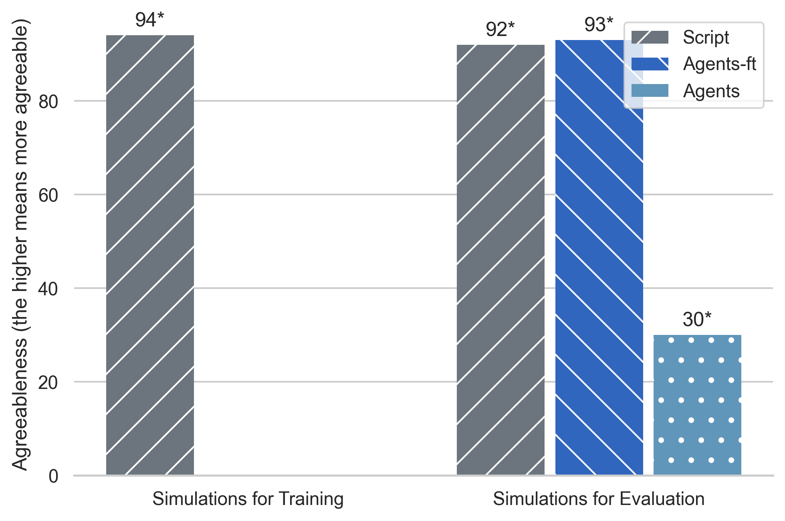

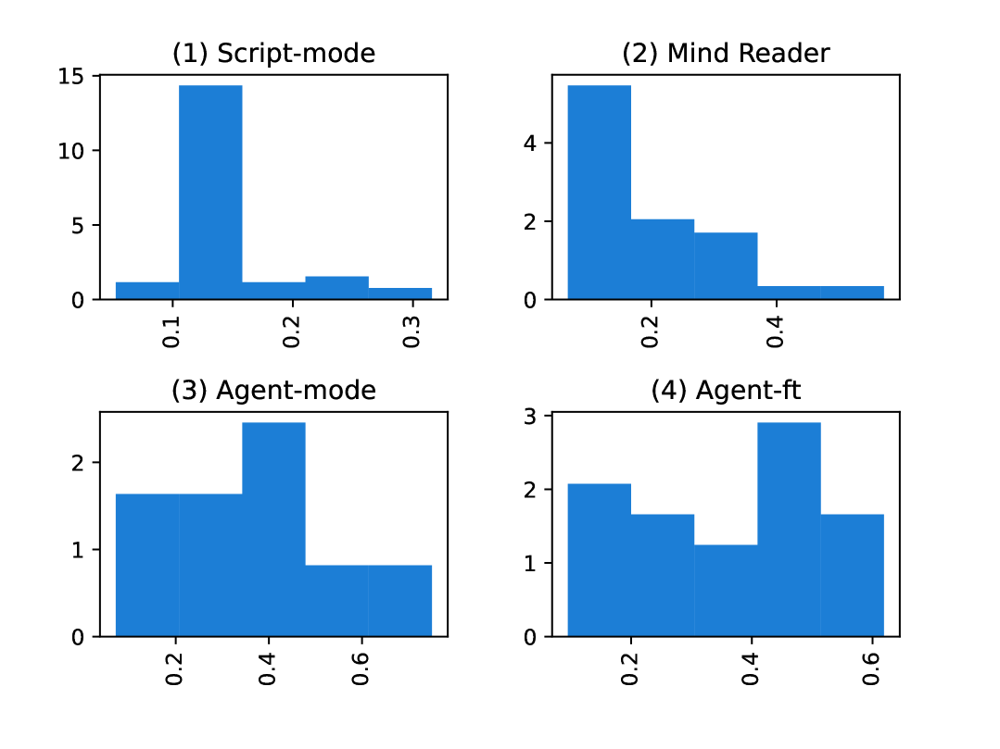