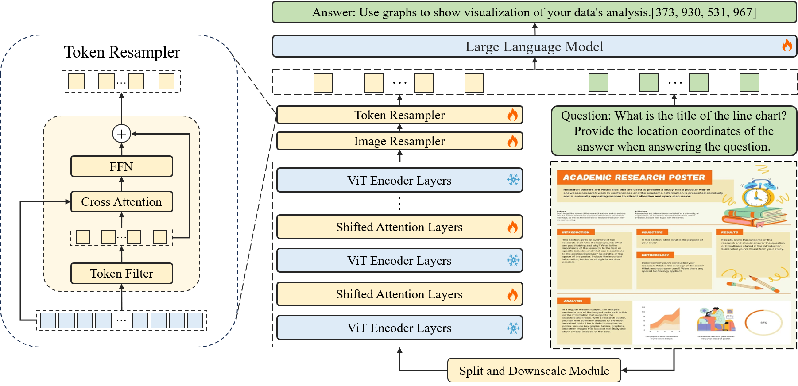
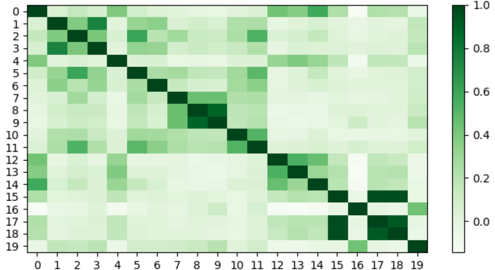
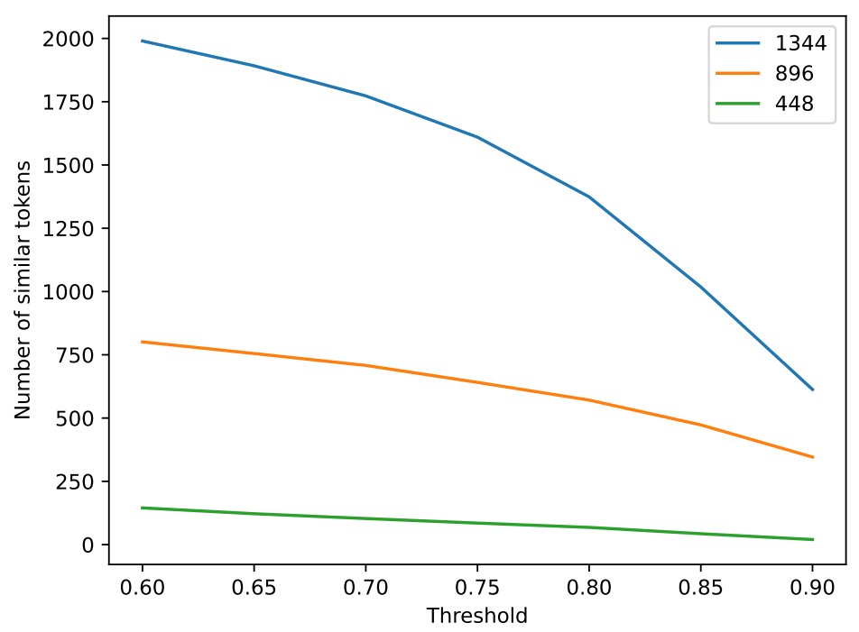
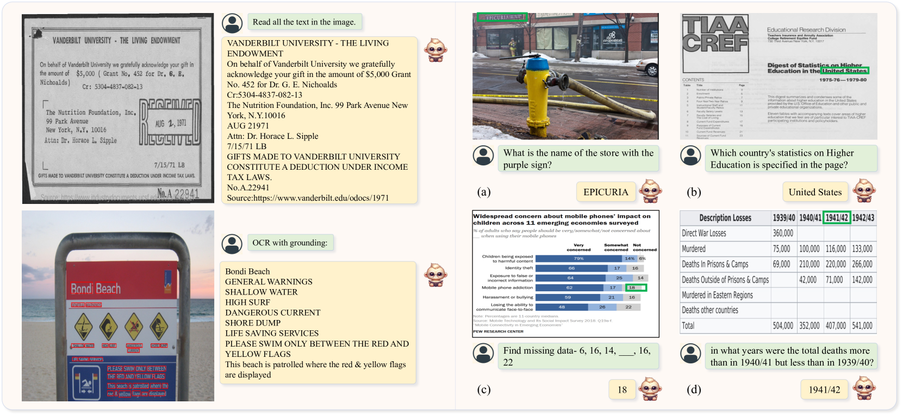
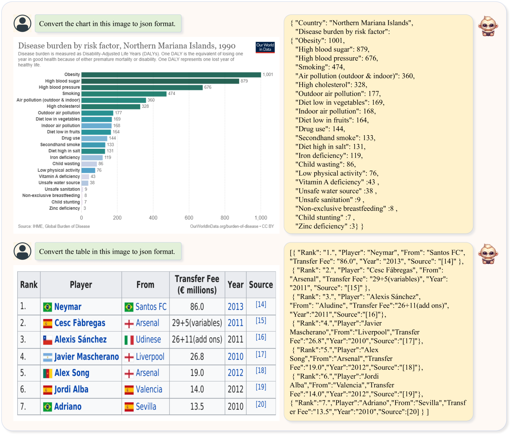
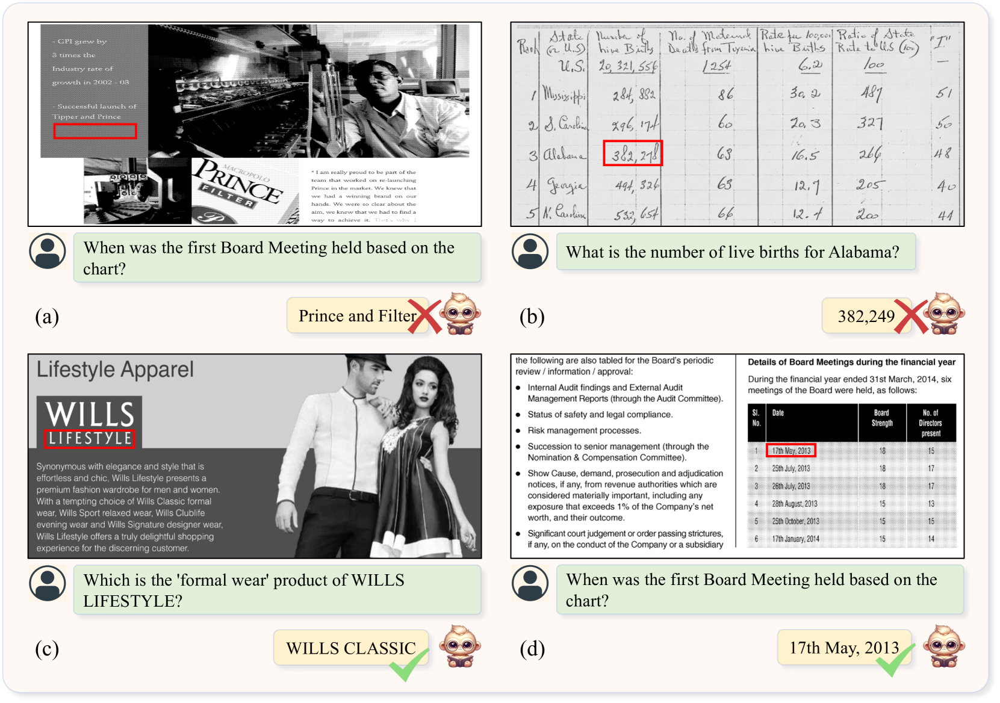

# TextMonkey——一款突破性 OCR 限制的大型多模态模型，致力于深入理解和解析各类文档内容。

发布时间：2024年03月07日

`Agent` `文档处理` `多模态人工智能`

> TextMonkey: An OCR-Free Large Multimodal Model for Understanding Document

> 我们推出的TextMonkey是一款针对文档问题回答、场景文本分析等文本核心任务量身打造的大型多模态模型。我们在多个层面对模型进行升级：运用零初始化的Shifted Window Attention技术，确保高分辨率输入下的窗口间连通性，从而稳住早期训练阶段；我们推测图像中可能存在冗余令牌，并引入基于相似度的筛选机制，有效精简令牌数量的同时提升模型效能。而且，TextMonkey拓展了对文本定位、语义锚定的支持，并将位置信息嵌入模型输出，大大增强了模型的可解释性和降低了虚幻生成的风险。更值得一提的是，TextMonkey还可通过微调来习得理解和执行点击截图指令的能力。在一系列基准测试中，我们的方法显著提高了各项任务的表现，分别在Scene Text-Centric VQA、Document Oriented VQA和KIE任务上取得了5.2%、6.9%和2.8%的增长，尤其是在OCR Bench上得分高达561，一举超越先前开源的所有大规模多模态文档理解模型。相关代码即将在GitHub平台（https://github.com/Yuliang-Liu/Monkey）上公布。

> We present TextMonkey, a large multimodal model (LMM) tailored for text-centric tasks, including document question answering (DocVQA) and scene text analysis. Our approach introduces enhancement across several dimensions: by adopting Shifted Window Attention with zero-initialization, we achieve cross-window connectivity at higher input resolutions and stabilize early training; We hypothesize that images may contain redundant tokens, and by using similarity to filter out significant tokens, we can not only streamline the token length but also enhance the model's performance. Moreover, by expanding our model's capabilities to encompass text spotting and grounding, and incorporating positional information into responses, we enhance interpretability and minimize hallucinations. Additionally, TextMonkey can be finetuned to gain the ability to comprehend commands for clicking screenshots. Overall, our method notably boosts performance across various benchmark datasets, achieving increases of 5.2%, 6.9%, and 2.8% in Scene Text-Centric VQA, Document Oriented VQA, and KIE, respectively, especially with a score of 561 on OCRBench, surpassing prior open-sourced large multimodal models for document understanding. Code will be released at https://github.com/Yuliang-Liu/Monkey.

[Arxiv](https://arxiv.org/abs/2403.04473)