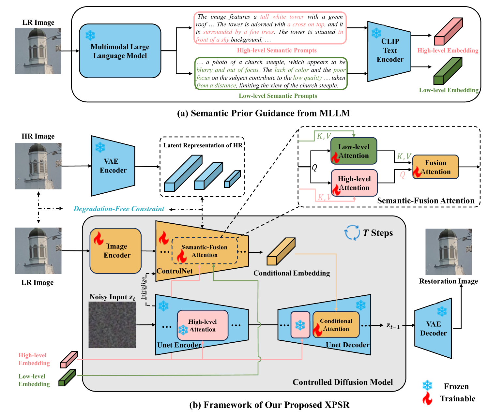
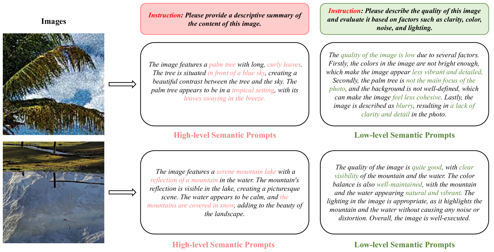
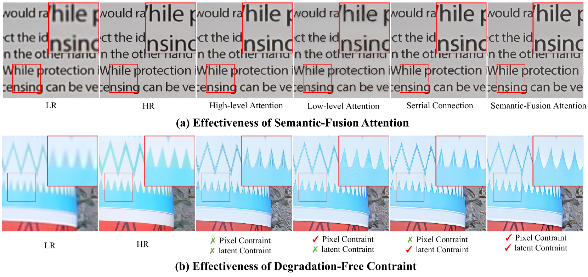

# [XPSR：探索扩散式图像超分辨率技术中的跨模态先验知识，旨在提升图像处理性能和质量。]

发布时间：2024年03月07日

`LLM应用`

> XPSR: Cross-modal Priors for Diffusion-based Image Super-Resolution

> 近年来，凭借强大的生成先验能力，基于扩散的方法在图像超分辨率（ISR）领域备受瞩目。但面对严重退化的低分辨率（LR）图像时，ISR模型往往难以准确捕获图像的语义和退化特征，从而可能导致恢复出的图像内容失真或出现不自然的伪影。为此，我们创新性地提出“跨模态先验超分辨率（XPSR）”框架。该框架内，利用前沿的多模态大型语言模型（MLLMs），为扩散模型提供精确而全面的语义条件。同时，我们设计了一种“语义融合注意力”机制，以促进跨模态先验的有效融合。为进一步剔除退化影响、保留语义信息，我们还在LR图像与其对应的高分辨率（HR）图像间增设了“无退化约束”。实验结果表明，无论是合成数据集还是真实世界数据集，XPSR都能生成具有高度保真度和逼真度的图像。相关代码将会在GitHub上的<https://github.com/qyp2000/XPSR>链接公布。

> Diffusion-based methods, endowed with a formidable generative prior, have received increasing attention in Image Super-Resolution (ISR) recently. However, as low-resolution (LR) images often undergo severe degradation, it is challenging for ISR models to perceive the semantic and degradation information, resulting in restoration images with incorrect content or unrealistic artifacts. To address these issues, we propose a \textit{Cross-modal Priors for Super-Resolution (XPSR)} framework. Within XPSR, to acquire precise and comprehensive semantic conditions for the diffusion model, cutting-edge Multimodal Large Language Models (MLLMs) are utilized. To facilitate better fusion of cross-modal priors, a \textit{Semantic-Fusion Attention} is raised. To distill semantic-preserved information instead of undesired degradations, a \textit{Degradation-Free Constraint} is attached between LR and its high-resolution (HR) counterpart. Quantitative and qualitative results show that XPSR is capable of generating high-fidelity and high-realism images across synthetic and real-world datasets. Codes will be released at \url{https://github.com/qyp2000/XPSR}.

[Arxiv](https://arxiv.org/abs/2403.05049)