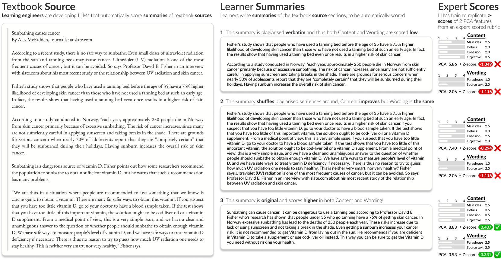
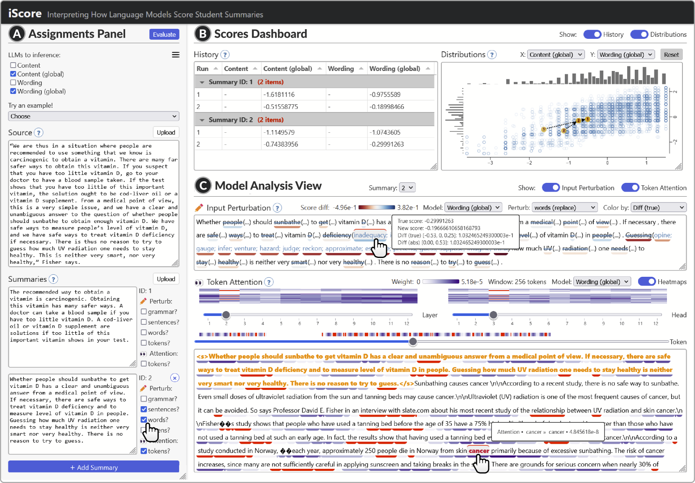
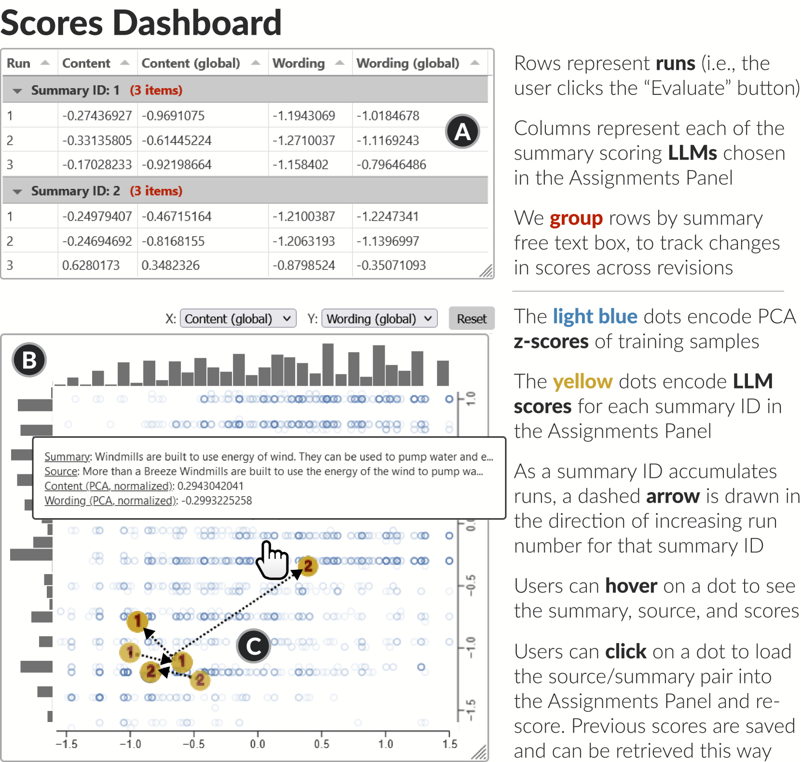
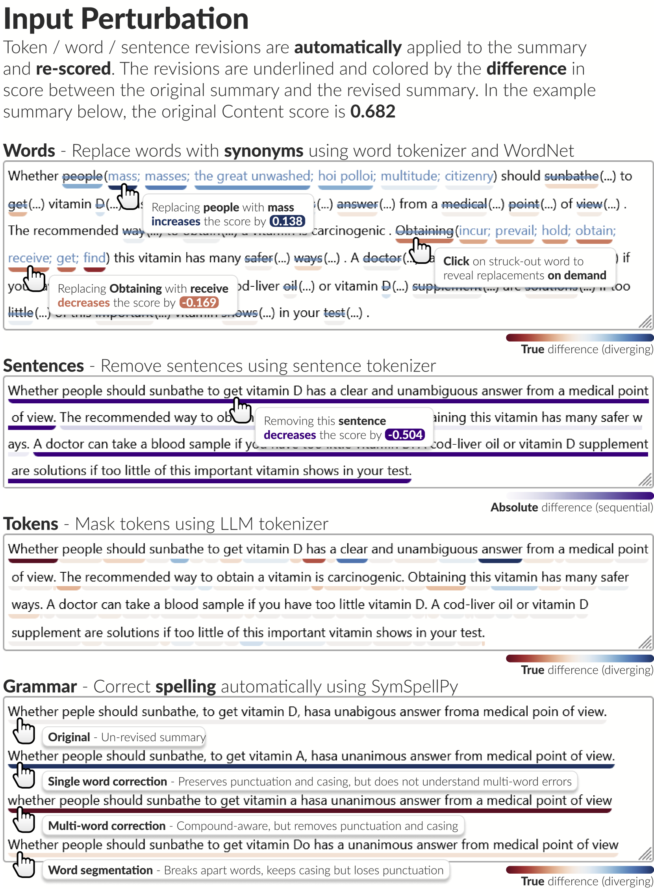
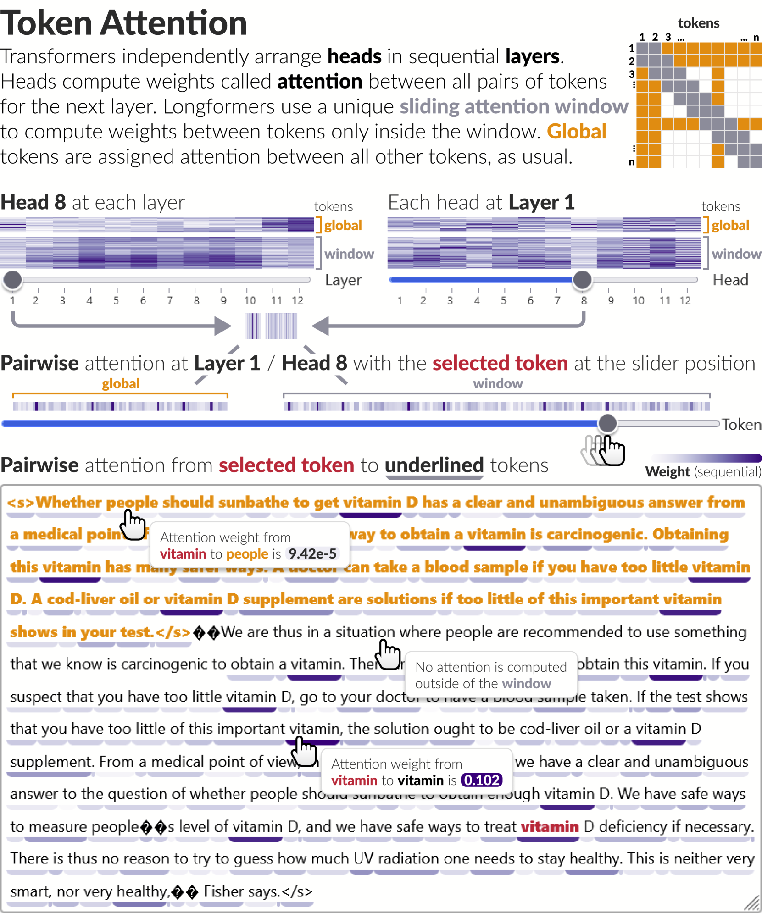

# [iScore 是一款可视化分析工具，它帮助我们理解语言模型如何自动评估和打分摘要内容。](https://arxiv.org/abs/2403.04760)

发布时间：2024年03月07日

`LLM应用`

> iScore: Visual Analytics for Interpreting How Language Models Automatically Score Summaries

> 随着LLMs的迅速普及，学习工程师们正积极将其应用于能自动评分概要写作的智能化教育工具。然而，在关键教育场景应用前，必须深入理解和严格评估LLMs，尤其是由于其庞大的规模和日益增多的参数导致在表现不佳时难以洞察内部运作，进而影响信任度。为此，我们与多位致力于构建和部署概要评分LLMs的学习工程师合作，通过以人为本的设计流程梳理出核心设计挑战与目标，涵盖了整合大量文本输入、追溯评分起源及提升LLM可解释性等多方面内容。为解决这些问题，我们创新研发了iScore这一交互式可视化分析工具，它允许学习工程师同时上传、评估和对比多个概要文件。借助iScore紧密集成的视图功能，用户可以循环优化概要文字表述，实时跟进LLM评分变化，并从多个抽象层面对模型权重进行可视化展示。为了验证工具的有效性，我们在一个月的时间内与三位学习工程师共同运用iScore开展实践。其中一个案例表明，通过与iScore的互动操作，一位学习工程师成功提高了其LLM评分准确率3个百分点。此外，通过对这些学习工程师的深度访谈，我们发现iScore在实际部署阶段确实助力他们更好地理解、评估LLMs，并逐步建立起对模型的信任。

> The recent explosion in popularity of large language models (LLMs) has inspired learning engineers to incorporate them into adaptive educational tools that automatically score summary writing. Understanding and evaluating LLMs is vital before deploying them in critical learning environments, yet their unprecedented size and expanding number of parameters inhibits transparency and impedes trust when they underperform. Through a collaborative user-centered design process with several learning engineers building and deploying summary scoring LLMs, we characterized fundamental design challenges and goals around interpreting their models, including aggregating large text inputs, tracking score provenance, and scaling LLM interpretability methods. To address their concerns, we developed iScore, an interactive visual analytics tool for learning engineers to upload, score, and compare multiple summaries simultaneously. Tightly integrated views allow users to iteratively revise the language in summaries, track changes in the resulting LLM scores, and visualize model weights at multiple levels of abstraction. To validate our approach, we deployed iScore with three learning engineers over the course of a month. We present a case study where interacting with iScore led a learning engineer to improve their LLM's score accuracy by three percentage points. Finally, we conducted qualitative interviews with the learning engineers that revealed how iScore enabled them to understand, evaluate, and build trust in their LLMs during deployment.

