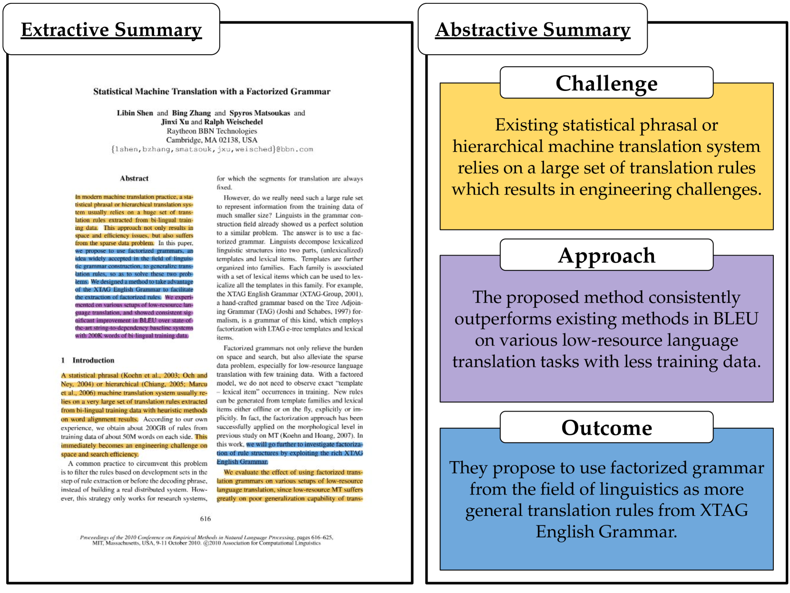
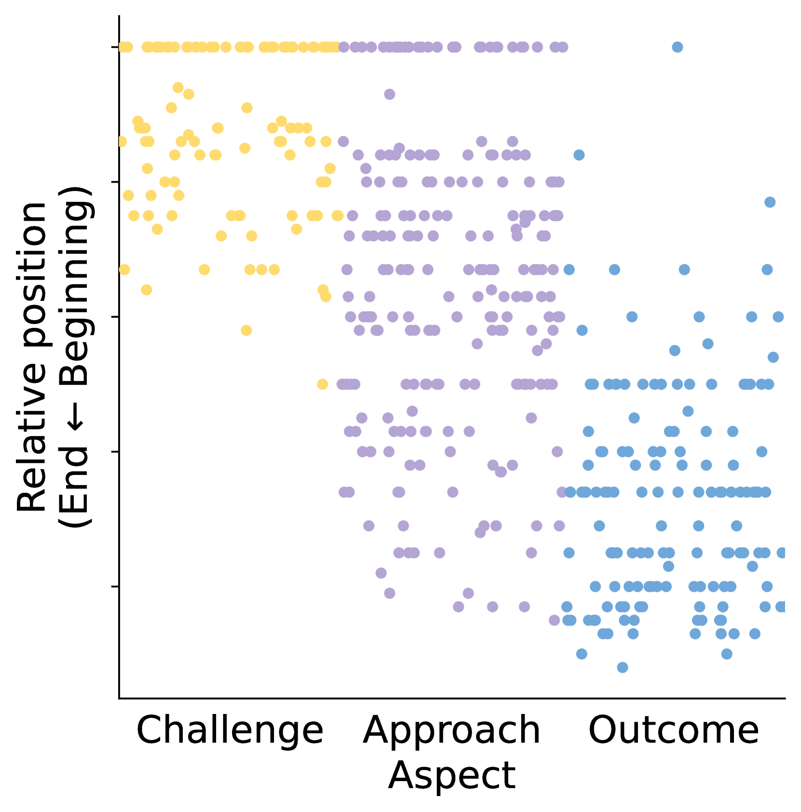
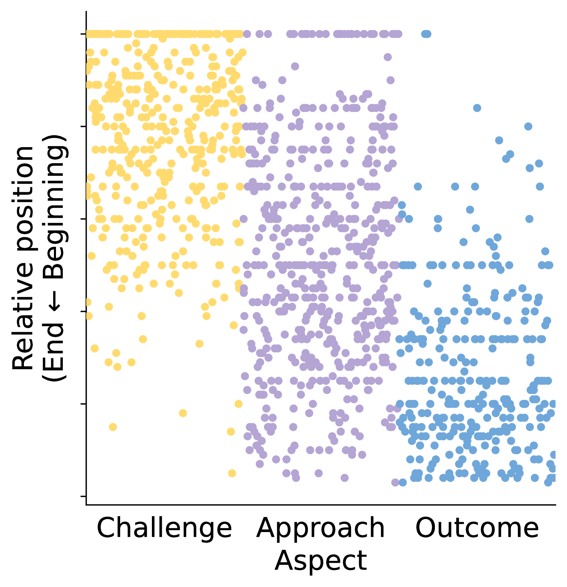
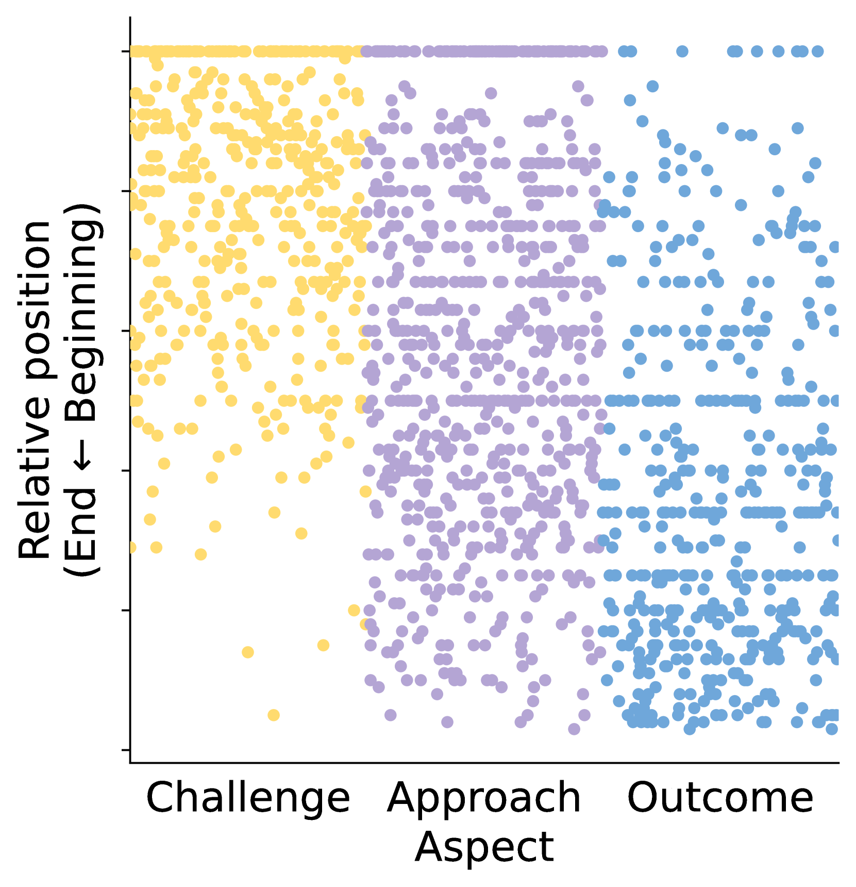
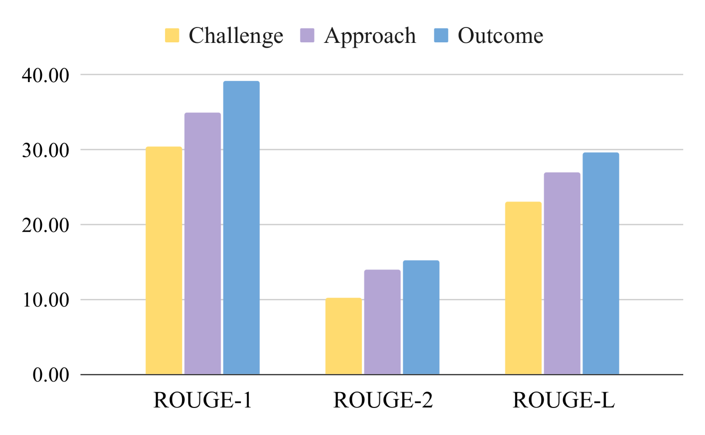
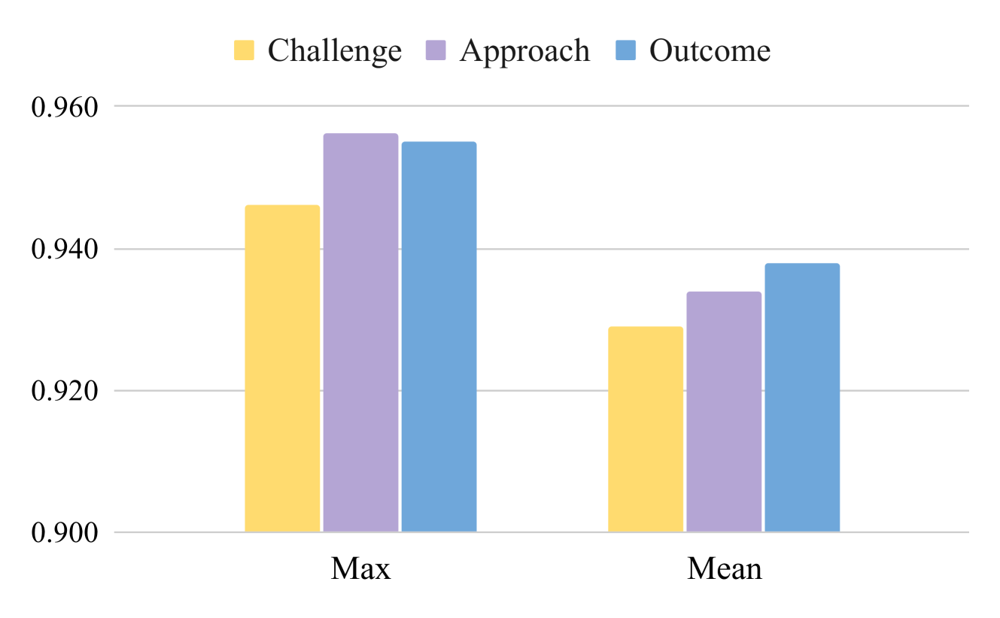
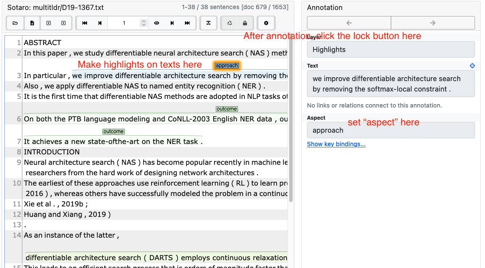

# ACLSum —— 专为科研论文打造的全新方面式摘要数据集

发布时间：2024年03月08日

`LLM应用`

> ACLSum: A New Dataset for Aspect-based Summarization of Scientific Publications

> 以往大量精力投入到了摘要数据集的研发，但多数资源依赖（半）自动化方式生成，主要通过网页抓取技术，这使得训练和评测摘要系统的素材品质受限，原因在于生成真实标准摘要的成本巨大，尤其对于多种语言和专业领域的多样性需求。针对这一问题，我们创新推出精心制作且经由领域专家严格评估的摘要数据集——ACLSum。它突破传统，能够对科研论文进行深度多维度摘要，覆盖挑战、方法及成果等方面。经过一系列广泛实验，我们不仅验证了此数据集的质量，还考察了基于预训练语言模型和当前顶级大型语言模型（LLMs）的模型表现。另外，我们基于自动识别的维度，在学术领域探究了抽取式与抽象式摘要的效果差异。研究结果印证了通用领域内的既有发现，并指出端到端的基于维度摘要方法整体上更具优势。该数据集现已公开发布在 https://github.com/sobamchan/aclsum。

> Extensive efforts in the past have been directed toward the development of summarization datasets. However, a predominant number of these resources have been (semi)-automatically generated, typically through web data crawling, resulting in subpar resources for training and evaluating summarization systems, a quality compromise that is arguably due to the substantial costs associated with generating ground-truth summaries, particularly for diverse languages and specialized domains. To address this issue, we present ACLSum, a novel summarization dataset carefully crafted and evaluated by domain experts. In contrast to previous datasets, ACLSum facilitates multi-aspect summarization of scientific papers, covering challenges, approaches, and outcomes in depth. Through extensive experiments, we evaluate the quality of our resource and the performance of models based on pretrained language models and state-of-the-art large language models (LLMs). Additionally, we explore the effectiveness of extractive versus abstractive summarization within the scholarly domain on the basis of automatically discovered aspects. Our results corroborate previous findings in the general domain and indicate the general superiority of end-to-end aspect-based summarization. Our data is released at https://github.com/sobamchan/aclsum.

[Arxiv](https://arxiv.org/abs/2403.05303)