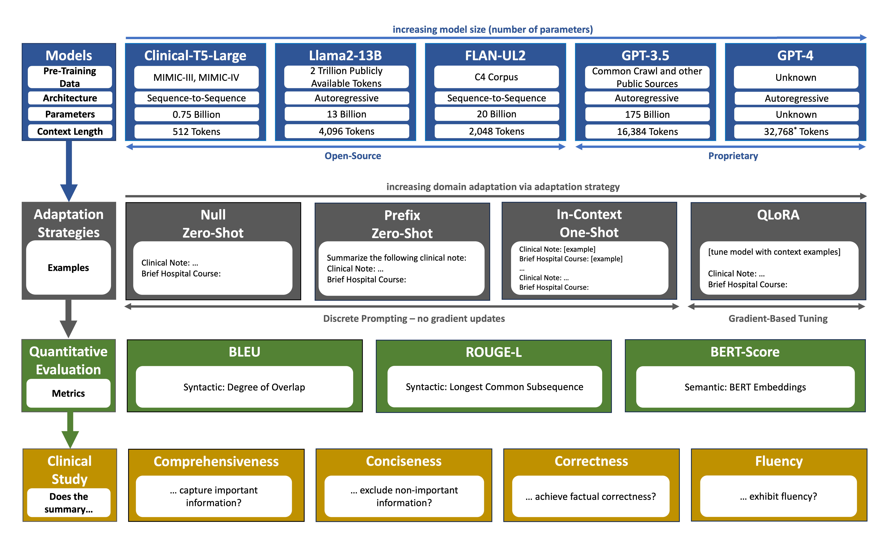
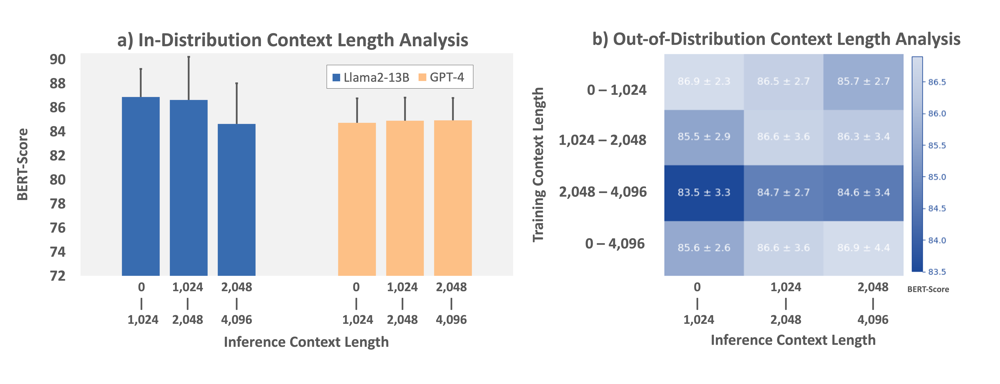
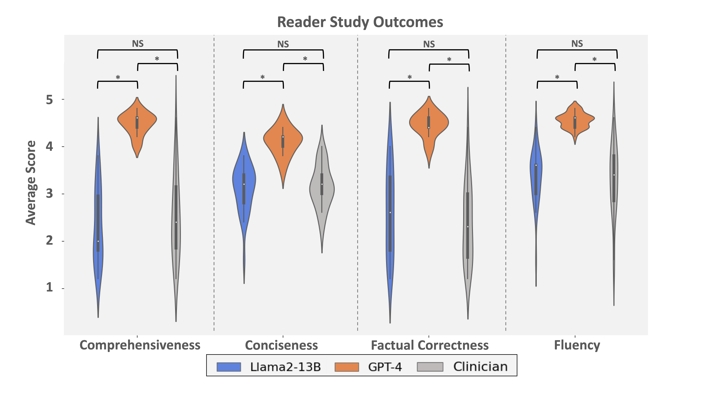

# [本研究提出了一项针对生成简要住院病程总结的大型语言模型领域适应能力的基准测试，旨在评估和比较各类经过特定医疗领域调整后的大型语言模型的表现。]

发布时间：2024年03月08日

`LLM应用`

> A Benchmark of Domain-Adapted Large Language Models for Generating Brief Hospital Course Summaries

> 简要住院病程总结（BHC）是通过对临床记录提炼而成的常见临床文档。尽管LLMs在解决实际任务时展现出了非凡实力，但在诸如BHC整合这样的医疗应用场景上的表现尚待探索。为促进LLMs在BHC整合上的应用，我们构建了一个创新的基准，并提供了一个源自MIMIC-IV临床笔记、经过预处理的数据集，其中包含了临床笔记与简要住院病程配对内容。我们评估了两类通用LLMs及三类针对医疗场景优化的LLMs在改善自临床记录生成BHC方面的能力。通过以临床记录为输入生成BHC，我们运用基于提示（利用上下文学习技术）和微调调整策略，对五个不同的LLMs（包括三个开源模型：Clinical-T5-Large、Llama2-13B和FLAN-UL2，以及两个专有模型：GPT-3.5和GPT-4）进行了试验。我们依据多种传统自然语言相似度指标，针对不同长度的输入，对这些LLMs的表现进行了量化评估。此外，我们还组织了一场定性研究，邀请了五名具备广泛专业背景的临床医师，在全面性、精炼性、事实准确性及通顺性等多个维度上，对30份样本中人工撰写的BHC和LLM生成的BHC进行盲测对比。总体而言，我们推出了一套全新的基准测试及预处理数据集，旨在推动LLMs在基于临床记录生成BHC领域的应用。实验结果显示，无论是在定量分析还是定性临床专家评审中，采用上下文学习的专有LLMs和经过微调的开源LLMs都能实现高质量的摘要生成。我们期望此研究能成为今后工作的一个基准参照，鼓励更多的研究来适应和评测LLMs在BHC整合任务上的效能。

> Brief hospital course (BHC) summaries are common clinical documents generated by summarizing clinical notes. While large language models (LLMs) depict remarkable capabilities in automating real-world tasks, their capabilities for healthcare applications such as BHC synthesis have not been shown. To enable the adaptation of LLMs for BHC synthesis, we introduce a novel benchmark consisting of a pre-processed dataset extracted from MIMIC-IV notes, encapsulating clinical note, and brief hospital course (BHC) pairs. We assess the performance of two general-purpose LLMs and three healthcare-adapted LLMs to improve BHC synthesis from clinical notes. Using clinical notes as input for generating BHCs, we apply prompting-based (using in-context learning) and fine-tuning-based adaptation strategies to three open-source LLMs (Clinical-T5-Large, Llama2-13B, FLAN-UL2) and two proprietary LLMs (GPT-3.5, GPT-4). We quantitatively evaluate the performance of these LLMs across varying context-length inputs using conventional natural language similarity metrics. We further perform a qualitative study where five diverse clinicians blindly compare clinician-written BHCs and two LLM-generated BHCs for 30 samples across metrics of comprehensiveness, conciseness, factual correctness, and fluency. Overall, we present a new benchmark and pre-processed dataset for using LLMs in BHC synthesis from clinical notes. We observe high-quality summarization performance for both in-context proprietary and fine-tuned open-source LLMs using both quantitative metrics and a qualitative clinical reader study. We propose our work as a benchmark to motivate future works to adapt and assess the performance of LLMs in BHC synthesis.

[Arxiv](https://arxiv.org/abs/2403.05720)