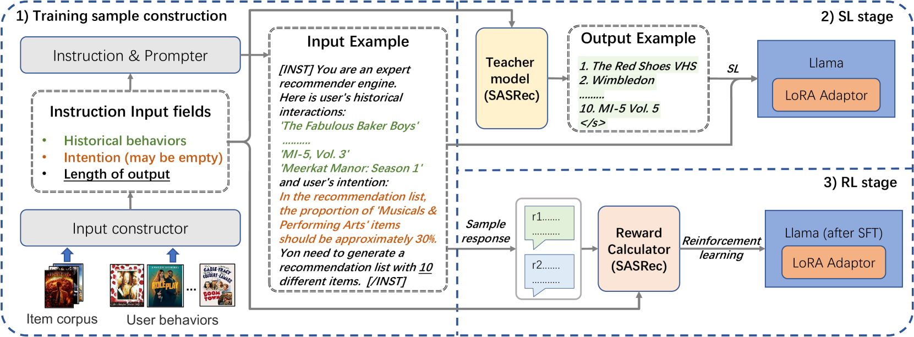

# 本研究致力于将大型语言模型与可控推荐相结合，通过调整和优化模型以实现更为精准且可控的推荐效果。

发布时间：2024年03月08日

`LLM应用`

> Aligning Large Language Models for Controllable Recommendations

> 受LLMs非凡智能启发，研究者正尝试将其应用于新一代对话式、可解释及可控的推荐系统。当前研究虽注重借助领域知识提升LLMs的推荐准确性，却往往忽视了其对指令执行的能力。为此，我们创新地引入了一系列利用传统推荐模型生成标签的监督学习任务，目标直指改善LLMs遵循推荐指令的专业性。接着，我们设计了一种强化学习驱动的校准方案，以深化LLMs理解用户需求并减少格式误判的能力。通过对两大真实数据集进行大规模实验，我们的方法有效提高了LLMs在推荐系统中遵循指令的表现力，并确保了高水准的精准推荐性能。

> Inspired by the exceptional general intelligence of Large Language Models (LLMs), researchers have begun to explore their application in pioneering the next generation of recommender systems - systems that are conversational, explainable, and controllable. However, existing literature primarily concentrates on integrating domain-specific knowledge into LLMs to enhance accuracy, often neglecting the ability to follow instructions. To address this gap, we initially introduce a collection of supervised learning tasks, augmented with labels derived from a conventional recommender model, aimed at explicitly improving LLMs' proficiency in adhering to recommendation-specific instructions. Subsequently, we develop a reinforcement learning-based alignment procedure to further strengthen LLMs' aptitude in responding to users' intentions and mitigating formatting errors. Through extensive experiments on two real-world datasets, our method markedly advances the capability of LLMs to comply with instructions within recommender systems, while sustaining a high level of accuracy performance.

[Arxiv](https://arxiv.org/abs/2403.05063)