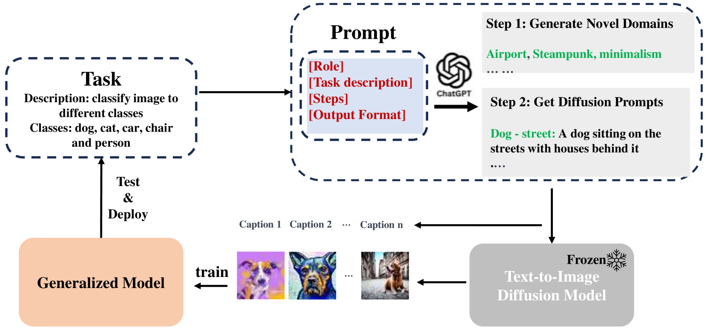
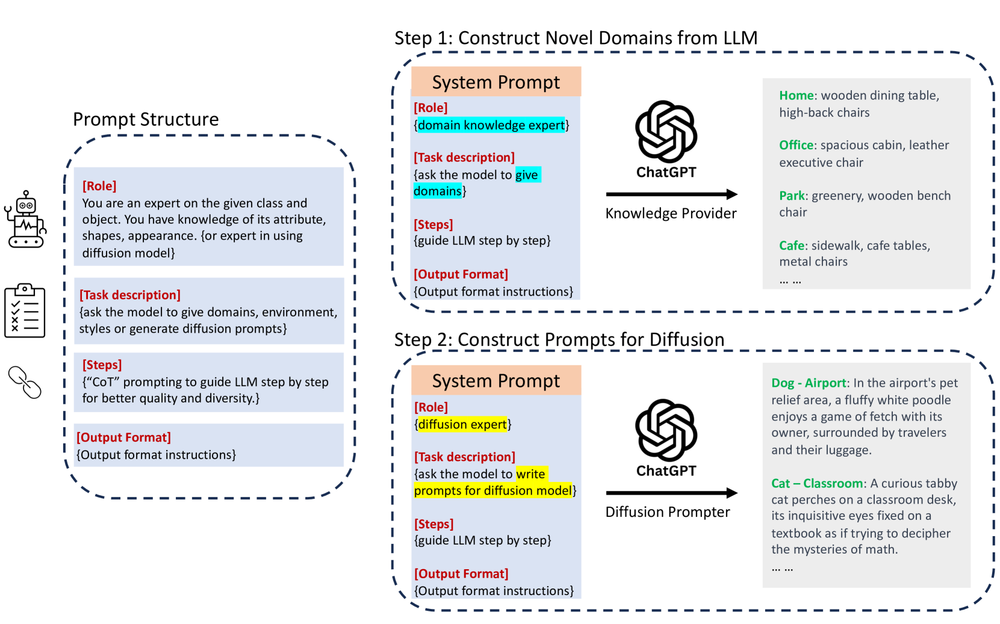

# [迈向无限可能：利用外推法突破数据局限，实现对未见过数据分布的泛化能力](https://arxiv.org/abs/2403.05523)

发布时间：2024年03月08日

`LLM应用`

> Beyond Finite Data: Towards Data-free Out-of-distribution Generalization via Extrapola

> 分布外泛化是深度神经网络渴望攻克的一大难题。然而，关键难点在于难以找到足够的源领域来让模型摆脱偶然特征的影响，从而习得不变的表达。虽然已有多种领域增强策略，但大多局限于对已有领域的内插操作，在创建真正“创新”的领域时往往捉襟见肘。相比之下，人类可以轻易地拓展至全新领域，这就引发了一个饶有兴趣的问题：神经网络如何借鉴人类的方式进行外推，进而实现OOD泛化呢？我们创新性地提出一种运用大型语言模型（LLMs）蕴含的强大推理能力和广泛知识来合成全新领域的外推方法。首先针对关注的目标类别，通过向LLMs提问获取相关的新颖领域知识。接着，借助文本转图像生成技术，我们将源自LLMs的文本中心知识与模型的像素输入空间有效连接起来。将这些高质量、如照片般逼真的新领域图像添加到领域泛化训练集中，我们得以在多个基准测试中，无论是单一还是多元领域泛化，都明显超越了当前所有已有的方法。鉴于此法能灵活地为任意类别外推至任意领域，理论上它有望在没有任何数据的情况下，针对任何任务训练出通用模型。为了进一步证明这一观点，我们提出了更为严苛的“无数据领域泛化”设定，旨在完全不依赖任何收集数据的情况下构建通用模型。实验结果有力支撑了以上论点，并且在诸如VLCS等数据集上，我们的方法在这一设定下表现卓越，甚至在某种程度上超越了监督学习方式，提升了约1-2\%的准确率。

> Out-of-distribution (OOD) generalization is a favorable yet challenging property for deep neural networks. The core challenges lie in the limited availability of source domains that help models learn an invariant representation from the spurious features. Various domain augmentation have been proposed but largely rely on interpolating existing domains and frequently face difficulties in creating truly "novel" domains. Humans, on the other hand, can easily extrapolate novel domains, thus, an intriguing question arises: How can neural networks extrapolate like humans and achieve OOD generalization?
  We introduce a novel approach to domain extrapolation that leverages reasoning ability and the extensive knowledge encapsulated within large language models (LLMs) to synthesize entirely new domains. Starting with the class of interest, we query the LLMs to extract relevant knowledge for these novel domains. We then bridge the gap between the text-centric knowledge derived from LLMs and the pixel input space of the model using text-to-image generation techniques. By augmenting the training set of domain generalization datasets with high-fidelity, photo-realistic images of these new domains, we achieve significant improvements over all existing methods, as demonstrated in both single and multi-domain generalization across various benchmarks.
  With the ability to extrapolate any domains for any class, our method has the potential to learn a generalized model for any task without any data. To illustrate, we put forth a much more difficult setting termed, data-free domain generalization, that aims to learn a generalized model in the absence of any collected data. Our empirical findings support the above argument and our methods exhibit commendable performance in this setting, even surpassing the supervised setting by approximately 1-2\% on datasets such as VLCS.

[Arxiv](https://arxiv.org/abs/2403.05523)