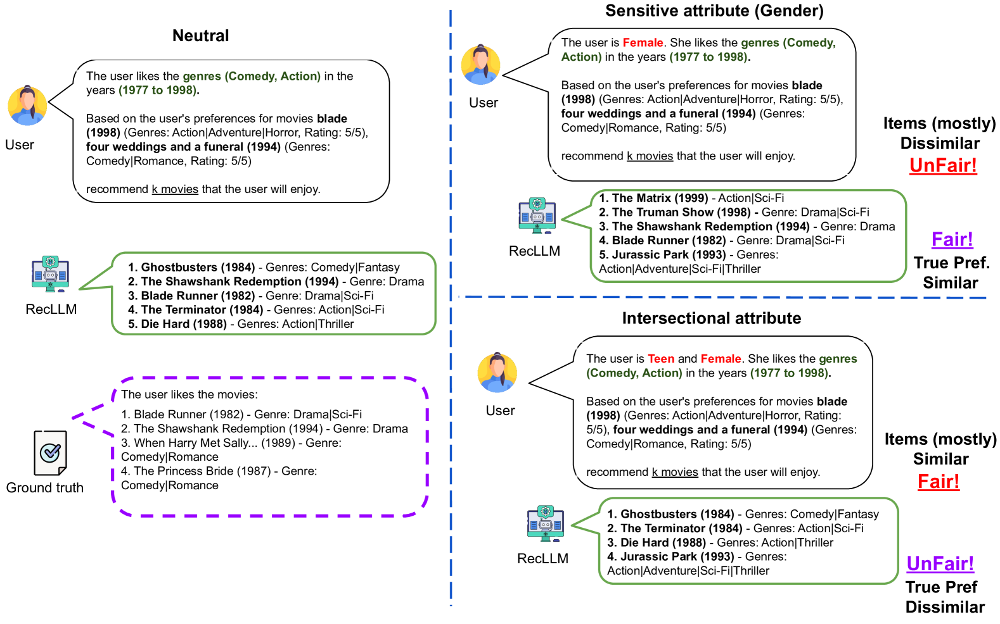
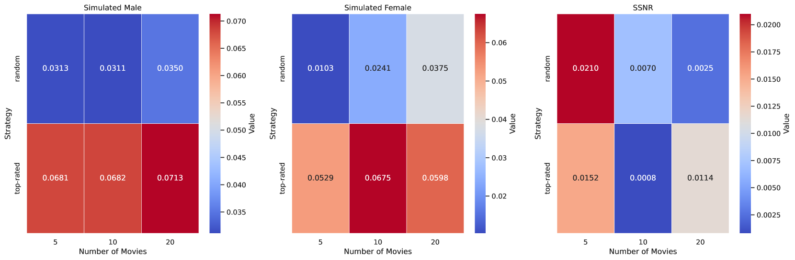

# [CFaiRLLM 是针对大型语言模型推荐系统的消费者公平性评测方案，旨在深入探究和评估该类系统中对消费者公平性的保障程度。](https://arxiv.org/abs/2403.05668)

发布时间：2024年03月08日

`LLM应用`

> CFaiRLLM: Consumer Fairness Evaluation in Large-Language Model Recommender System

> 随着LLM如ChatGPT等在推荐系统领域的应用革新，RecLLM这一新概念开启了推荐技术的新纪元。然而，尽管此类技术有望大幅提升个性化体验和效率，但其对公平性的考量却引发了深度关注，尤其是在敏感用户属性可能导致推荐结果无意识地延续或加剧偏见方面。为此，本研究提出了一套全面评估框架CFaiRLLM，旨在针对RecLLM中消费者一侧的偏见进行评估与缓解。我们系统地探究了RecLLMs的公平性，通过对比分析在推荐过程中加入性别、年龄等敏感属性及其交集情况下推荐结果的变化，并采用相似度对齐和真实偏好对齐两种方式。研究还通过观察在不同条件下的推荐生成，包括在用户提示中使用敏感属性的情形，以识别其中存在的潜在偏见。同时，我们深入研究了构建用户画像的不同精细化策略（如随机、热门、近期）对是否考虑敏感属性的推荐结果一致性产生的影响，进而揭示RecLLM内在的偏见形成机制。研究结果显示，在将敏感属性融入推荐流程后，尤其当单个或多个敏感属性共同作用时，推荐公平性方面的差距显著增大。进一步分析证实，选择何种用户画像抽样策略对最终的公平性结果有重大影响，这也进一步印证了在LLM时代追求公平推荐的复杂性和挑战。

> In the evolving landscape of recommender systems, the integration of Large Language Models (LLMs) such as ChatGPT marks a new era, introducing the concept of Recommendation via LLM (RecLLM). While these advancements promise unprecedented personalization and efficiency, they also bring to the fore critical concerns regarding fairness, particularly in how recommendations might inadvertently perpetuate or amplify biases associated with sensitive user attributes. In order to address these concerns, our study introduces a comprehensive evaluation framework, CFaiRLLM, aimed at evaluating (and thereby mitigating) biases on the consumer side within RecLLMs.
  Our research methodically assesses the fairness of RecLLMs by examining how recommendations might vary with the inclusion of sensitive attributes such as gender, age, and their intersections, through both similarity alignment and true preference alignment. By analyzing recommendations generated under different conditions-including the use of sensitive attributes in user prompts-our framework identifies potential biases in the recommendations provided. A key part of our study involves exploring how different detailed strategies for constructing user profiles (random, top-rated, recent) impact the alignment between recommendations made without consideration of sensitive attributes and those that are sensitive-attribute-aware, highlighting the bias mechanisms within RecLLMs.
  The findings in our study highlight notable disparities in the fairness of recommendations, particularly when sensitive attributes are integrated into the recommendation process, either individually or in combination. The analysis demonstrates that the choice of user profile sampling strategy plays a significant role in affecting fairness outcomes, highlighting the complexity of achieving fair recommendations in the era of LLMs.

[Arxiv](https://arxiv.org/abs/2403.05668)