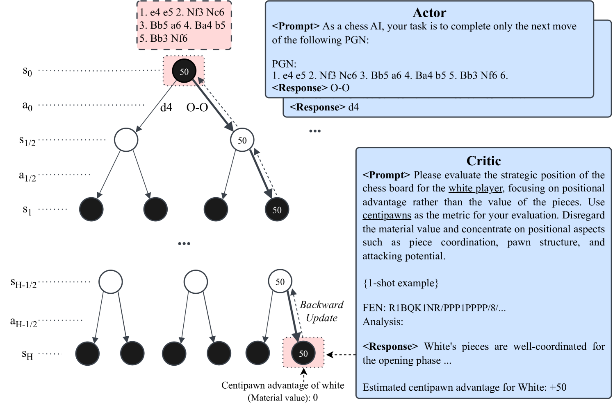

# [大型语言模型能否涉足游戏领域？我们通过一项以自我对弈法为切入点的案例研究，探索这一可能性。]

发布时间：2024年03月08日

`Agent`

> Can Large Language Models Play Games? A Case Study of A Self-Play Approach

> LLMs凭借互联网大数据的力量，积累了丰富先验知识，但在推理能力和抵抗幻觉现象等方面存在局限，影响其作为决策辅助工具的可靠性。与此同时，MCTS作为一种借助递归模拟和自对弈机制实现可靠决策的启发式搜索算法，在复杂决策情境下，其有效性高度依赖于启发式剪枝及外部价值函数的支持。本研究创新性地融合LLMs与MCTS自我对弈技术，无需额外训练就能有效解决如国际象棋和围棋这类确定性轮流零和游戏(DTZG)。具体而言，我们巧妙地运用LLMs同时担当动作剪枝角色和价值函数代理，全程无需任何附加训练。理论分析表明，我们提出的这种方法中，估算值的次优化程度与$\tilde{\mathcal O}\Bigl(\frac{|\tilde {\mathcal A}|}{\sqrt{N}} + ε_\mathrm{pruner} + ε_\mathrm{critic}\Bigr)$成正比关系，其中$N$表示模拟次数，$|\tilde {\mathcal A}|$代表经由LLMs修剪后动作空间的数量级，而$ε_\mathrm{pruner}$和$ε_\mathrm{critic}$则分别量化了LLMs在动作剪枝和价值函数代理过程中引入的误差大小。实验证明，这一方法在国际象棋和围棋上的应用不仅成功应对了超越MCTS局限性的挑战，还显著提升了直接应用LLMs时的性能表现。

> Large Language Models (LLMs) harness extensive data from the Internet, storing a broad spectrum of prior knowledge. While LLMs have proven beneficial as decision-making aids, their reliability is hampered by limitations in reasoning, hallucination phenomenon, and so on. On the other hand, Monte-Carlo Tree Search (MCTS) is a heuristic search algorithm that provides reliable decision-making solutions, achieved through recursive rollouts and self-play. However, the effectiveness of MCTS relies heavily on heuristic pruning and external value functions, particularly in complex decision scenarios. This work introduces an innovative approach that bolsters LLMs with MCTS self-play to efficiently resolve deterministic turn-based zero-sum games (DTZG), such as chess and go, without the need for additional training. Specifically, we utilize LLMs as both action pruners and proxies for value functions without the need for additional training. We theoretically prove that the suboptimality of the estimated value in our proposed method scales with $\tilde{\mathcal O}\Bigl(\frac{|\tilde {\mathcal A}|}{\sqrt{N}} + ε_\mathrm{pruner} + ε_\mathrm{critic}\Bigr)$, where \(N\) is the number of simulations, $|\tilde {\mathcal A}|$ is the cardinality of the pruned action space by LLM, and $ε_\mathrm{pruner}$ and $ε_\mathrm{critic}$ quantify the errors incurred by adopting LLMs as action space pruner and value function proxy, respectively. Our experiments in chess and go demonstrate the capability of our method to address challenges beyond the scope of MCTS and improve the performance of the directly application of LLMs.

[Arxiv](https://arxiv.org/abs/2403.05632)