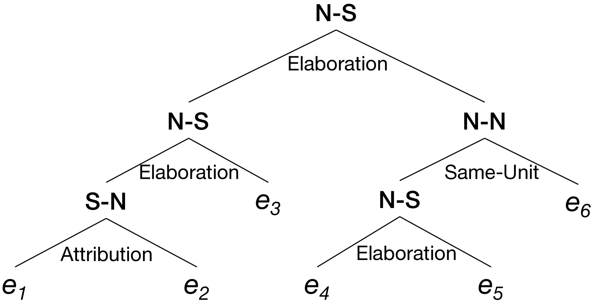
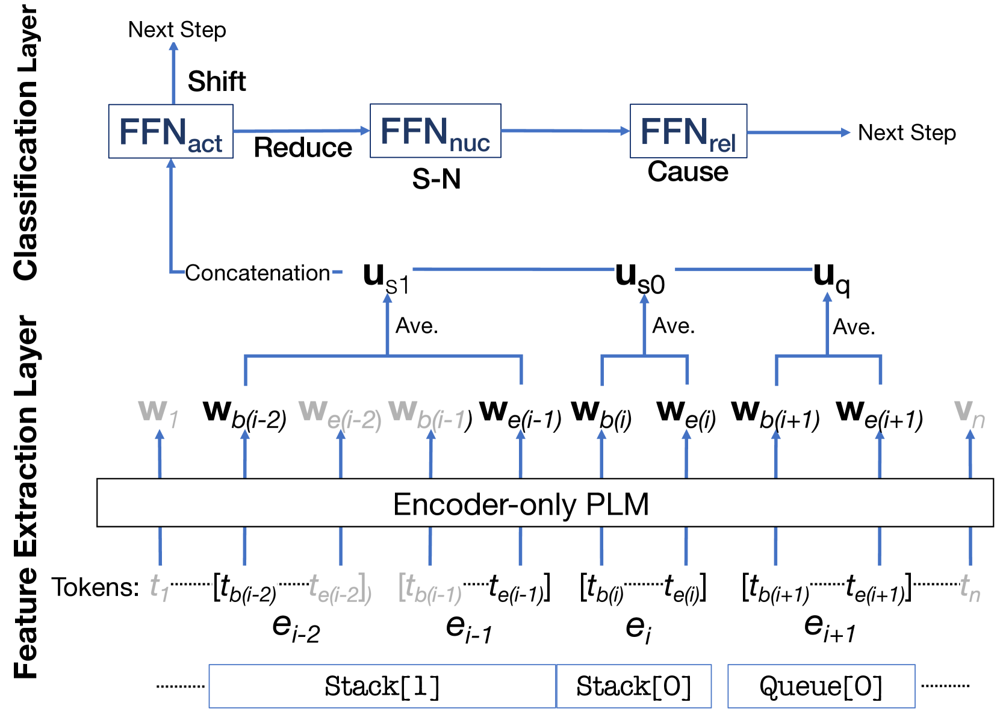
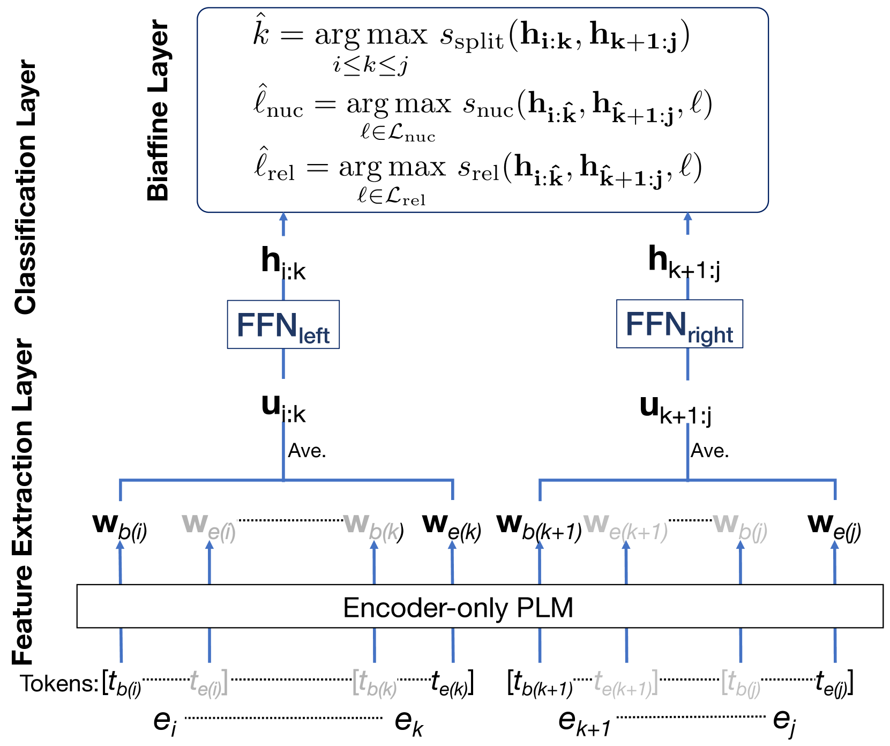
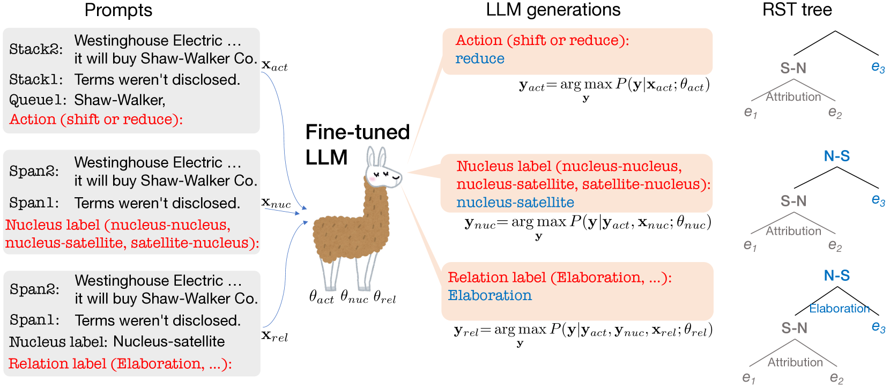
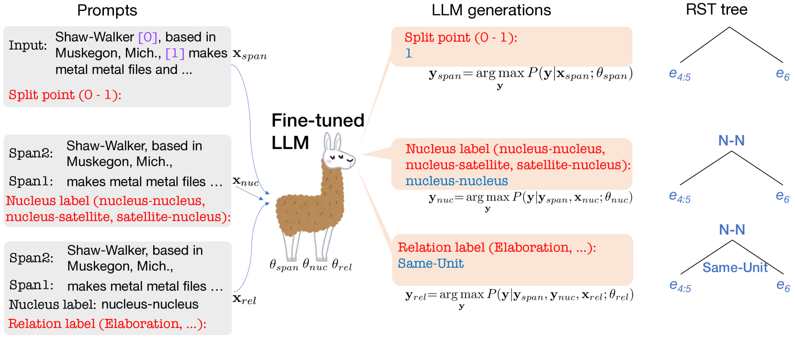
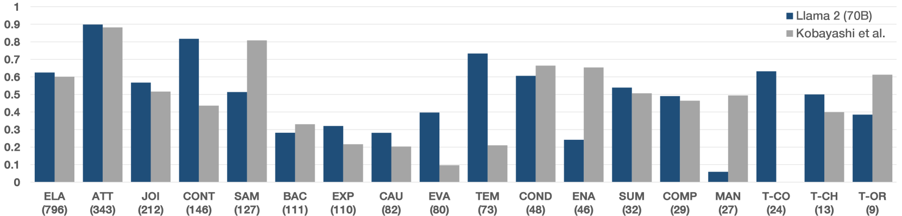

# [在 RST 对话解析任务上，大型语言模型能否助力我们实现显著突破？]

发布时间：2024年03月08日

`RAG`

> Can we obtain significant success in RST discourse parsing by using Large Language Models?

> 近年来，数十亿参数级的解码器-only预训练LLMs在多种NLP任务中取得了突破性进展。然而，对于LLMs能否有效处理篇章解析这一特定任务，尤其是基于RST的篇章解析，尚待深入探究。为此，本论文积极探索LLMs在RST篇章解析方面的应用潜力，将自顶向下和自底向上的两种基础解析策略转换为适合LLMs处理的提示形式。我们选用Llama 2模型，并借助参数精简、便于微调的QLoRA方法进行优化调整。实验在RST-DT、Instr-DT以及GUM三大权威数据集上展开，结果显示，在自底向上的策略下，参数高达700亿的Llama 2模型以显著优势刷新了SOTA纪录。不仅如此，我们的解析器在RST-DT数据集上展现出强大的泛化能力，即使仅使用GUM语料库训练，其性能也能与那些专门针对RST-DT训练的已有解析器相媲美。

> Recently, decoder-only pre-trained large language models (LLMs), with several tens of billion parameters, have significantly impacted a wide range of natural language processing (NLP) tasks. While encoder-only or encoder-decoder pre-trained language models have already proved to be effective in discourse parsing, the extent to which LLMs can perform this task remains an open research question. Therefore, this paper explores how beneficial such LLMs are for Rhetorical Structure Theory (RST) discourse parsing. Here, the parsing process for both fundamental top-down and bottom-up strategies is converted into prompts, which LLMs can work with. We employ Llama 2 and fine-tune it with QLoRA, which has fewer parameters that can be tuned. Experimental results on three benchmark datasets, RST-DT, Instr-DT, and the GUM corpus, demonstrate that Llama 2 with 70 billion parameters in the bottom-up strategy obtained state-of-the-art (SOTA) results with significant differences. Furthermore, our parsers demonstrated generalizability when evaluated on RST-DT, showing that, in spite of being trained with the GUM corpus, it obtained similar performances to those of existing parsers trained with RST-DT.

[Arxiv](https://arxiv.org/abs/2403.05065)