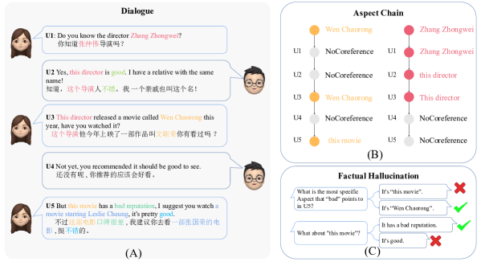
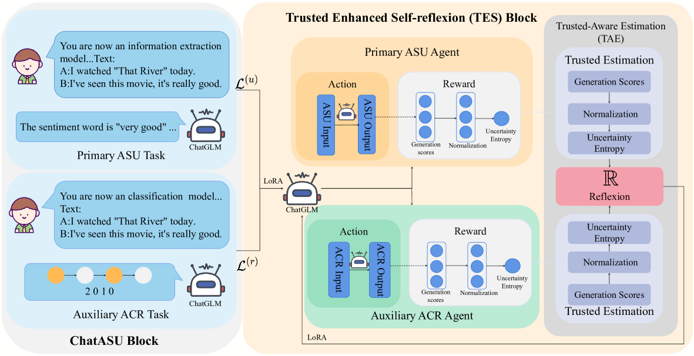
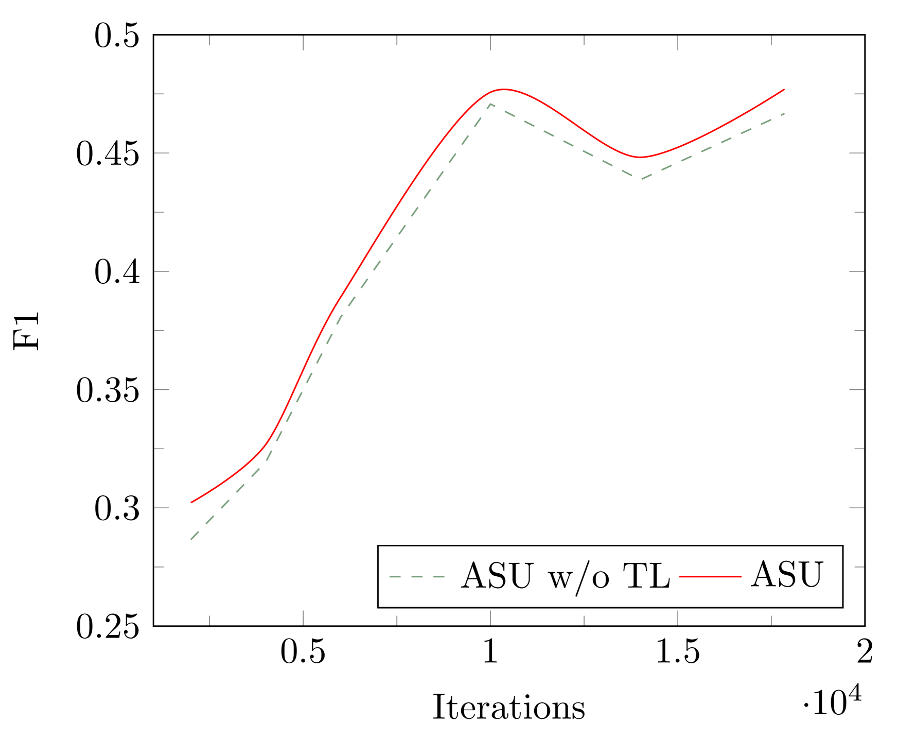
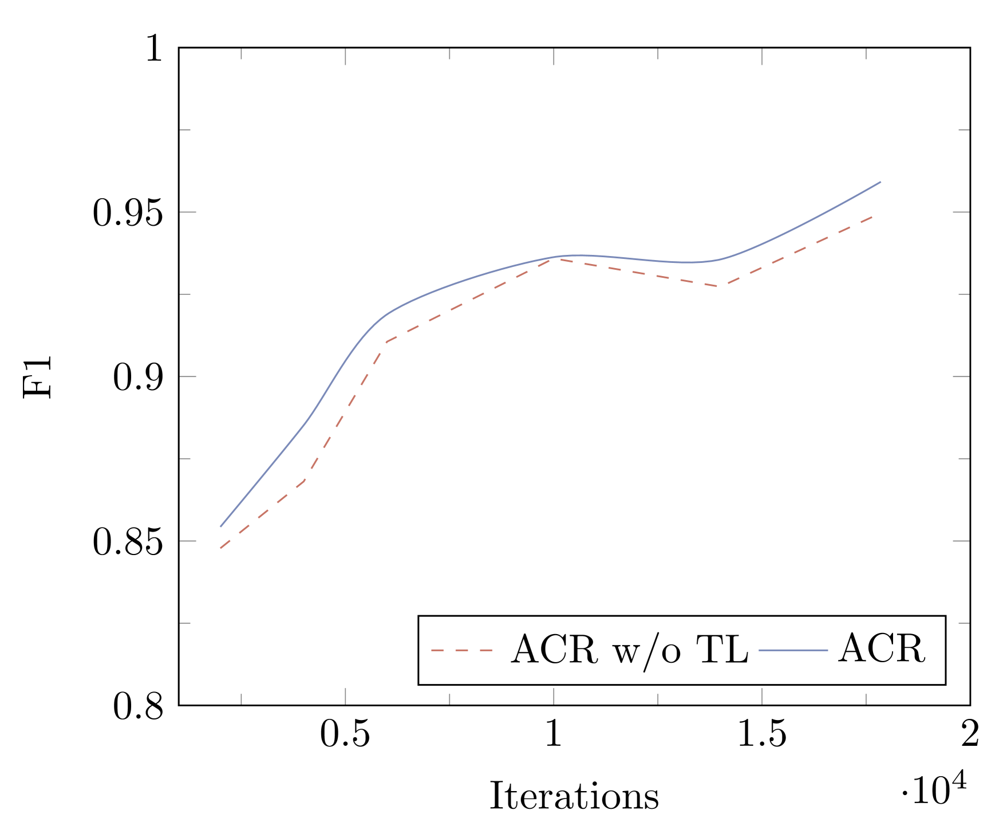
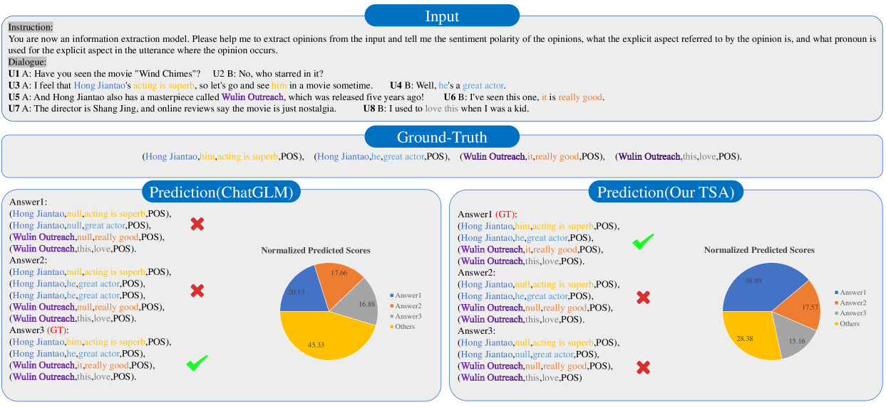

# ChatASU 研究通过触发 LLM 在对话情境中的深度反思，旨在真实捕捉和理解方面的具体情感倾向。

发布时间：2024年03月08日

`LLM应用`

> ChatASU: Evoking LLM's Reflexion to Truly Understand Aspect Sentiment in Dialogues

# 摘要

> 近年来，ASU在问答、对话等交互场景的研究热度不断攀升并取得重大突破。但现有研究在处理交互式ASU时，普遍忽视了观点对象（即方面）的代词指代问题，而这个问题在对话等交互场景中却极为常见，这无疑制约了ASU性能的提升。随着LLMs展现出整合多种NLP任务的强大实力，本论文创新性地提出了基于对话的方面情感理解新任务——ChatASU，旨在探究LLMs在对话情境下理解方面情感的潜力。其中，ChatASU任务特别设计了一个子任务——方面链推理（ACR），用于解决方面代词一致性难题。在此基础上，我们构建了一个名为可信自省方法（TSA）的解决方案，以ChatGLM为核心支撑。该方法巧妙地将ACR任务作为辅助手段，以提高ASU主任务的表现力，并且通过融入可信学习机制到自省模块中，有效减轻LLMs内在的事实虚构问题。为了验证TSA的有效性，我们精心构建了一个高质量的ChatASU数据集，并进行了大量对比实验。实验结果显示，我们提出的TSA方案明显超越了几款前沿的基准方法，有力证明了TSA在ChatASU领域的优越效果及充分考虑代词一致性和虚构问题在ChatASU研究中的重要意义。

> Aspect Sentiment Understanding (ASU) in interactive scenarios (e.g., Question-Answering and Dialogue) has attracted ever-more interest in recent years and achieved important progresses. However, existing studies on interactive ASU largely ignore the coreference issue for opinion targets (i.e., aspects), while this phenomenon is ubiquitous in interactive scenarios especially dialogues, limiting the ASU performance. Recently, large language models (LLMs) shows the powerful ability to integrate various NLP tasks with the chat paradigm. In this way, this paper proposes a new Chat-based Aspect Sentiment Understanding (ChatASU) task, aiming to explore LLMs' ability in understanding aspect sentiments in dialogue scenarios. Particularly, this ChatASU task introduces a sub-task, i.e., Aspect Chain Reasoning (ACR) task, to address the aspect coreference issue. On this basis, we propose a Trusted Self-reflexion Approach (TSA) with ChatGLM as backbone to ChatASU. Specifically, this TSA treats the ACR task as an auxiliary task to boost the performance of the primary ASU task, and further integrates trusted learning into reflexion mechanisms to alleviate the LLMs-intrinsic factual hallucination problem in TSA. Furthermore, a high-quality ChatASU dataset is annotated to evaluate TSA, and extensive experiments show that our proposed TSA can significantly outperform several state-of-the-art baselines, justifying the effectiveness of TSA to ChatASU and the importance of considering the coreference and hallucination issues in ChatASU.

[Arxiv](https://arxiv.org/abs/2403.05326)