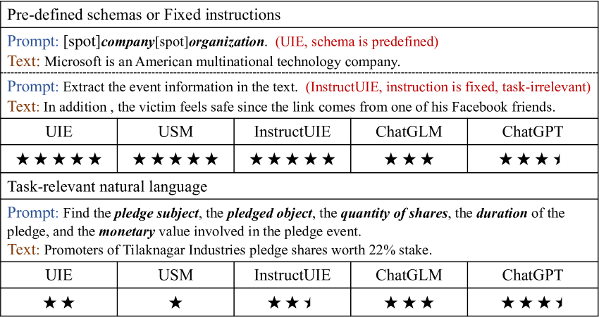
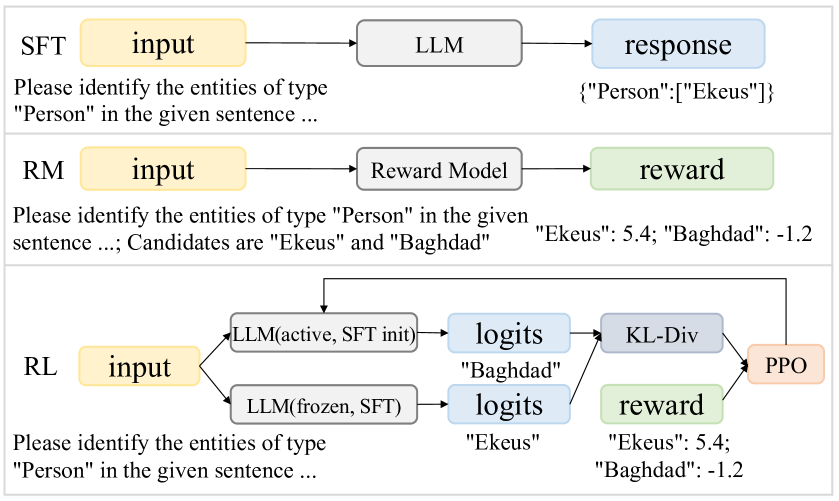
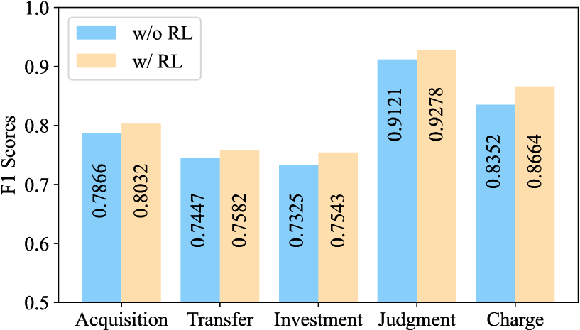
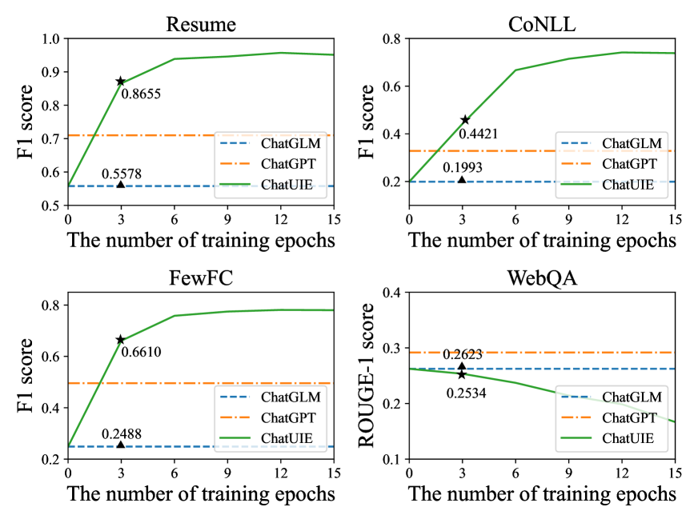
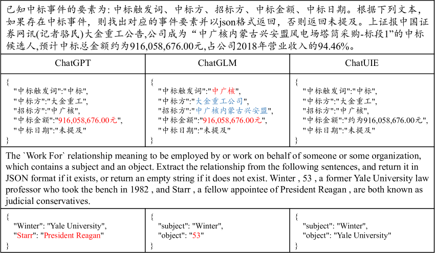

# [ChatUIE 是一项研究，借助大型语言模型的力量，致力于探究和实现基于聊天模式的统一信息抽取技术。]

发布时间：2024年03月08日

`LLM应用`

> ChatUIE: Exploring Chat-based Unified Information Extraction using Large Language Models

> 近期大模型在一般聊天场景中的表现颇为抢眼，但在诸如信息抽取等特定领域的能力仍有局限。过去基于提示的方法在处理非预设模式或指令的自然语言时，抽取结构化信息颇具难度。因此，我们着手研究将领域特异性建模应用于聊天式语言模型中，以期有效提取自然语言中的结构化信息。本文介绍了一款名为ChatUIE的创新型统一信息抽取框架，它构建于ChatGLM之上，并巧妙地运用强化学习优化和协调各类涉及复杂及样本不足的任务。我们还引入了生成约束机制，解决生成与输入无关元素的问题。实验证明，ChatUIE能在较小程度牺牲聊天能力的同时，显著提升信息抽取的表现。

> Recent advancements in large language models have shown impressive performance in general chat. However, their domain-specific capabilities, particularly in information extraction, have certain limitations. Extracting structured information from natural language that deviates from known schemas or instructions has proven challenging for previous prompt-based methods. This motivated us to explore domain-specific modeling in chat-based language models as a solution for extracting structured information from natural language. In this paper, we present ChatUIE, an innovative unified information extraction framework built upon ChatGLM. Simultaneously, reinforcement learning is employed to improve and align various tasks that involve confusing and limited samples. Furthermore, we integrate generation constraints to address the issue of generating elements that are not present in the input. Our experimental results demonstrate that ChatUIE can significantly improve the performance of information extraction with a slight decrease in chatting ability.

[Arxiv](https://arxiv.org/abs/2403.05132)