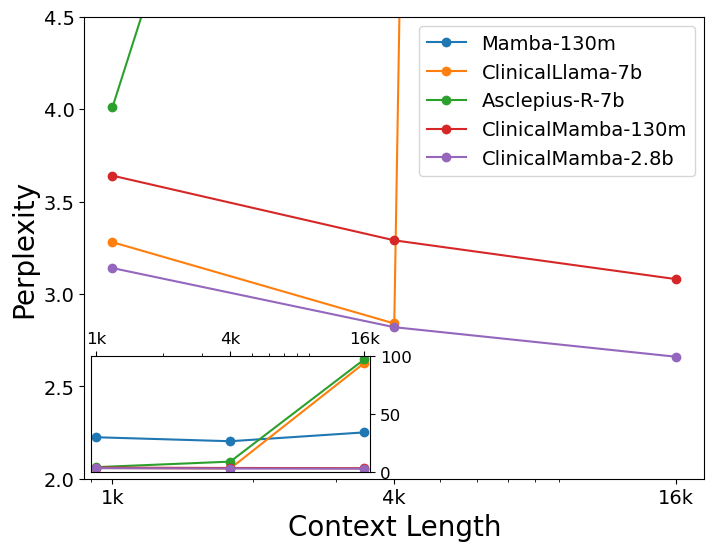
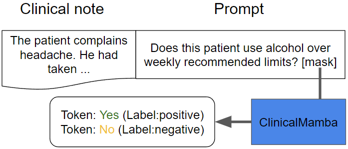
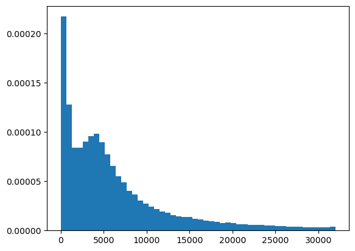

# ClinicalMamba——一款在连续性临床笔记上训练出的生成式临床语言模型，专门针对纵向临床记录进行设计和构建。

发布时间：2024年03月08日

`LLM应用`

> ClinicalMamba: A Generative Clinical Language Model on Longitudinal Clinical Notes

# 摘要

> 医疗健康领域的NLP系统之所以能取得突破，关键在于语言模型能够理解深藏于临床笔记中的复杂信息，这通常涉及梳理患者整个医疗历程中的不同时间点信息。然而，早先的临床语言模型大多局限于单篇临床文档的上下文长度进行预训练。本研究引入了一款专为医学领域打造的 ClinicalMamba，它是基于大规模纵向临床笔记语料库预训练的Mamba语言模型变体，精准对应医学领域的独特语言特征与信息处理需求。ClinicalMamba拥有1.3亿至28亿参数量，在处理跨长文本段落的临床语言建模任务时，相较于Mamba、临床Llama等模型表现出更优的性能。通过少量样本学习，ClinicalMamba在纵向临床笔记信息提取任务中实现了高速度和高精度的双重飞跃，不仅超越现有临床语言模型，还在该领域击败了像GPT-4这样的通用领域大型模型。

> The advancement of natural language processing (NLP) systems in healthcare hinges on language model ability to interpret the intricate information contained within clinical notes. This process often requires integrating information from various time points in a patient's medical history. However, most earlier clinical language models were pretrained with a context length limited to roughly one clinical document. In this study, We introduce ClinicalMamba, a specialized version of the Mamba language model, pretrained on a vast corpus of longitudinal clinical notes to address the unique linguistic characteristics and information processing needs of the medical domain. ClinicalMamba, with 130 million and 2.8 billion parameters, demonstrates a superior performance in modeling clinical language across extended text lengths compared to Mamba and clinical Llama. With few-shot learning, ClinicalMamba achieves notable benchmarks in speed and accuracy, outperforming existing clinical language models and general domain large models like GPT-4 in longitudinal clinical notes information extraction tasks.

[Arxiv](https://arxiv.org/abs/2403.05795)