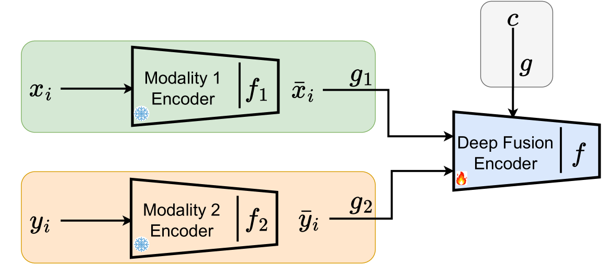
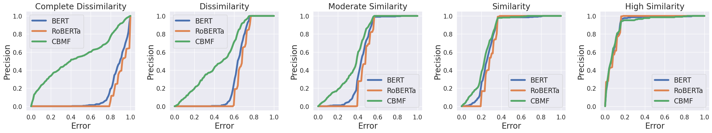
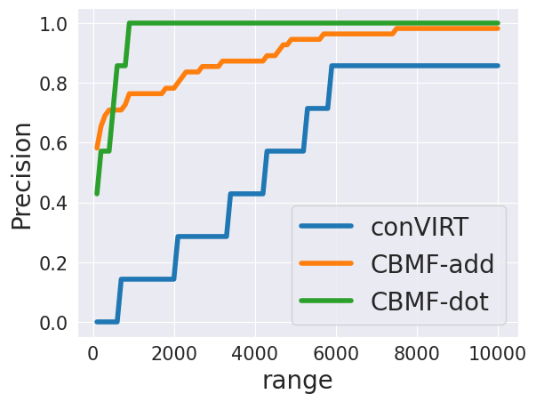

# [情境化多模态融合技术，是指将不同模态的信息在特定语境下进行有效整合的过程。](https://arxiv.org/abs/2403.04650)

发布时间：2024年03月08日

`Agent` `多模态` `机器学习`

> Context-Based Multimodal Fusion

> 融合模型广泛应用于多模态任务中，能高效整合多元信息，但其在跨模态对齐数据分布上存在显著短板，影响到学习鲁棒表示的一致性和效率。尽管对准模型针对性地解决了这一难题，但实现最佳效果通常需从零开始训练并依赖大规模数据集，导致高昂的时间和资源投入。为此，我们创新性地提出了基于上下文的多模态融合模型（CBMF），它巧妙地结合了模态融合与数据分布对齐技术。在CBMF中，每个模态通过独特上下文向量与自身的嵌入相结合，使得我们可以利用可冻结的大型预训练模型，有效降低计算负担和训练数据需求。同时，该网络通过与上下文融合的方式学会辨别不同模态的嵌入，并运用对比自监督学习策略实现数据分布的精准对齐。因此，CBMF为解决复杂的多模态任务提供了一种既高效又经济的理想方案。

> The fusion models, which effectively combine information from different sources, are widely used in solving multimodal tasks. However, they have significant limitations related to aligning data distributions across different modalities. This challenge can lead to inconsistencies and difficulties in learning robust representations. Alignment models, while specifically addressing this issue, often require training "from scratch" with large datasets to achieve optimal results, which can be costly in terms of resources and time. To overcome these limitations, we propose an innovative model called Context-Based Multimodal Fusion (CBMF), which combines both modality fusion and data distribution alignment. In CBMF, each modality is represented by a specific context vector, fused with the embedding of each modality. This enables the use of large pre-trained models that can be frozen, reducing the computational and training data requirements. Additionally, the network learns to differentiate embeddings of different modalities through fusion with context and aligns data distributions using a contrastive approach for self-supervised learning. Thus, CBMF offers an effective and economical solution for solving complex multimodal tasks.

[Arxiv](https://arxiv.org/abs/2403.04650)