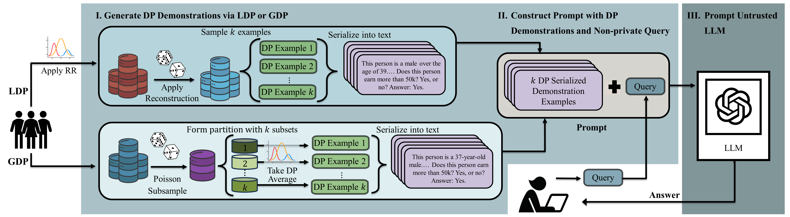
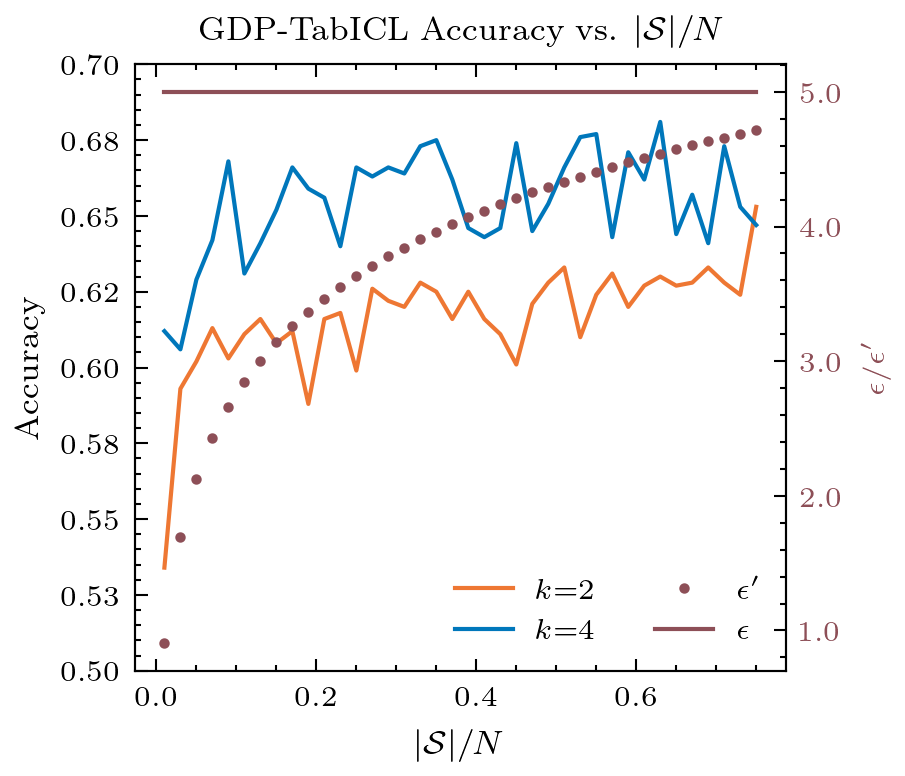
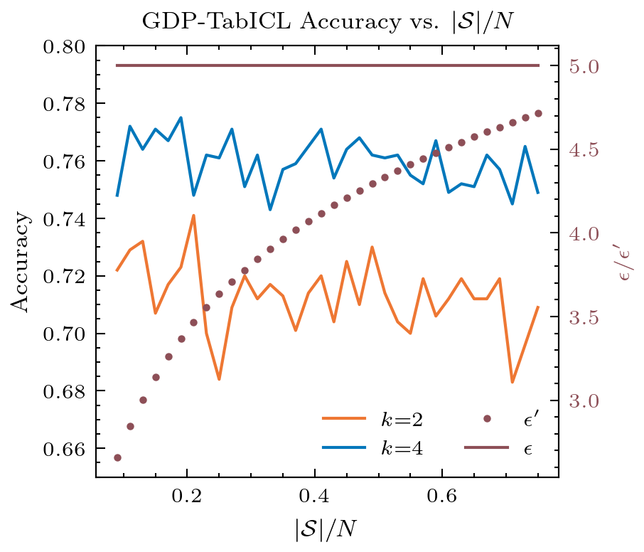

# [DP-TabICL：探索在带有差分隐私保护的表格数据环境中进行上下文学习的能力](https://arxiv.org/abs/2403.05681)

发布时间：2024年03月08日

`LLM应用`

> DP-TabICL: In-Context Learning with Differentially Private Tabular Data

> ICL技术让LLMs通过参考问题-答案对样例轻松适应新任务，其效果堪比耗时的模型重训与微调。最近这一技术进一步延伸，将表格数据转化为自然语言格式作为示例，用于ICL中。然而，由于LLMs可能泄露提示中的信息，而表格数据往往富含敏感内容，因此研究如何在ICL过程中保护原始表格数据隐私成为研究热点。本文首开先河，探索运用久负盛名的数据隐私保护工具——差分隐私（DP），确保ICL中表格数据的安全性。具体而言，我们提出两种具备严格隐私保证的私密ICL框架——分别在本地（LDP-TabICL）和全局（GDP-TabICL）DP环境下，通过对单个记录或整体统计信息添加噪声实现。这两个框架均经过严密证明，确保隐私不被侵犯。我们使用八个真实世界的表格数据集，在多种ICL及DP配置下检验了基于DP的框架性能。实验证明，基于DP的ICL在有效保护表格数据隐私的同时，也能保持与非LLM基准相当的表现力，尤其在高度注重隐私保护的场景下表现更为出色。

> In-context learning (ICL) enables large language models (LLMs) to adapt to new tasks by conditioning on demonstrations of question-answer pairs and it has been shown to have comparable performance to costly model retraining and fine-tuning. Recently, ICL has been extended to allow tabular data to be used as demonstration examples by serializing individual records into natural language formats. However, it has been shown that LLMs can leak information contained in prompts, and since tabular data often contain sensitive information, understanding how to protect the underlying tabular data used in ICL is a critical area of research. This work serves as an initial investigation into how to use differential privacy (DP) -- the long-established gold standard for data privacy and anonymization -- to protect tabular data used in ICL. Specifically, we investigate the application of DP mechanisms for private tabular ICL via data privatization prior to serialization and prompting. We formulate two private ICL frameworks with provable privacy guarantees in both the local (LDP-TabICL) and global (GDP-TabICL) DP scenarios via injecting noise into individual records or group statistics, respectively. We evaluate our DP-based frameworks on eight real-world tabular datasets and across multiple ICL and DP settings. Our evaluations show that DP-based ICL can protect the privacy of the underlying tabular data while achieving comparable performance to non-LLM baselines, especially under high privacy regimes.

[Arxiv](https://arxiv.org/abs/2403.05681)