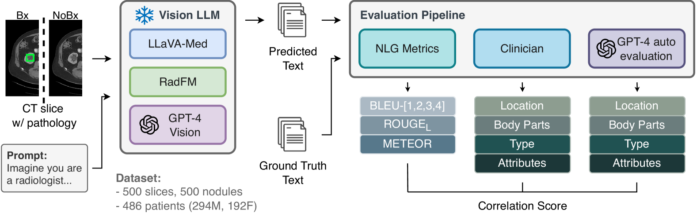
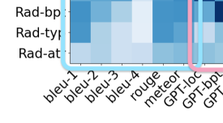
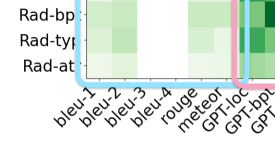
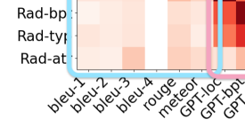

# [利用GPT-4对基于视觉的LLM预测进行拆解，实现自动评估目标](https://arxiv.org/abs/2403.05680)

发布时间：2024年03月08日

`LLM应用`

> Decomposing Vision-based LLM Predictions for Auto-Evaluation with GPT-4

> 全球CT检查量逐年攀升，使得放射科医生面临过劳问题。LLMs有望缓解这一压力，但其在临床上的应用程度则依赖于医生对其的信任以及内容评估的便捷性。目前虽有许多自动化手段可评估胸片报告质量，但在CT领域却缺乏类似方案。本文创新性地提出了一种评估框架，旨在评价视觉-语言LLMs在精准总结基于CT的异常状况方面的表现。我们将包含病变等异常信息的CT切片输入给诸如GPT-4V、LLaVA-Med和RadFM这类基于视觉的LLM，让其生成异常特征预测的自由文本摘要。接着，GPT-4模型进一步拆解此摘要，分析其涉及的身体部位、位置、类型和属性，并自动比对实际情况，基于临床相关性和真实性为各部分打分。这些分数再与专业医生所作评估进行对照，结果显示两者高度相关（相关系数达85%，p值小于.001）。尽管在本研究中GPT-4V相较于其他模型表现出色，但仍存在总体提升空间。我们提出的评估方法有助于深入揭示亟待改进的关键领域，为未来该领域的研发指明方向。

> The volume of CT exams being done in the world has been rising every year, which has led to radiologist burn-out. Large Language Models (LLMs) have the potential to reduce their burden, but their adoption in the clinic depends on radiologist trust, and easy evaluation of generated content. Presently, many automated methods are available to evaluate the reports generated for chest radiographs, but such an approach is not available for CT presently. In this paper, we propose a novel evaluation framework to judge the capabilities of vision-language LLMs in generating accurate summaries of CT-based abnormalities. CT slices containing an abnormality (e.g., lesion) were input to a vision-based LLM (GPT-4V, LLaVA-Med, and RadFM), and it generated a free-text summary of the predicted characteristics of the abnormality. Next, a GPT-4 model decomposed the summary into specific aspects (body part, location, type, and attributes), automatically evaluated the characteristics against the ground-truth, and generated a score for each aspect based on its clinical relevance and factual accuracy. These scores were then contrasted against those obtained from a clinician, and a high correlation ( 85%, p < .001) was observed. Although GPT-4V outperformed other models in our evaluation, it still requires overall improvement. Our evaluation method offers valuable insights into the specific areas that need the most enhancement, guiding future development in this field.

[Arxiv](https://arxiv.org/abs/2403.05680)