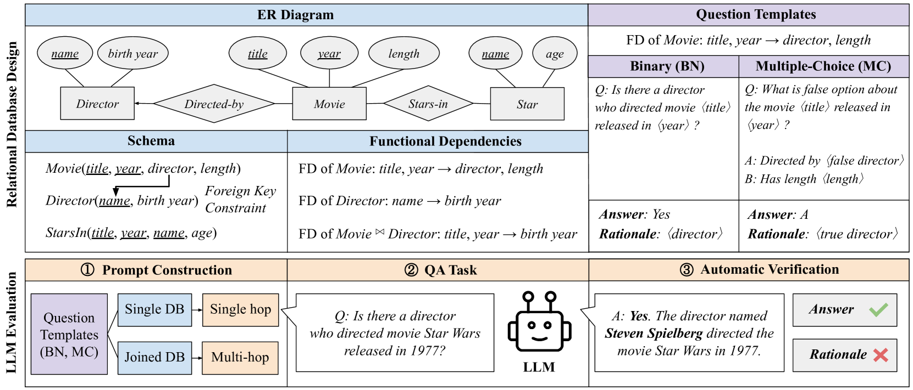
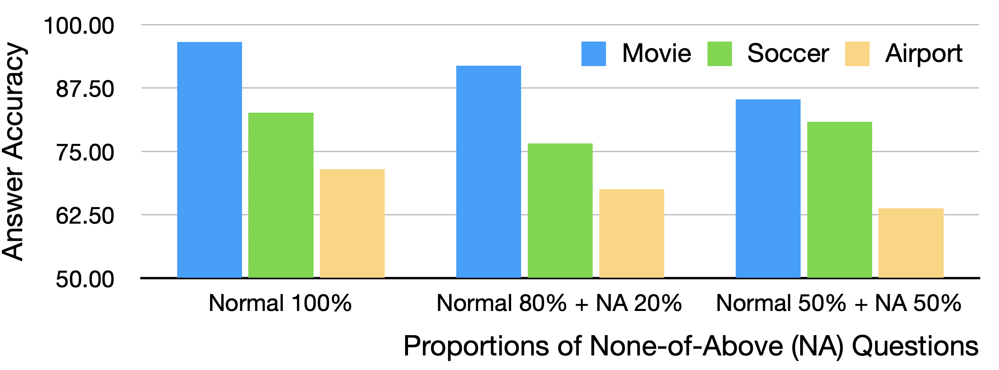

# ERBench 是专为大型语言模型设计的、基于实体关系的自动化验证幻觉基准测试，旨在精确衡量和评估模型在处理复杂实体关系时出现的幻觉现象。

发布时间：2024年03月08日

`LLM应用`

> ERBench: An Entity-Relationship based Automatically Verifiable Hallucination Benchmark for Large Language Models

> 尽管LLMs在众多应用场景中取得了突破性的成果，但如何有效评估它们仍是一大挑战。当前的幻想性测试基准要么过于固定，要么难以调整复杂度以深入探究。为此，我们提出了一种创新思路——利用现有关系数据库构建基准测试，因其能借助函数依赖精确描述知识。由此诞生了ERBench，它能自动化将任何关系数据库转化为基于ER模型的评测基准。ERBench的关键在于利用数据库模式、数据记录及函数依赖构造可自动验证的问题，并且通过外键约束串联表间关系，设计出任意复杂的多级推理问题，以检验LLMs的中间输出结果。此外，ERBench还支持持续评估、多模态提问以及多种提示工程技巧。实验证明，在采用不同领域数据库构建的LLM基准上，更优秀的模型如GPT-4虽能应对更多样化的问题类型，但仍存在不足。同时，ERBench相较于其他基准在评估各类问题时的一大亮点是，即便答案正确，也需进一步审视背后的推断逻辑是否合理。相关代码已开源至https://github.com/DILAB-KAIST/ERBench。

> Large language models (LLMs) have achieved unprecedented performance in various applications, yet their evaluation remains a critical issue. Existing hallucination benchmarks are either static or lack adjustable complexity for thorough analysis. We contend that utilizing existing relational databases is a promising approach for constructing benchmarks due to their accurate knowledge description via functional dependencies. We propose ERBench to automatically convert any relational database into a benchmark based on the entity-relationship (ER) model. Our key idea is to construct questions using the database schema, records, and functional dependencies such that they can be automatically verified. In addition, we use foreign key constraints to join relations and construct multihop questions, which can be arbitrarily complex and used to debug the intermediate answers of LLMs. Finally, ERBench supports continuous evaluation, multimodal questions, and various prompt engineering techniques. In our experiments, we construct an LLM benchmark using databases of multiple domains and make an extensive comparison of contemporary LLMs. We observe that better LLMs like GPT-4 can handle a larger variety of question types, but are by no means perfect. Also, correct answers do not necessarily imply correct rationales, which is an important evaluation that ERBench does better than other benchmarks for various question types. Code is available at https: //github.com/DILAB-KAIST/ERBench.

[Arxiv](https://arxiv.org/abs/2403.05266)