# [本研究致力于挖掘卫星图像中能够有效应用于少量样本目标检测任务的稳健特征，旨在提升该领域的检测性能和泛化能力。](https://arxiv.org/abs/2403.05381)

发布时间：2024年03月08日

`Agent`

> Exploring Robust Features for Few-Shot Object Detection in Satellite Imagery

> 本研究旨在借助少量示例实现卫星图像中的目标检测，让用户能方便地用最少标注定义任意对象类别。我们借鉴了开放词汇检测领域的最新进展，并针对遥感场景加以应用。我们设计了一个基于经典两阶段框架的少量样本目标检测模型，将分类组件替换为基于原型的分类器，并利用大规模预训练模型生成类参照嵌入或原型，通过对区域建议内容与这些原型进行对比来预测标签。不仅如此，我们还提出了一个创新点——在有限训练图像上对原型进行微调，以提升性能并区分类似类别间的差异，比如不同类型的飞机。实验在包含复杂罕见对象的两个遥感数据集上全面展开，同时探究了视觉特征（如DINOv2）以及图像-文本特征（如CLIP，其中包括两款专门优化于遥感应用的CLIP模型）的表现。实验结果显示，相较于视觉-语言模型，视觉特征因其具备更强的领域特定词汇能力而表现出明显优势。最终，在SIMD和DIOR数据集上，尽管训练参数极少，但我们研发的检测器仍成功超越了完全监督和少量样本方法的性能。

> The goal of this paper is to perform object detection in satellite imagery with only a few examples, thus enabling users to specify any object class with minimal annotation. To this end, we explore recent methods and ideas from open-vocabulary detection for the remote sensing domain. We develop a few-shot object detector based on a traditional two-stage architecture, where the classification block is replaced by a prototype-based classifier. A large-scale pre-trained model is used to build class-reference embeddings or prototypes, which are compared to region proposal contents for label prediction. In addition, we propose to fine-tune prototypes on available training images to boost performance and learn differences between similar classes, such as aircraft types. We perform extensive evaluations on two remote sensing datasets containing challenging and rare objects. Moreover, we study the performance of both visual and image-text features, namely DINOv2 and CLIP, including two CLIP models specifically tailored for remote sensing applications. Results indicate that visual features are largely superior to vision-language models, as the latter lack the necessary domain-specific vocabulary. Lastly, the developed detector outperforms fully supervised and few-shot methods evaluated on the SIMD and DIOR datasets, despite minimal training parameters.

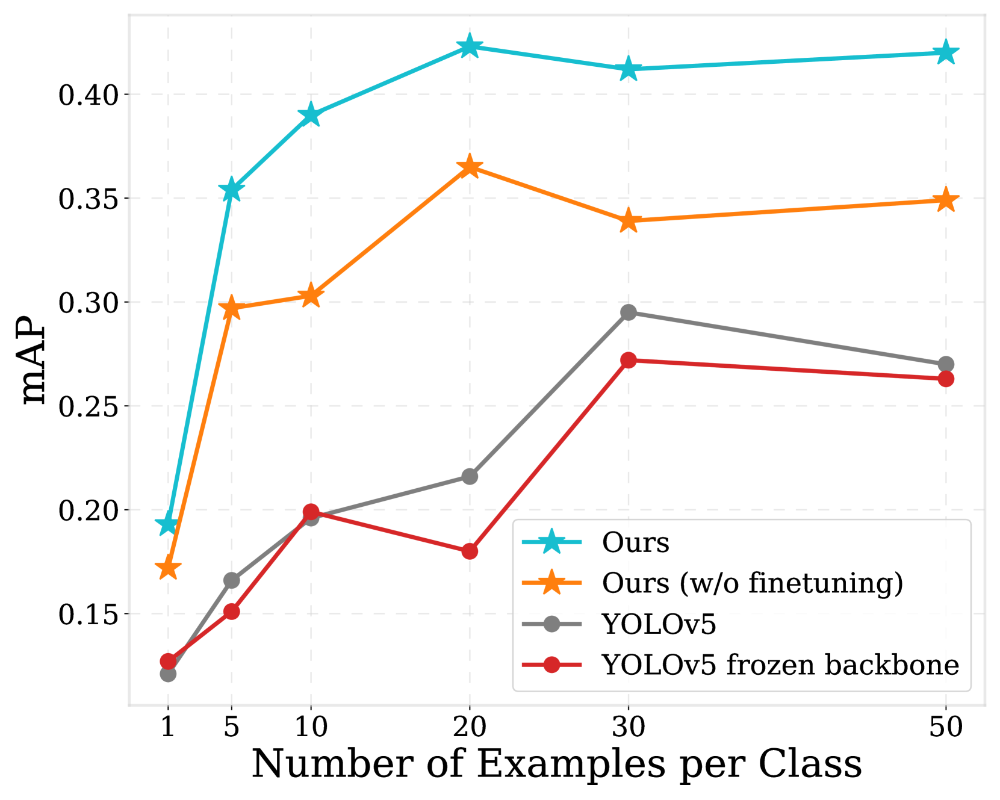

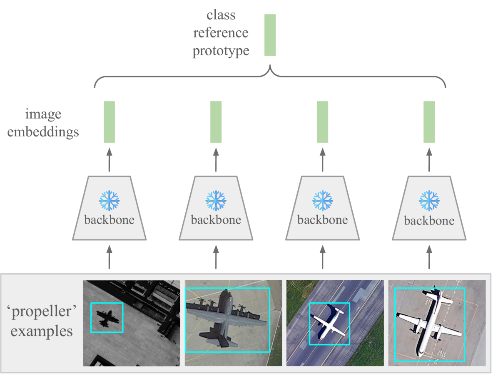

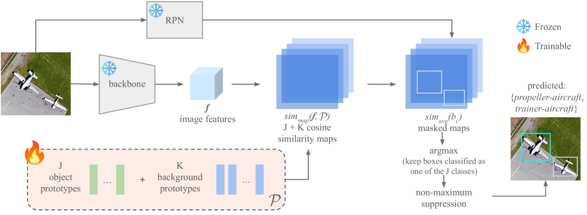

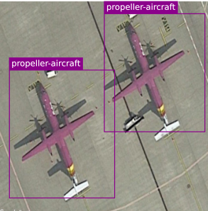

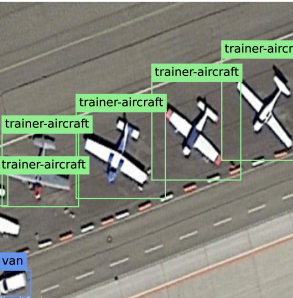

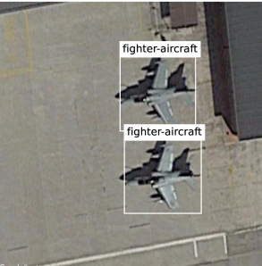

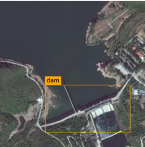

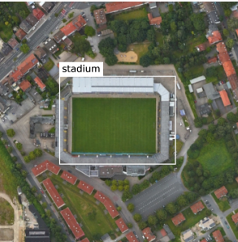

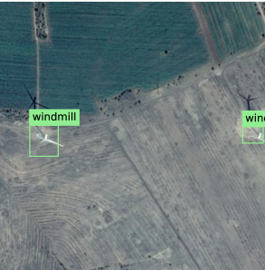

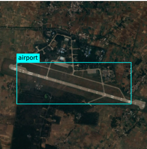

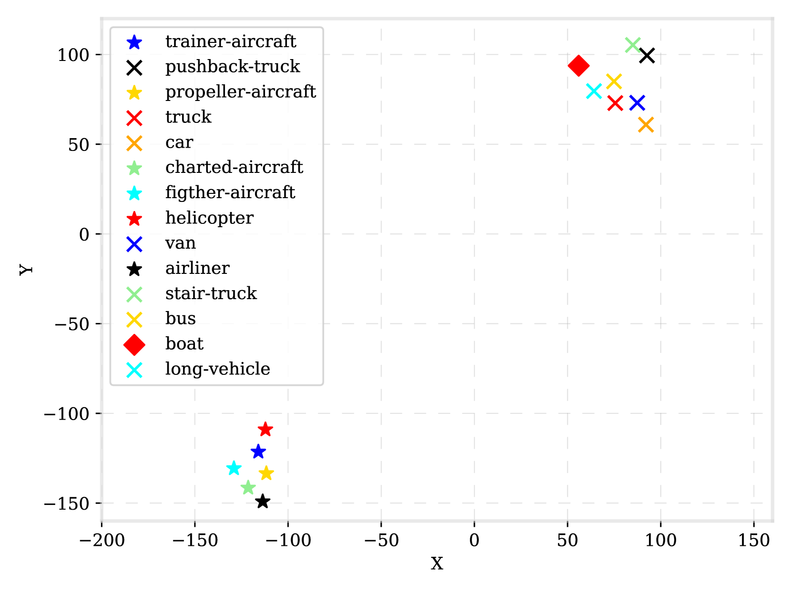

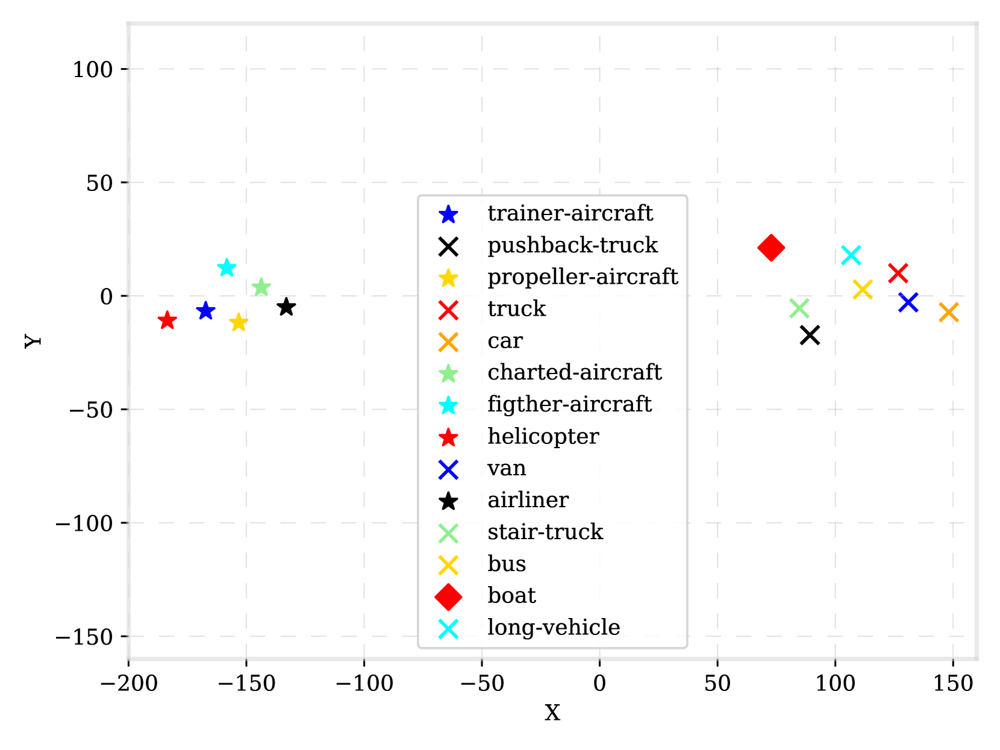