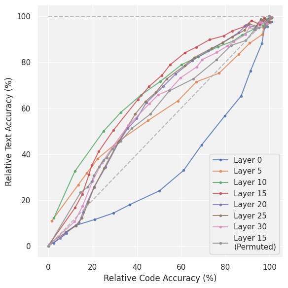
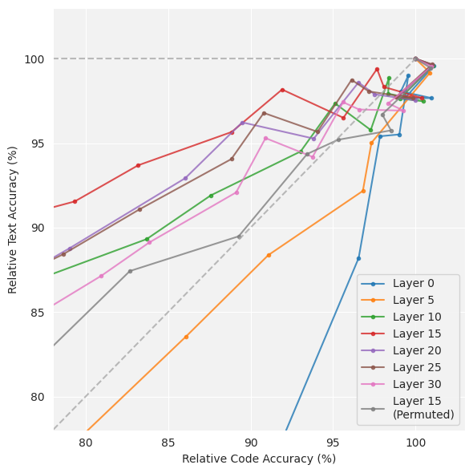
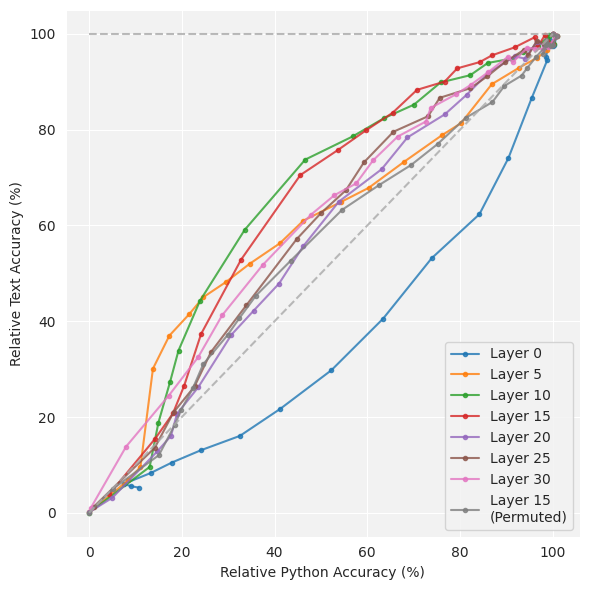
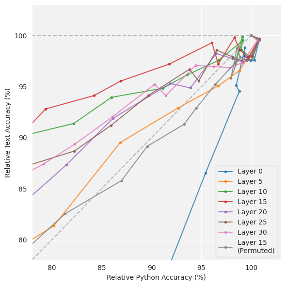
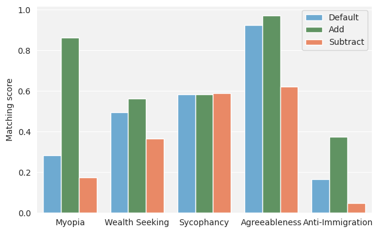
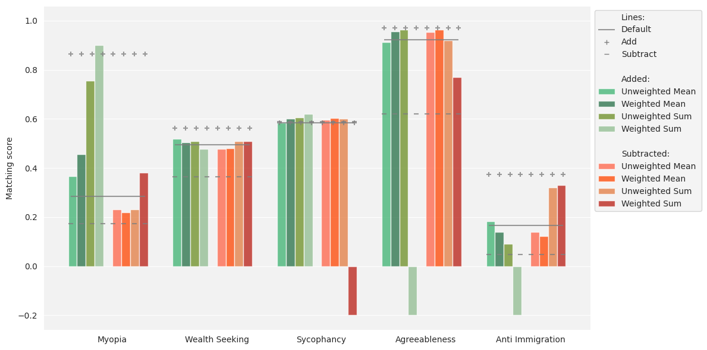
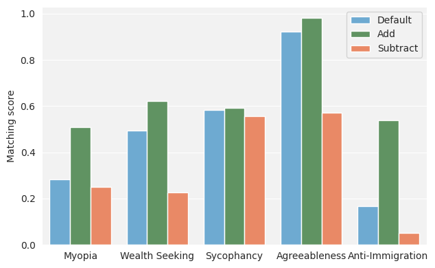
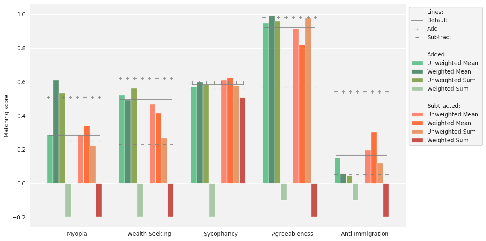
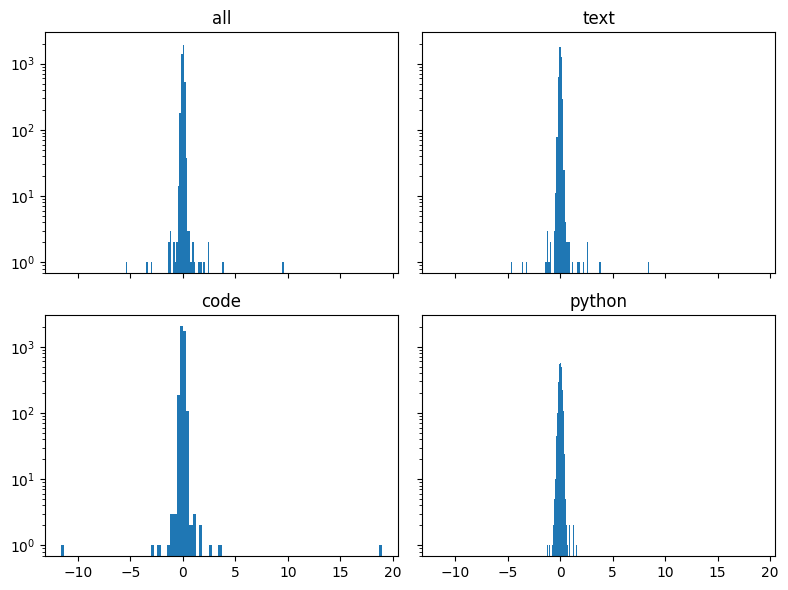
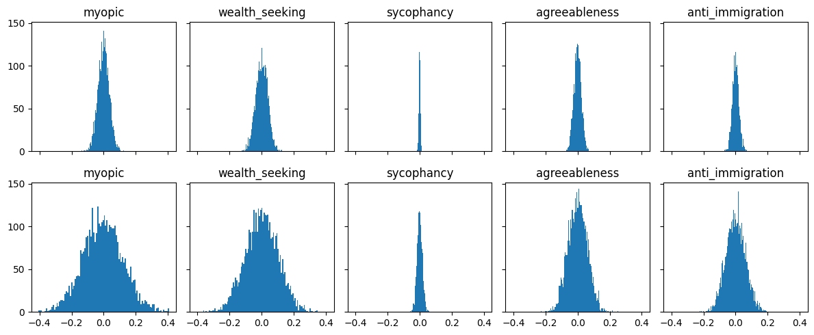

# [我们将 Activation Steering 技术推广到更广泛的技能领域和多元行为表现，旨在探究其在不同能力和情境下的应用效果。](https://arxiv.org/abs/2403.05767)

发布时间：2024年03月08日

`Agent`

> Extending Activation Steering to Broad Skills and Multiple Behaviours

> 现今的大型语言模型潜藏危险能力，并且这一问题在未来可能会加剧。运用激活引导技术能有效降低此类风险。本研究探讨了该技术在调控广泛技能和多元行为上的效果。实验显示，在对通用编程能力和Python专项能力进行性能抑制对比时，引导广域技能的表现可与窄域技能相媲美。进一步地，我们尝试引导模型表现出不同程度的短视倾向及财富追求等行为特征。然而，实验结果显示，将针对多种行为设计的引导向量合并为单一引导向量的方法收效甚微；而将各个不同的引导向量分别适时地注入模型内部，则展现出较为乐观的应用潜力。

> Current large language models have dangerous capabilities, which are likely to become more problematic in the future. Activation steering techniques can be used to reduce risks from these capabilities. In this paper, we investigate the efficacy of activation steering for broad skills and multiple behaviours. First, by comparing the effects of reducing performance on general coding ability and Python-specific ability, we find that steering broader skills is competitive to steering narrower skills. Second, we steer models to become more or less myopic and wealth-seeking, among other behaviours. In our experiments, combining steering vectors for multiple different behaviours into one steering vector is largely unsuccessful. On the other hand, injecting individual steering vectors at different places in a model simultaneously is promising.

