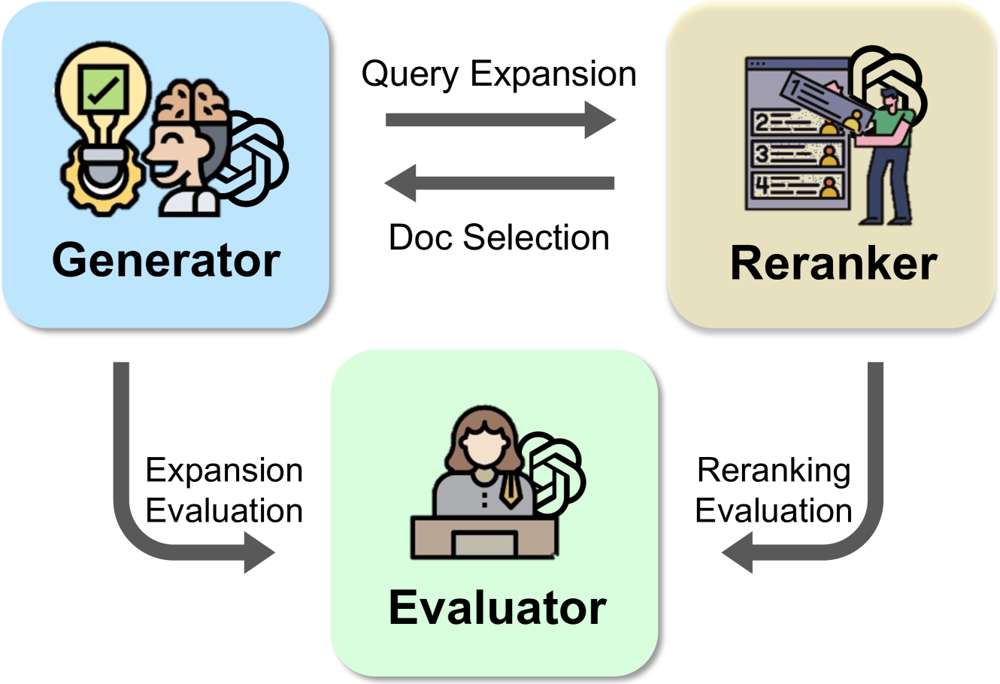
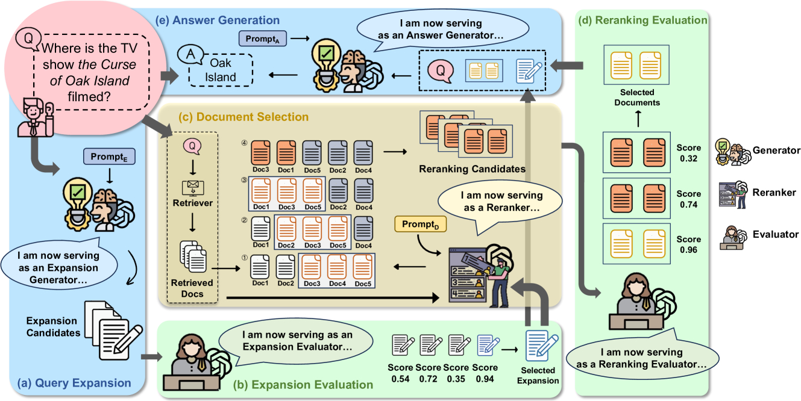
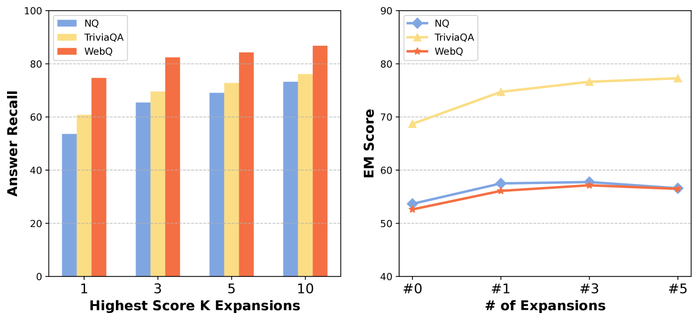
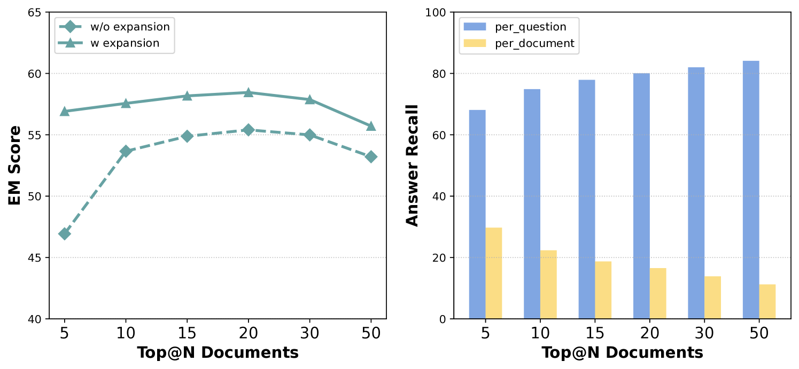
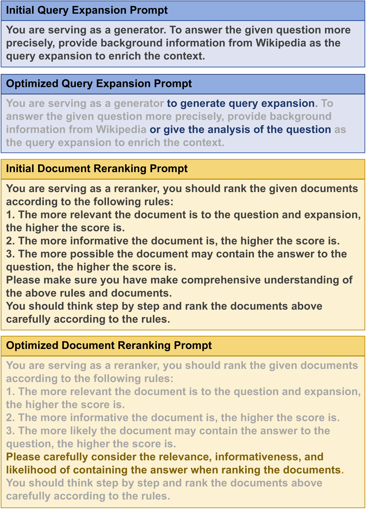

# 为解决开放领域问题回答任务，本研究探讨如何有效地利用大型语言模型所具备的多元角色功能。

发布时间：2024年03月08日

`LLM应用`

> Harnessing Multi-Role Capabilities of Large Language Models for Open-Domain Question Answering

# 摘要

> 在信息系统研究领域，开放领域问题回答（ODQA）已迅速成为核心议题。当前主流方法通过两大途径获取支持信息：一是采用“检索后阅读”模式，从外部文库抽取相关信息文档；二是运用大型语言模型(LLMs)，采取“生成后阅读”方式产出相应文档。但遗憾的是，这两种方法均无法全面满足多元化的证据需求。因此，我们创新提出LLMQA这一通用框架，它将ODQA流程精炼为三个基础步骤——查询拓展、文档筛选和答案生成，成功融合了检索型和生成型证据的优势。考虑到LLMs在处理多种任务上展现出的强大实力，我们在该框架下让LLMs身兼数职，包括生成器、重排序器及评估器，并促使它们在ODQA过程中高效协作。另外，我们还独创了一种提示优化算法，旨在优化LLMs的角色扮演提示，引导其输出更高品质的证据与答案。大规模实验证据显示，在NQ、WebQ和TriviaQA等广泛应用的基准测试中，LLMQA无论是在答案精确度还是证据质量上都取得了最优表现，充分彰显其在推动ODQA科研进展及实际应用方面的巨大潜力。

> Open-domain question answering (ODQA) has emerged as a pivotal research spotlight in information systems. Existing methods follow two main paradigms to collect evidence: (1) The \textit{retrieve-then-read} paradigm retrieves pertinent documents from an external corpus; and (2) the \textit{generate-then-read} paradigm employs large language models (LLMs) to generate relevant documents. However, neither can fully address multifaceted requirements for evidence. To this end, we propose LLMQA, a generalized framework that formulates the ODQA process into three basic steps: query expansion, document selection, and answer generation, combining the superiority of both retrieval-based and generation-based evidence. Since LLMs exhibit their excellent capabilities to accomplish various tasks, we instruct LLMs to play multiple roles as generators, rerankers, and evaluators within our framework, integrating them to collaborate in the ODQA process. Furthermore, we introduce a novel prompt optimization algorithm to refine role-playing prompts and steer LLMs to produce higher-quality evidence and answers. Extensive experimental results on widely used benchmarks (NQ, WebQ, and TriviaQA) demonstrate that LLMQA achieves the best performance in terms of both answer accuracy and evidence quality, showcasing its potential for advancing ODQA research and applications.

[Arxiv](https://arxiv.org/abs/2403.05217)