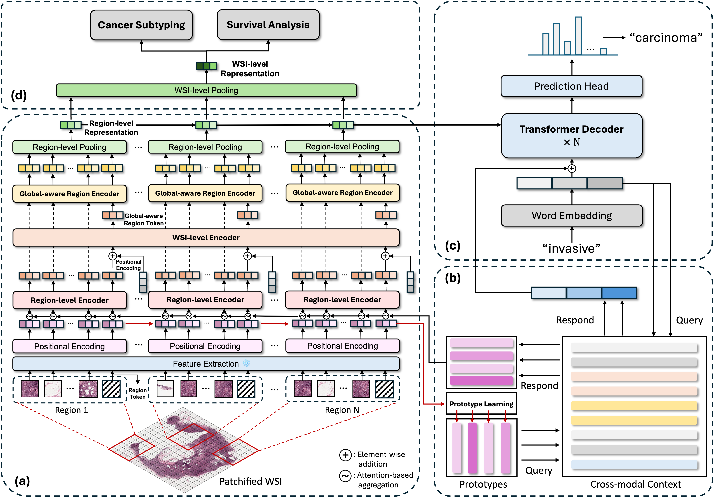
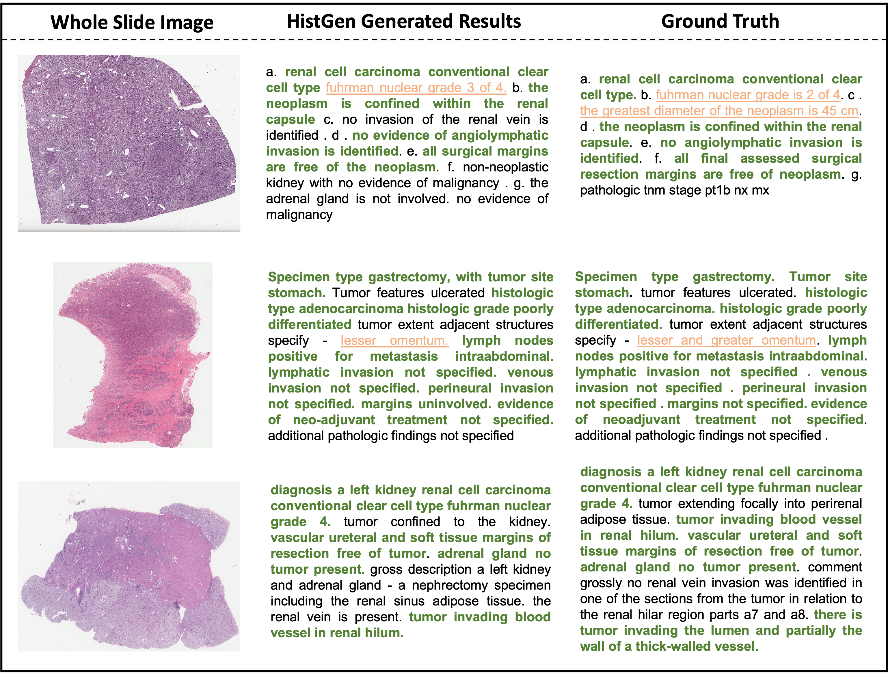
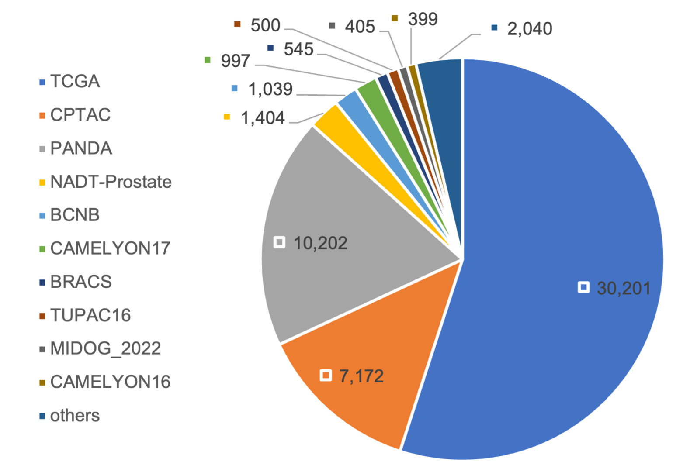
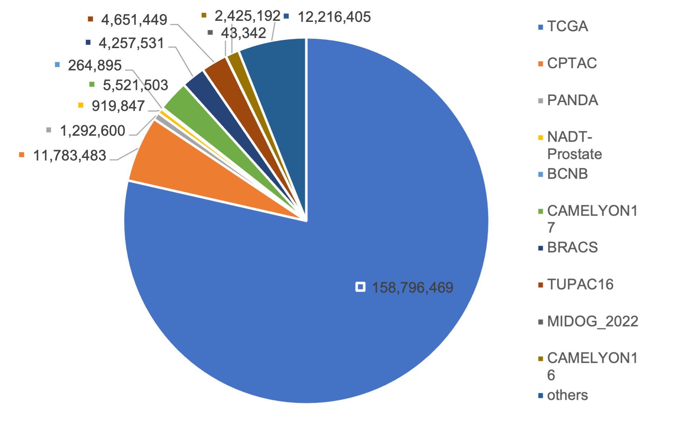

# HistGen 是一种创新方法，利用局部-全局特征编码及跨模态上下文互动技术，专为自动生成组织病理学报告而设计。

发布时间：2024年03月08日

`Agent`

> HistGen: Histopathology Report Generation via Local-Global Feature Encoding and Cross-modal Context Interaction

# 摘要

> 组织病理学作为癌症诊断的权威依据，其临床报告对于解读诊断过程并指导治疗方案至关重要。运用深度学习自动化的组织病理报告生成技术，能够大幅提升临床工作效率，减轻病理医生撰写报告的压力。为此，我们创新推出了 HistGen——一个基于多实例学习的组织病理报告自动生成框架，并随附首个用于评估的基准数据集。受到实际诊断及报告编撰流程的启示，HistGen 搭载了两大精细定制模块，旨在通过在局部和全局层面整合全视野图像（WSIs）与诊断报告信息，有力驱动报告生成质量的提升。我们特制了一款局部-全局层级编码器，能高效汇聚从局部区域到整张切片的视觉特征。同时，创新构建了一项跨模态上下文模块，以显式强化不同模态间的一致性和相互作用，有效连接 WSIs 的海量视觉信息与高度概括的对应报告。实验证明，该模型在 WSI 报告生成任务上明显优于现有的 SOTA 模型。更令人欣喜的是，经过微调后的 HistGen 在癌症亚型分类和生存分析等任务上的表现也超越了 SOTA 方法，充分展现了卓越的迁移学习能力。所有相关数据集、模型参数及源代码已开放在 GitHub 地址：https://github.com/dddavid4real/HistGen。

> Histopathology serves as the gold standard in cancer diagnosis, with clinical reports being vital in interpreting and understanding this process, guiding cancer treatment and patient care. The automation of histopathology report generation with deep learning stands to significantly enhance clinical efficiency and lessen the labor-intensive, time-consuming burden on pathologists in report writing. In pursuit of this advancement, we introduce HistGen, a multiple instance learning-empowered framework for histopathology report generation together with the first benchmark dataset for evaluation. Inspired by diagnostic and report-writing workflows, HistGen features two delicately designed modules, aiming to boost report generation by aligning whole slide images (WSIs) and diagnostic reports from local and global granularity. To achieve this, a local-global hierarchical encoder is developed for efficient visual feature aggregation from a region-to-slide perspective. Meanwhile, a cross-modal context module is proposed to explicitly facilitate alignment and interaction between distinct modalities, effectively bridging the gap between the extensive visual sequences of WSIs and corresponding highly summarized reports. Experimental results on WSI report generation show the proposed model outperforms state-of-the-art (SOTA) models by a large margin. Moreover, the results of fine-tuning our model on cancer subtyping and survival analysis tasks further demonstrate superior performance compared to SOTA methods, showcasing strong transfer learning capability. Dataset, model weights, and source code are available in https://github.com/dddavid4real/HistGen.

[Arxiv](https://arxiv.org/abs/2403.05396)