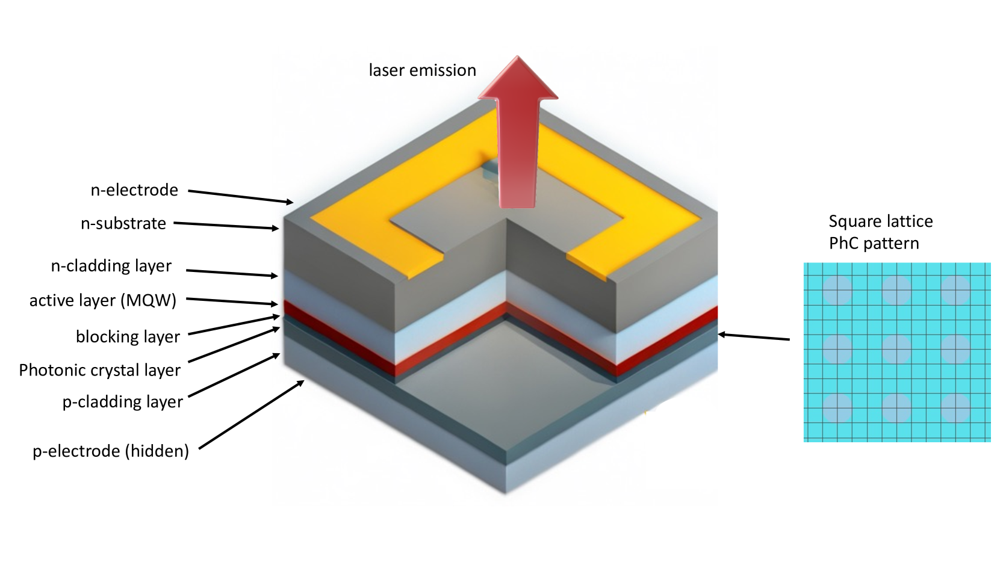
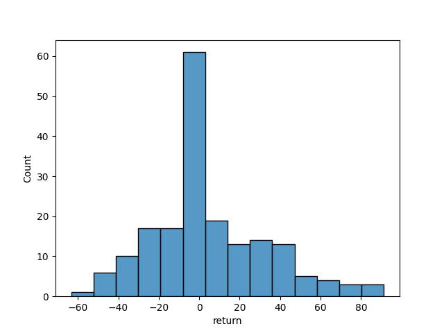
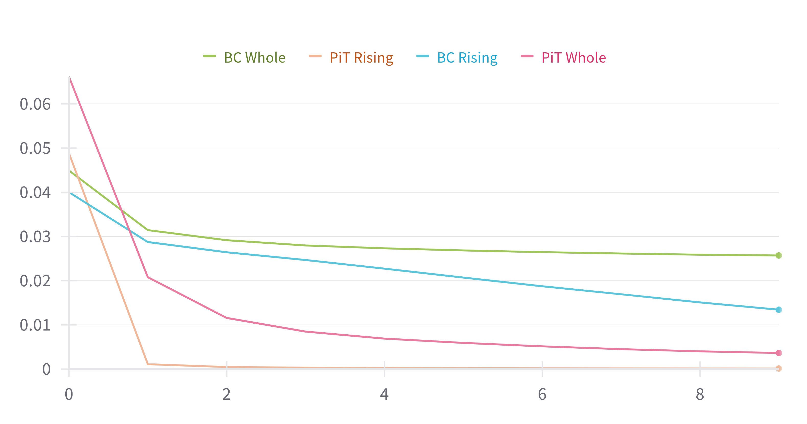

# 设计光子晶体表面发射激光器的逆向工程实质上可视为一个序列模型构建问题。

发布时间：2024年03月08日

`Agent`

> Inverse Design of Photonic Crystal Surface Emitting Lasers is a Sequence Modeling Problem

> PCSEL逆向设计因其涉及物理、材料及量子力学等领域高深知识而工作量巨大，但先进的人工智能技术，尤其是强化学习（RL），已崭露头角，助力提升并加快这一复杂过程。将PCSEL逆向设计视作一系列决策问题，RL能从零起步构建理想的PCSEL结构。然而，因需与精密昂贵的仿真环境实时互动而导致的数据利用率低，限制了RL方法的广泛应用。近期，尤其以Transformer为代表的序列模型，在处理序列决策问题时表现抢眼，凭借其简洁性和在大规模语言模型上的良好可扩展性。本文引入一种创新框架——PCSEL逆向设计Transformer（PiT），将PCSEL逆向设计转化为序列模型问题。PiT的关键在于运用Transformer架构，依据历史轨迹与当前状态预测当前操作。相较于传统RL方法，PiT借助离线数据和预期收益条件化，可直接输出最优行动方案，并精准实现目标PCSEL设计。实验结果显示，PiT在性能和数据效率上都明显超越基准方法。

> Photonic Crystal Surface Emitting Lasers (PCSEL)'s inverse design demands expert knowledge in physics, materials science, and quantum mechanics which is prohibitively labor-intensive. Advanced AI technologies, especially reinforcement learning (RL), have emerged as a powerful tool to augment and accelerate this inverse design process. By modeling the inverse design of PCSEL as a sequential decision-making problem, RL approaches can construct a satisfactory PCSEL structure from scratch. However, the data inefficiency resulting from online interactions with precise and expensive simulation environments impedes the broader applicability of RL approaches. Recently, sequential models, especially the Transformer architecture, have exhibited compelling performance in sequential decision-making problems due to their simplicity and scalability to large language models. In this paper, we introduce a novel framework named PCSEL Inverse Design Transformer (PiT) that abstracts the inverse design of PCSEL as a sequence modeling problem. The central part of our PiT is a Transformer-based structure that leverages the past trajectories and current states to predict the current actions. Compared with the traditional RL approaches, PiT can output the optimal actions and achieve target PCSEL designs by leveraging offline data and conditioning on the desired return. Results demonstrate that PiT achieves superior performance and data efficiency compared to baselines.

[Arxiv](https://arxiv.org/abs/2403.05149)