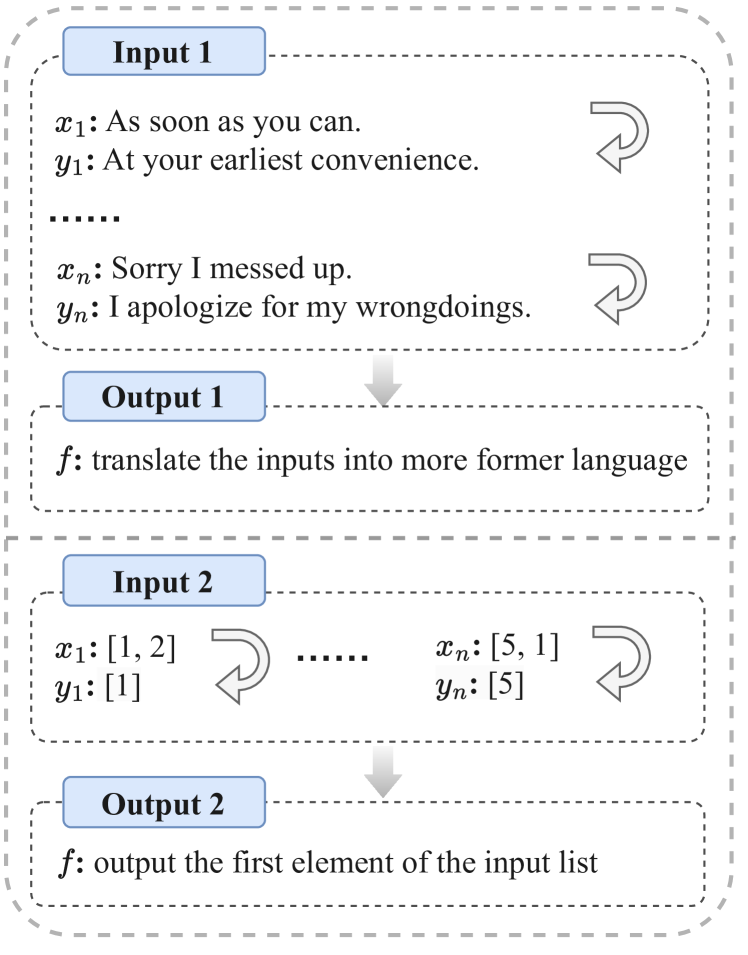
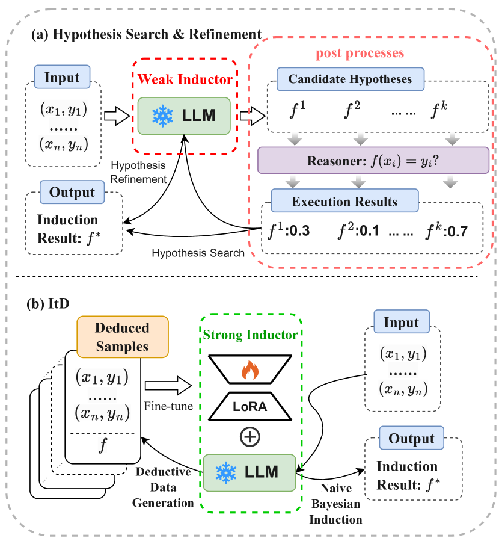
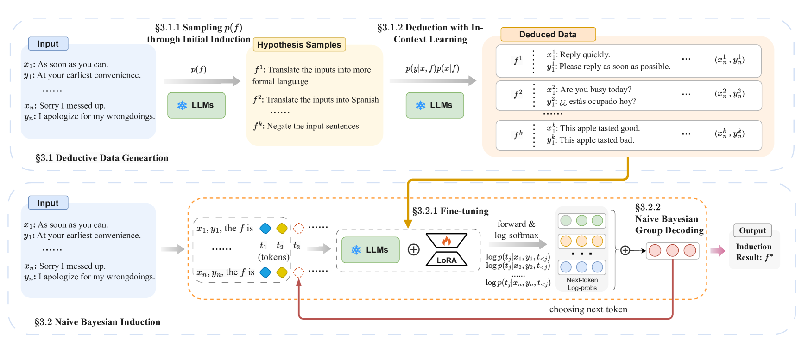
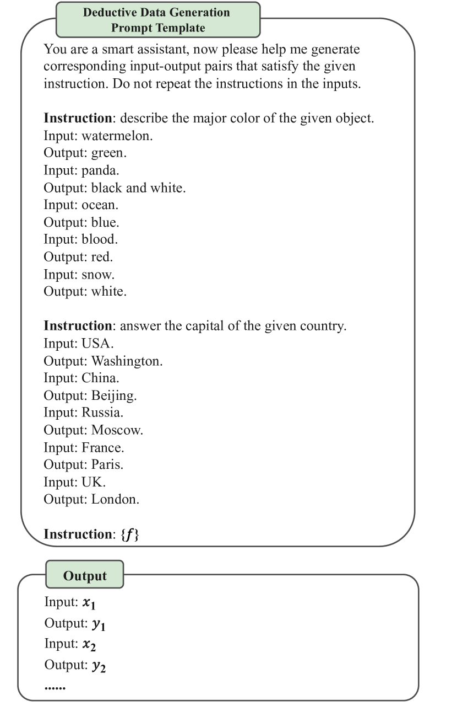

# [ItD 研究表明，大型语言模型能够通过演绎推理过程来自我发现和掌握归纳能力。](https://arxiv.org/abs/2403.05789)

发布时间：2024年03月08日

`LLM理论`

> ItD: Large Language Models Can Teach Themselves Induction through Deduction

> 尽管LLMs在众多NLP任务上大放异彩，但在归纳推理上的能力仍有局限。现有工作多依赖“后处理”策略以提升LLMs在归纳任务上的性能，但这依然受限于LLMs固有的归纳能力。为此，本文创新性地提出了一种名为“演绎驱动归纳”（ItD）的框架，让LLMs通过演绎过程自学习归纳技巧。该框架包含两大支柱：演绎数据生成模块负责产出有益于归纳的学习数据，而朴素贝叶斯归纳模块则专注于优化LLMs的微调及解码阶段。实验结果显示，ItD在两项归纳任务基准测试中表现出色，相较于之前的最优方法，性能分别提高了36%和10%。我们通过消融研究确认了ItD中两大关键模块的作用，并进一步验证了ItD在不同LLMs及演绎组件中的普适有效性。相关数据和代码已公开，访问地址为https://anonymous.4open.science/r/ItD-E844。

> Although Large Language Models (LLMs) are showing impressive performance on a wide range of Natural Language Processing tasks, researchers have found that they still have limited ability to conduct induction. Recent works mainly adopt ``post processes'' paradigms to improve the performance of LLMs on induction (e.g., the hypothesis search & refinement methods), but their performance is still constrained by the inherent inductive capability of the LLMs. In this paper, we propose a novel framework, Induction through Deduction (ItD), to enable the LLMs to teach themselves induction through deduction. The ItD framework is composed of two main components: a Deductive Data Generation module to generate induction data and a Naive Bayesian Induction module to optimize the fine-tuning and decoding of LLMs. Our empirical results showcase the effectiveness of ItD on two induction benchmarks, achieving relative performance improvement of 36% and 10% compared with previous state-of-the-art, respectively. Our ablation study verifies the effectiveness of two key modules of ItD. We also verify the effectiveness of ItD across different LLMs and deductors. The data and code of this paper can be found at https://anonymous.4open.science/r/ItD-E844.

[Arxiv](https://arxiv.org/abs/2403.05789)