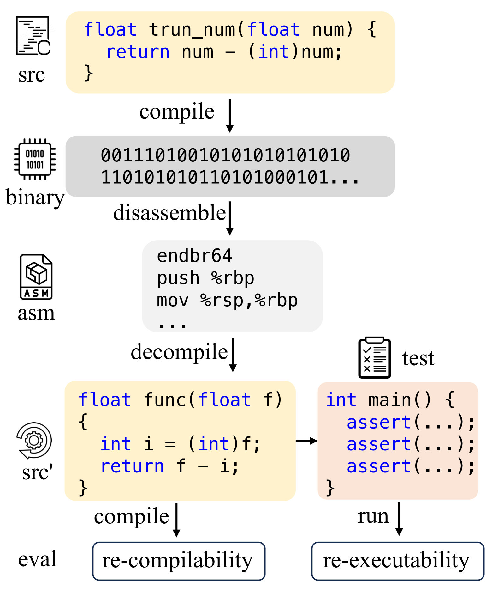
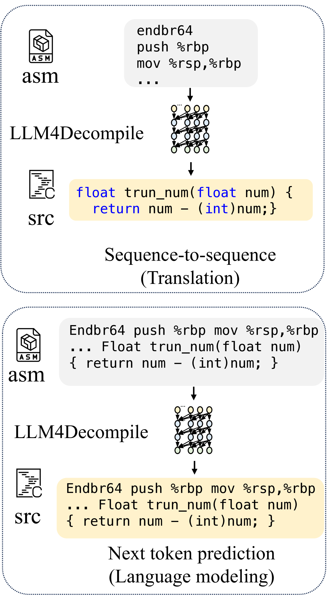
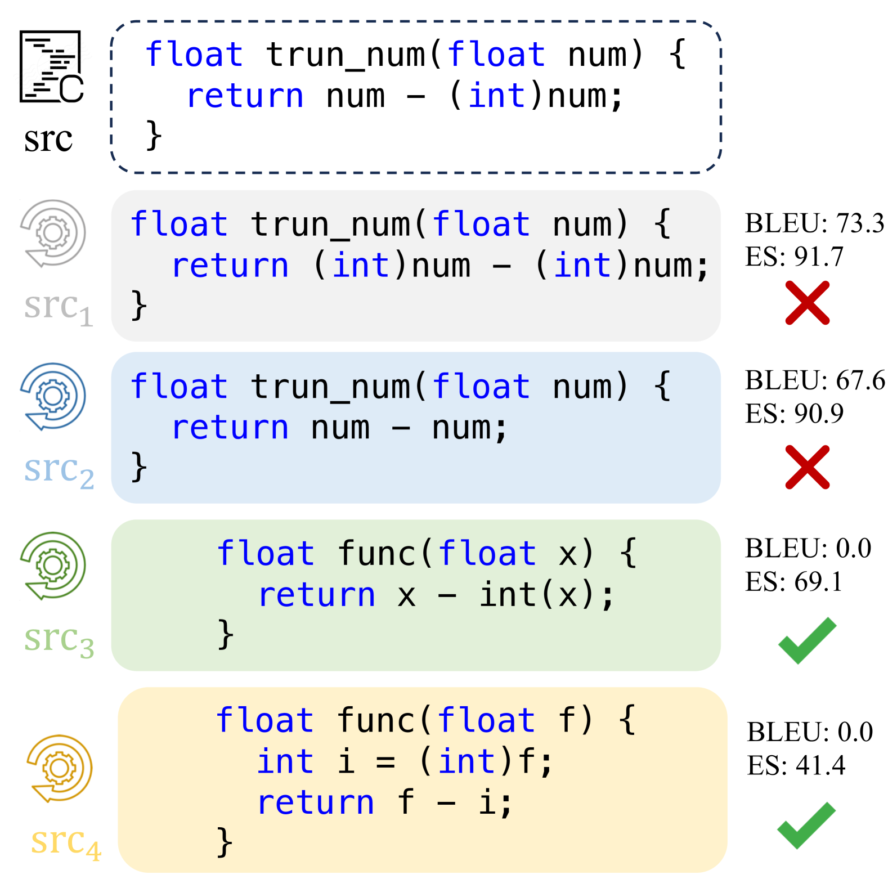

# [LLM4Decompile 是一项利用大型语言模型来实现二进制代码反编译的技术。](https://arxiv.org/abs/2403.05286)

发布时间：2024年03月08日

`LLM应用`

> LLM4Decompile: Decompiling Binary Code with Large Language Models

> 反编译技术致力于将晦涩难懂的编译代码还原为易于阅读的源代码，但常面临名称与结构等具体问题的挑战。近年来，大型语言模型（LLMs）在编程任务中的卓越表现启发了它们在反编译上的应用尝试，然而市面上却未见任何针对反编译任务的开源LLM。同时，现存的反编译评估体系多侧重于符号级精度，却往往忽略了衡量程序质量核心的可执行性。鉴于此，我们首次推出了系列规模从10亿至330亿参数不等，并基于40亿C源代码及相应汇编代码预训练的开放获取反编译LLMs，旨在为后续研发提供基准参考。为进一步确保程序反编译效果的实用性评价，我们构建了首个注重程序能否重新编译并有效执行的Decompile-Eval数据集，突显了从程序语义层面审视反编译模型评估的重要性。实验证明，我们的LLM4Decompile模型成功精确反编译了21%的汇编代码片段，相较于GPT-4取得了高达50%的性能提升。所有相关代码、数据集以及模型均已通过https://github.com/albertan017/LLM4Decompile对外开放。

> Decompilation aims to restore compiled code to human-readable source code, but struggles with details like names and structure. Large language models (LLMs) show promise for programming tasks, motivating their application to decompilation. However, there does not exist any open-source LLM for decompilation. Moreover, existing decompilation evaluation systems mainly consider token-level accuracy and largely ignore code executability, which is the most important feature of any program. Therefore, we release the first open-access decompilation LLMs ranging from 1B to 33B pre-trained on 4 billion tokens of C source code and the corresponding assembly code. The open-source LLMs can serve as baselines for further development in the field. To ensure practical program evaluation, we introduce Decompile-Eval, the first dataset that considers re-compilability and re-executability for decompilation. The benchmark emphasizes the importance of evaluating the decompilation model from the perspective of program semantics. Experiments indicate that our LLM4Decompile has demonstrated the capability to accurately decompile 21% of the assembly code, which achieves a 50% improvement over GPT-4. Our code, dataset, and models are released at https://github.com/albertan017/LLM4Decompile

[Arxiv](https://arxiv.org/abs/2403.05286)