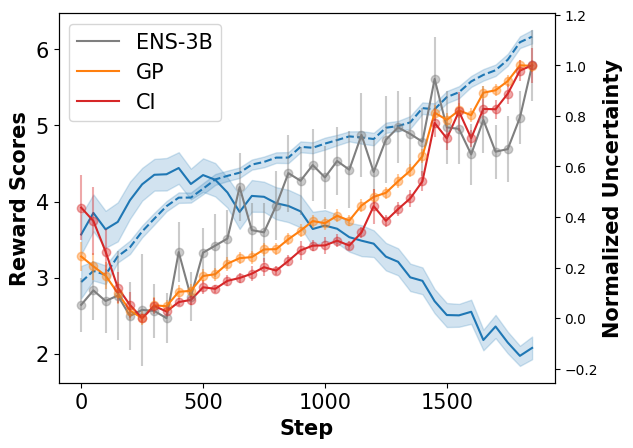
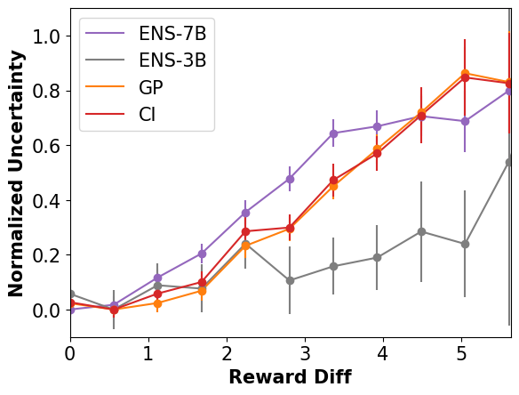
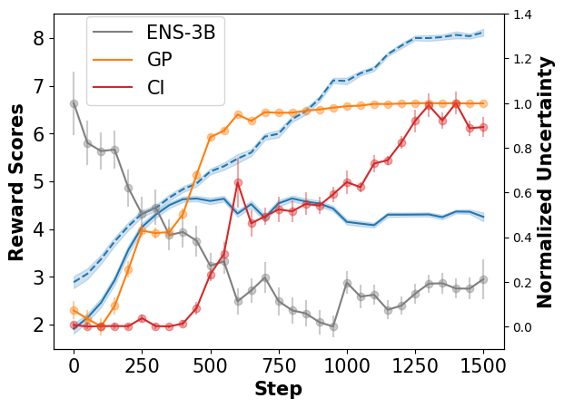
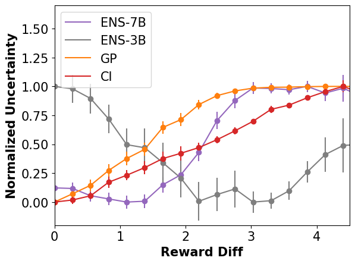
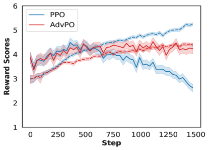
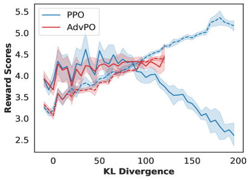
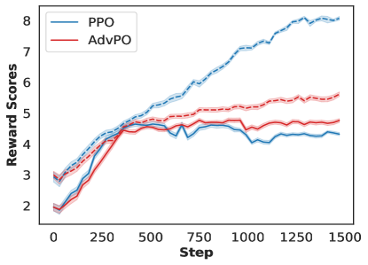
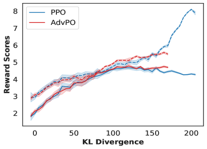

# 借助轻量级不确定性估计的对抗性策略优化方法，有效解决奖励函数过度优化难题。

发布时间：2024年03月08日

`Agent`

> Overcoming Reward Overoptimization via Adversarial Policy Optimization with Lightweight Uncertainty Estimation

> 为了解决LLMs在RLHF中普遍存在的过度优化奖励难题，我们创新性地提出了对抗性策略优化（AdvPO）。该方法能够在奖励模型不能完全反映人类偏好，导致RL策略优化误用奖励误差的情况下发挥作用。我们首先提出了一种简便的方法，利用奖励模型最后一层嵌入来量化奖励不确定性，无需复杂的奖励集成计算。接着，AdvPO聚焦于围绕奖励模型预测置信区间的分布鲁棒优化问题，以此来改进策略。通过对Anthropic HH和TL;DR摘要数据集进行全面深入的实验，我们生动证明了AdvPO能够有效减轻过度优化现象，并借助人工评估最终提升了整体表现。

> We introduce Adversarial Policy Optimization (AdvPO), a novel solution to the pervasive issue of reward over-optimization in Reinforcement Learning from Human Feedback (RLHF) for Large Language Models (LLMs). Over-optimization occurs when a reward model serves as an imperfect proxy for human preference, and RL-driven policy optimization erroneously exploits reward inaccuracies. In this paper, we begin by introducing a lightweight way to quantify uncertainties in rewards, relying solely on the last layer embeddings of the reward model, without the need for computationally expensive reward ensembles. AdvPO then addresses a distributionally robust optimization problem centred around the confidence interval of the reward model's predictions for policy improvement. Through comprehensive experiments on the Anthropic HH and TL;DR summarization datasets, we illustrate the efficacy of AdvPO in mitigating the overoptimization issue, consequently resulting in enhanced performance as evaluated through human-assisted evaluation.

[Arxiv](https://arxiv.org/abs/2403.05171)