# [PipeRAG 是一种创新方法，借助算法与系统协同设计的策略，高效实现了检索增强生成。这一技术旨在显著提升文本生成的速度，并在保持高质量的同时，充分融合检索与生成的优势。](https://arxiv.org/abs/2403.05676)

发布时间：2024年03月08日

`RAG`

> PipeRAG: Fast Retrieval-Augmented Generation via Algorithm-System Co-design

> RAG技术借助外源令牌数据库能显著提升LLMs的文本生成品质，但频繁从大型数据库检索信息会占用大量生成时间，尤其是在需要根据生成实时状态更新检索内容的情况下。本文提出了创新的PipeRAG方案，它通过算法与系统的协同设计，有效降低生成延迟并优化生成质量。PipeRAG整合三项核心技术：(1)运用管道并行处理让检索与生成进程同步进行；(2)设置灵活的检索间隔策略，最大化利用管道并行的优势；(3)构建性能模型，依据生成阶段及硬件条件智能调节检索质量和响应速度。实验结果显示，PipeRAG成功将端到端生成延迟提升了2.6倍，并且在此过程中还提升了生成品质。这一系列积极成果充分验证了算法与底层系统联合设计的有效途径，预示着PipeRAG在未来RAG系统中的广泛应用前景。

> Retrieval-augmented generation (RAG) can enhance the generation quality of large language models (LLMs) by incorporating external token databases. However, retrievals from large databases can constitute a substantial portion of the overall generation time, particularly when retrievals are periodically performed to align the retrieved content with the latest states of generation. In this paper, we introduce PipeRAG, a novel algorithm-system co-design approach to reduce generation latency and enhance generation quality. PipeRAG integrates (1) pipeline parallelism to enable concurrent retrieval and generation processes, (2) flexible retrieval intervals to maximize the efficiency of pipeline parallelism, and (3) a performance model to automatically balance retrieval quality and latency based on the generation states and underlying hardware. Our evaluation shows that, by combining the three aforementioned methods, PipeRAG achieves up to 2.6$\times$ speedup in end-to-end generation latency while improving generation quality. These promising results showcase the effectiveness of co-designing algorithms with underlying systems, paving the way for the adoption of PipeRAG in future RAG systems.

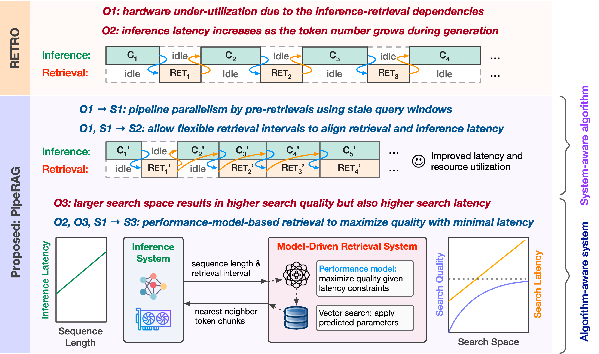

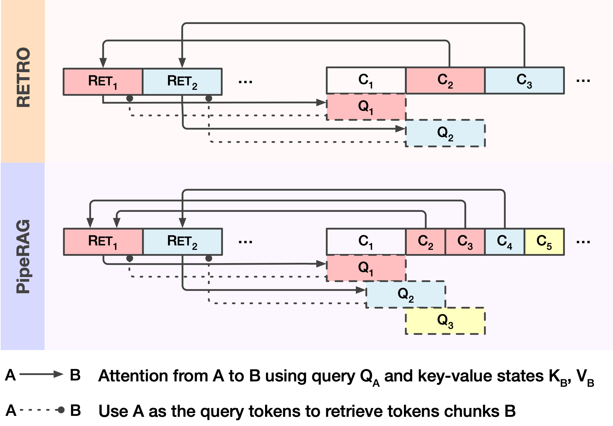

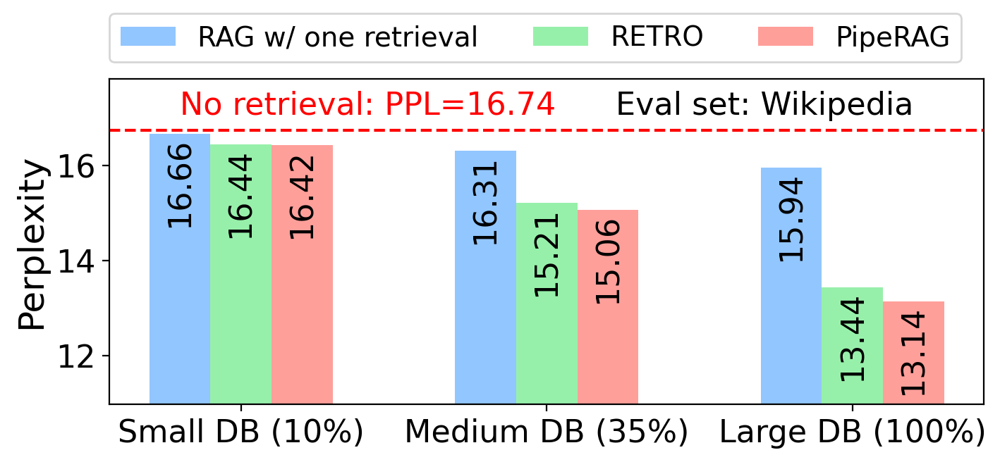

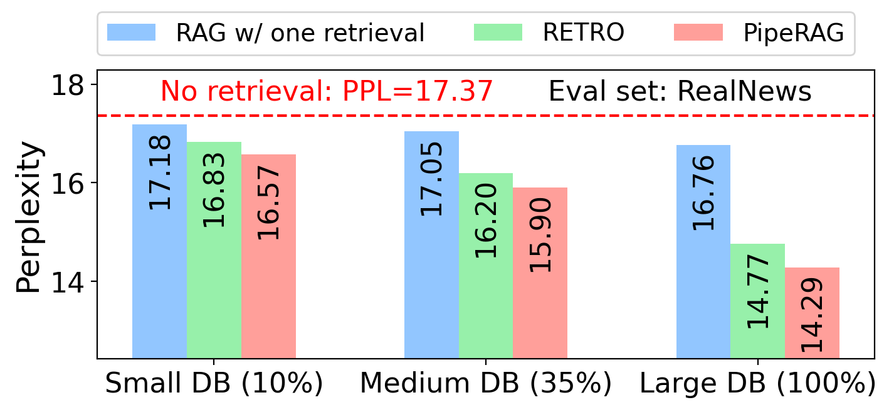

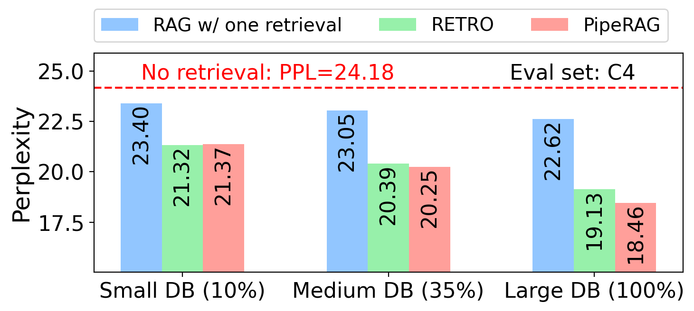

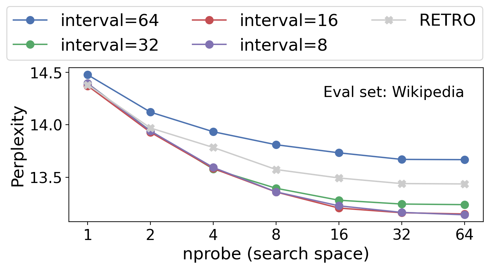

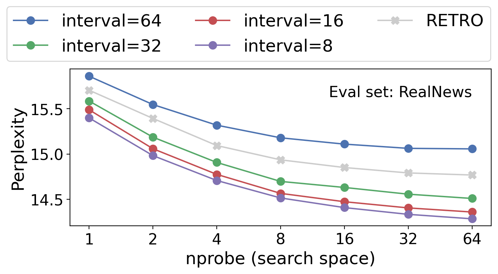

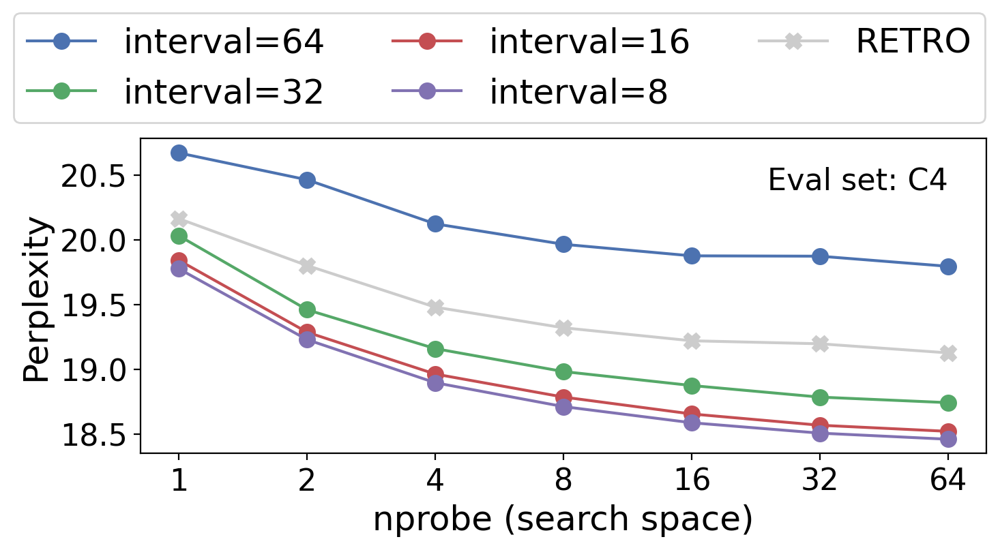

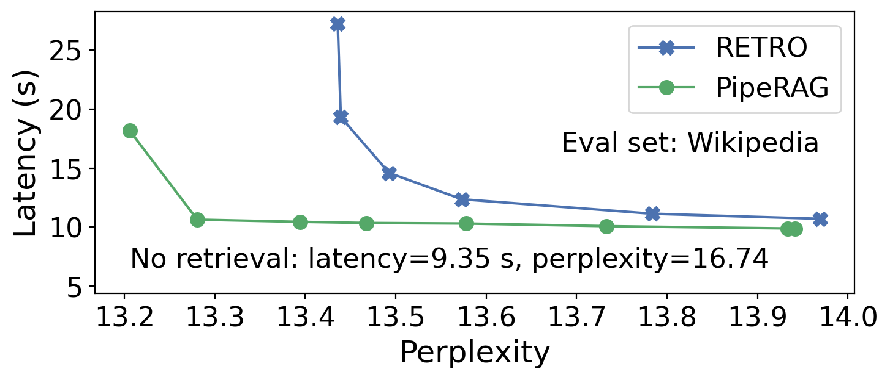

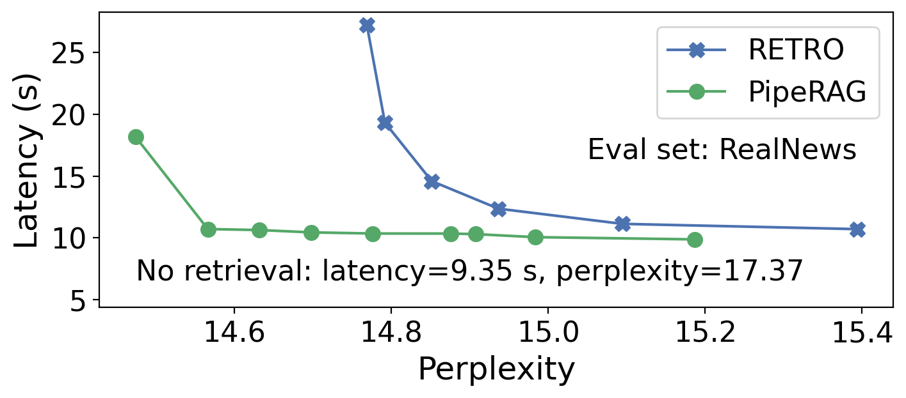

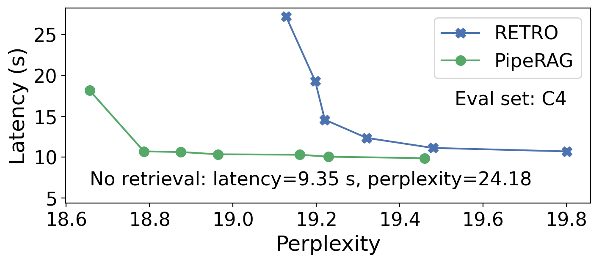

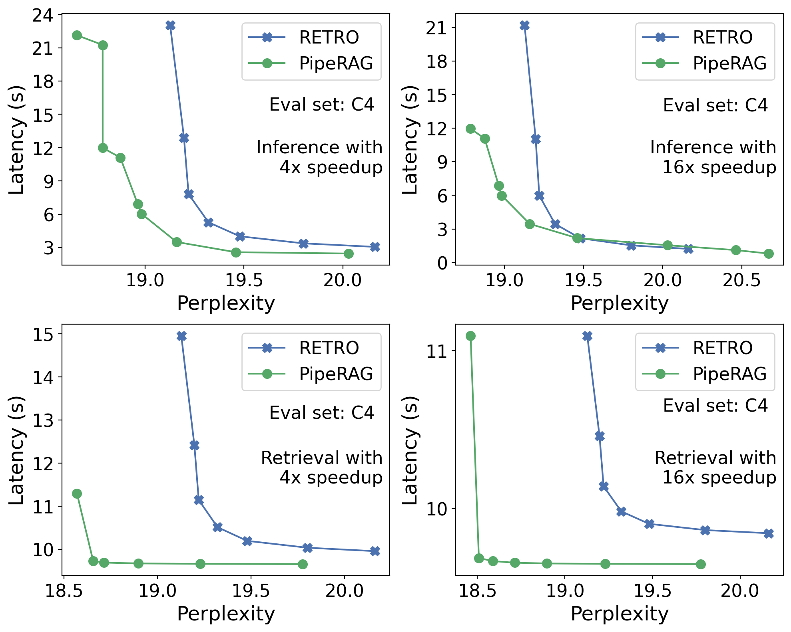

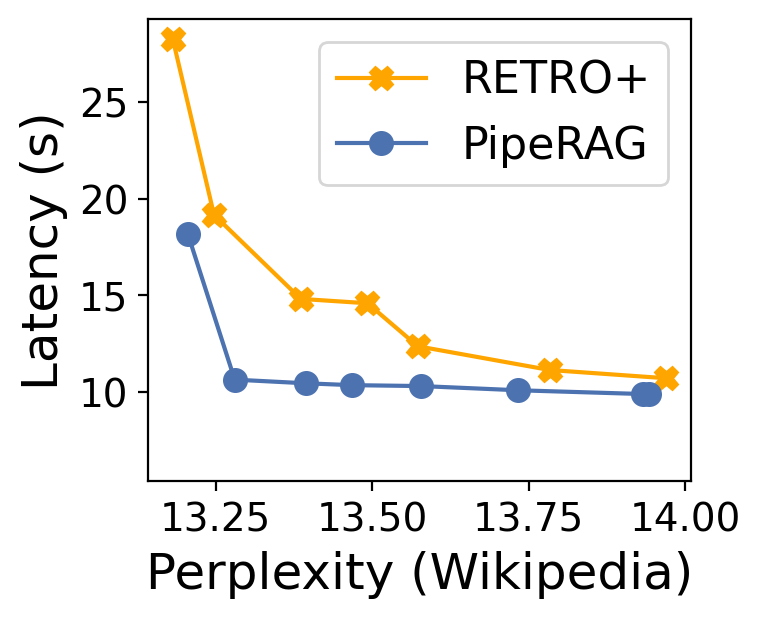

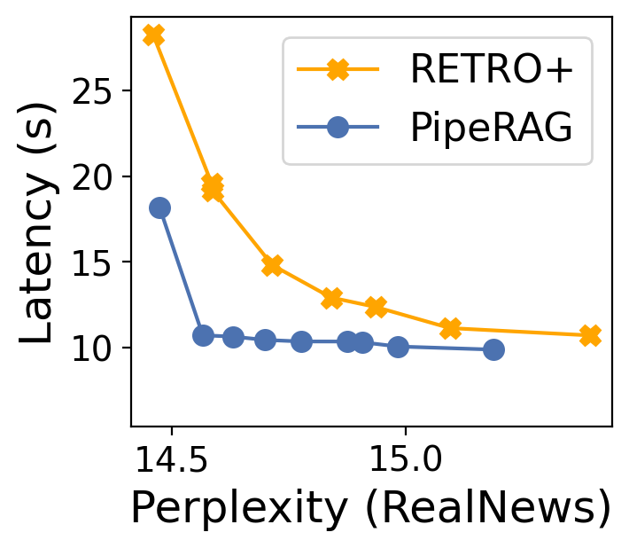

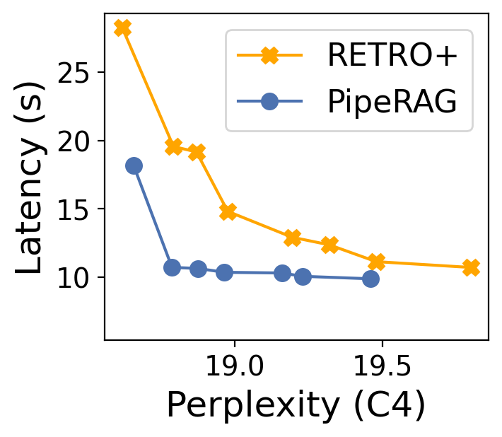

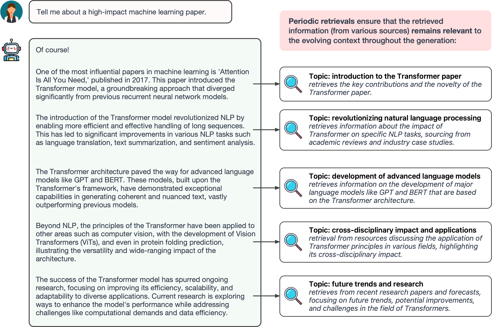

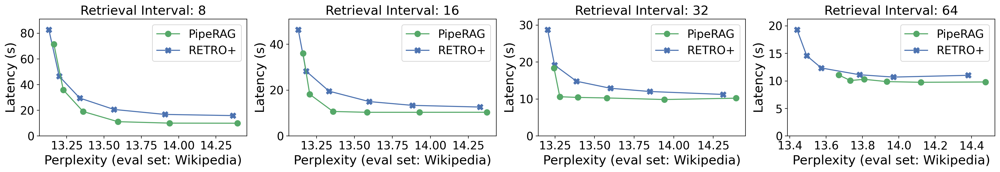

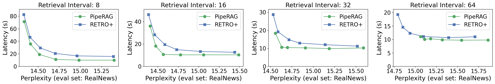

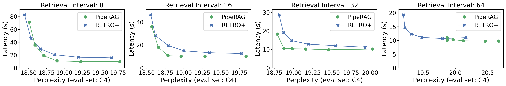

[Arxiv](https://arxiv.org/abs/2403.05676)