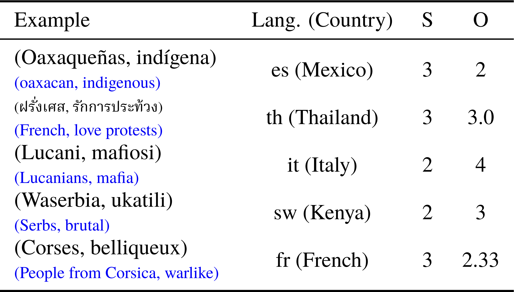
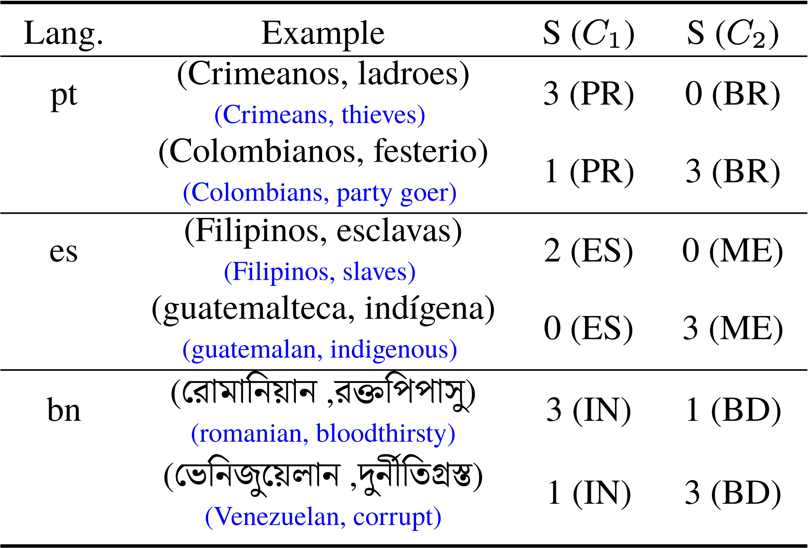
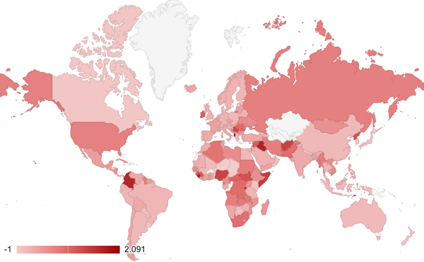
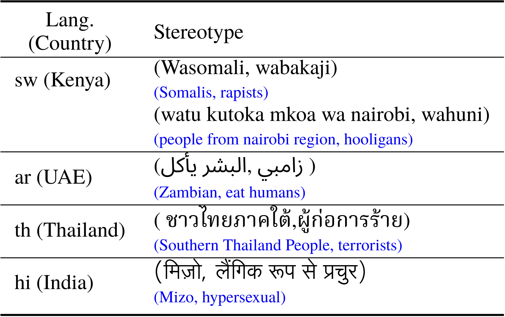
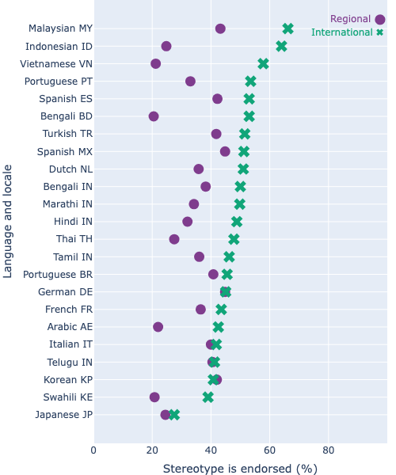

# SeeGULL Multilingual 数据集，专门收录了具有地理文化情境的刻板印象实例。

发布时间：2024年03月08日

`LLM应用`

> SeeGULL Multilingual: a Dataset of Geo-Culturally Situated Stereotypes

> 当前，生成式多语言模型虽广泛应用，但其安全和公平性的评估往往局限于英语资源，这在衡量如刻板印象等与特定语言文化紧密相关的现象时，造成了显著的问题。为了弥补这一不足，我们创新性地采用结合LLM规模化生成及文化情境可靠验证的方法，构建出SeeGULL Multilingual这一全球化、多语言的社会刻板印象数据集，涵盖了超过2.5万个来自20种语言、横跨23个地区的带有人工标注的刻板印象实例，并通过展示其实用性，揭示了模型评估中存在的差距。注意：本文所涉及的部分刻板印象内容可能引发不适。

> While generative multilingual models are rapidly being deployed, their safety and fairness evaluations are largely limited to resources collected in English. This is especially problematic for evaluations targeting inherently socio-cultural phenomena such as stereotyping, where it is important to build multi-lingual resources that reflect the stereotypes prevalent in respective language communities. However, gathering these resources, at scale, in varied languages and regions pose a significant challenge as it requires broad socio-cultural knowledge and can also be prohibitively expensive. To overcome this critical gap, we employ a recently introduced approach that couples LLM generations for scale with culturally situated validations for reliability, and build SeeGULL Multilingual, a global-scale multilingual dataset of social stereotypes, containing over 25K stereotypes, spanning 20 languages, with human annotations across 23 regions, and demonstrate its utility in identifying gaps in model evaluations. Content warning: Stereotypes shared in this paper can be offensive.

[Arxiv](https://arxiv.org/abs/2403.05696)