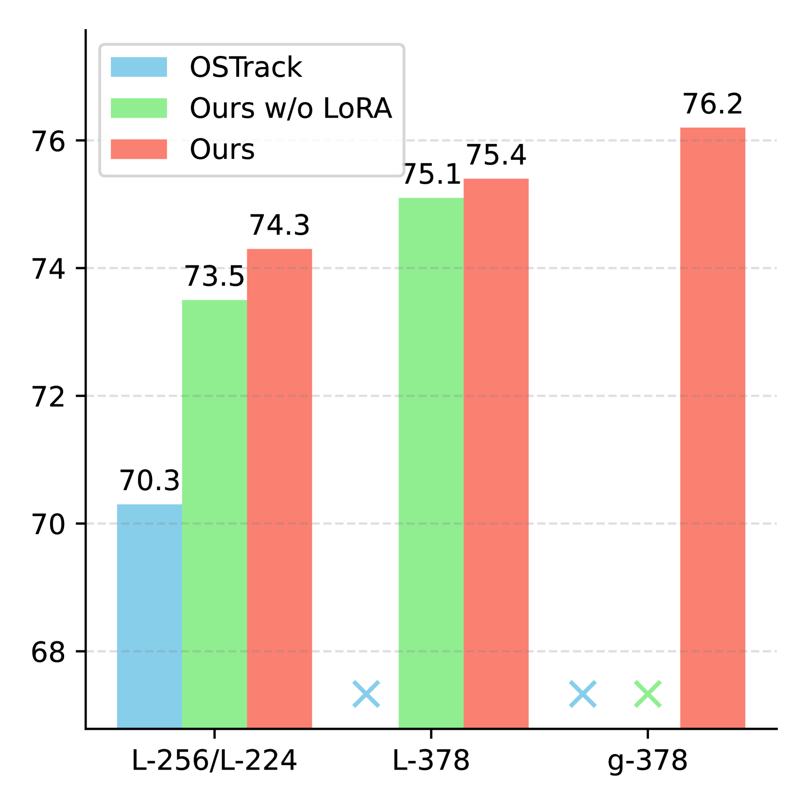
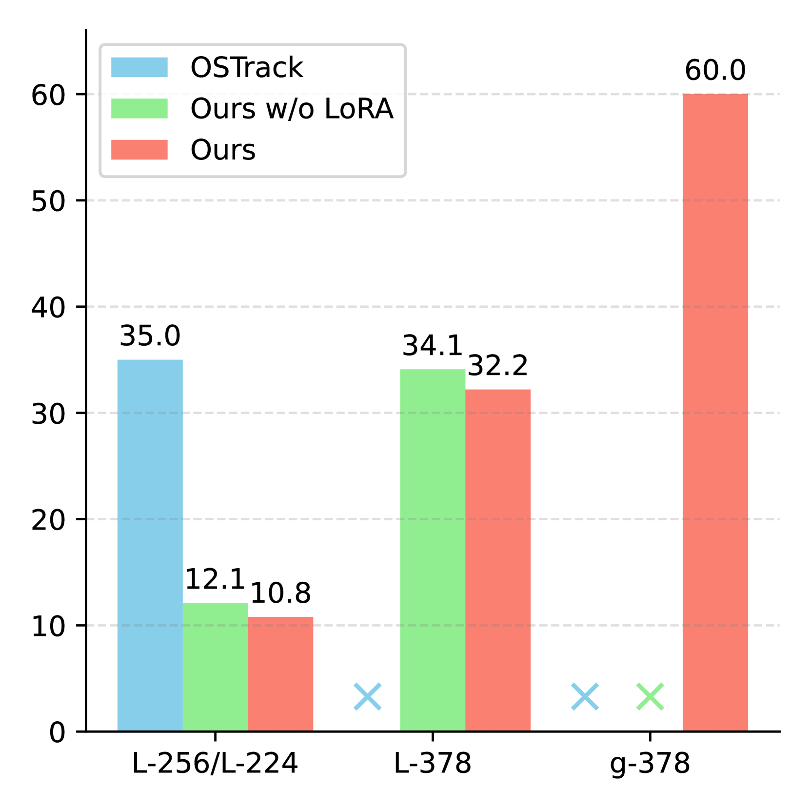
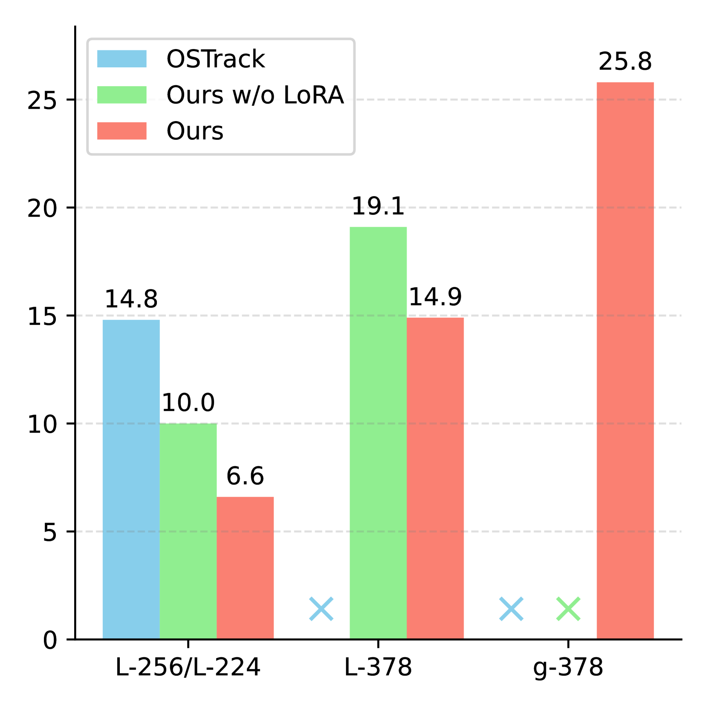
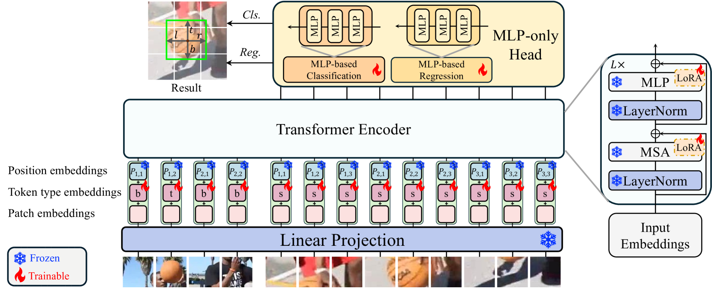

# [在本次研究中，我们将追踪技术与LoRA相结合，带来更快的训练速度、支持更大规模的模型，并实现了更出色的整体性能。](https://arxiv.org/abs/2403.05231)

发布时间：2024年03月08日

`Agent`

> Tracking Meets LoRA: Faster Training, Larger Model, Stronger Performance

> 鉴于大型语言模型中的参数经济型微调思路，我们提出了一项名为LoRAT的新方法，它能在有限实验室资源下激发出更大规模Vision Transformer（ViT）在视觉跟踪任务上的强大能力。本质上，我们尝试将LoRA技术——一种仅需微调少量模型参数且不影响推理速度的方法——巧妙地应用于视觉跟踪场景。但这一过程并非易事，面临着独特挑战与领域差距：一是Transformer架构下的跟踪器对模板和搜索图像采用非共享的位置编码，这给LoRA技术的迁移带来了难题，需要保证在迁移过程中与预训练主干网络及下游任务的一致性；二是卷积头部内在的归纳偏置削弱了参数高效微调在跟踪模型中的优势。为突破这些限制，我们创新性地将Transformer跟踪器的位置编码拆分为共享空间编码和独立类型编码，前者沿用了预训练主干对多分辨率图像（即模板和搜索图像）绝对坐标的描述，后者则从零开始学习以标识各个标记的来源。同时，我们精心设计了一种基于纯MLP的无锚头结构，以更好地适应PETR并实现性能优化与计算成本降低的双重目标。通过上述改进措施，我们不仅成功实现在仅配备25.8GB显存（批量大小16）的GPU上利用ViT-g主干训练跟踪器，还将L-224变体的训练时间从35.0小时大幅缩短至10.8 GPU小时，并使其在LaSOT数据集上的SUC得分从0.703跃升至0.743，同时将L-224变体的推理速度从52 FPS大幅提升至119 FPS。最终，我们将公布相关的代码与模型资源。

> Motivated by the Parameter-Efficient Fine-Tuning (PEFT) in large language models, we propose LoRAT, a method that unveils the power of larger Vision Transformers (ViT) for tracking within laboratory-level resources. The essence of our work lies in adapting LoRA, a technique that fine-tunes a small subset of model parameters without adding inference latency, to the domain of visual tracking. However, unique challenges and potential domain gaps make this transfer not as easy as the first intuition. Firstly, a transformer-based tracker constructs unshared position embedding for template and search image. This poses a challenge for the transfer of LoRA, usually requiring consistency in the design when applied to the pre-trained backbone, to downstream tasks. Secondly, the inductive bias inherent in convolutional heads diminishes the effectiveness of parameter-efficient fine-tuning in tracking models. To overcome these limitations, we first decouple the position embeddings in transformer-based trackers into shared spatial ones and independent type ones. The shared embeddings, which describe the absolute coordinates of multi-resolution images (namely, the template and search images), are inherited from the pre-trained backbones. In contrast, the independent embeddings indicate the sources of each token and are learned from scratch. Furthermore, we design an anchor-free head solely based on a multilayer perceptron (MLP) to adapt PETR, enabling better performance with less computational overhead. With our design, 1) it becomes practical to train trackers with the ViT-g backbone on GPUs with only memory of 25.8GB (batch size of 16); 2) we reduce the training time of the L-224 variant from 35.0 to 10.8 GPU hours; 3) we improve the LaSOT SUC score from 0.703 to 0.743 with the L-224 variant; 4) we fast the inference speed of the L-224 variant from 52 to 119 FPS. Code and models will be released.

