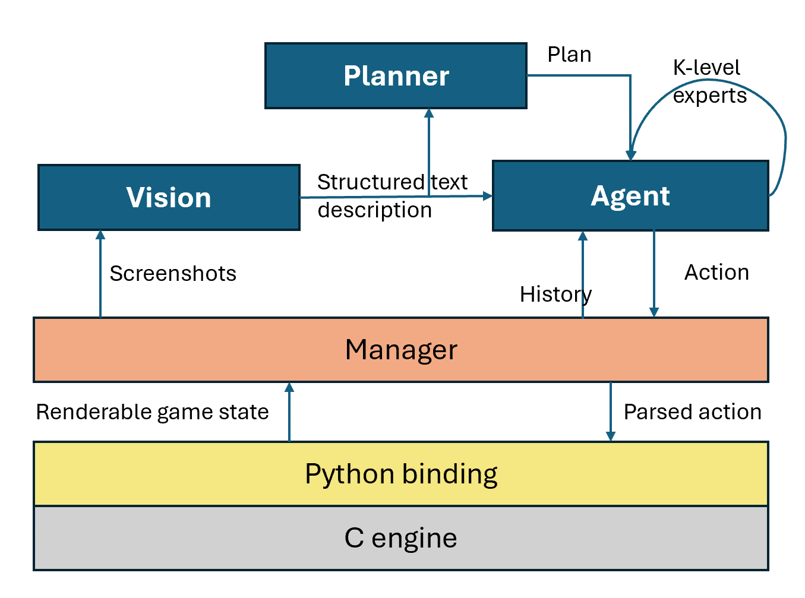
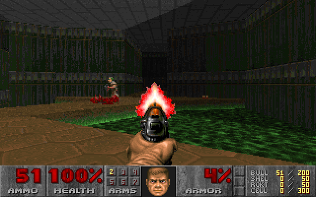
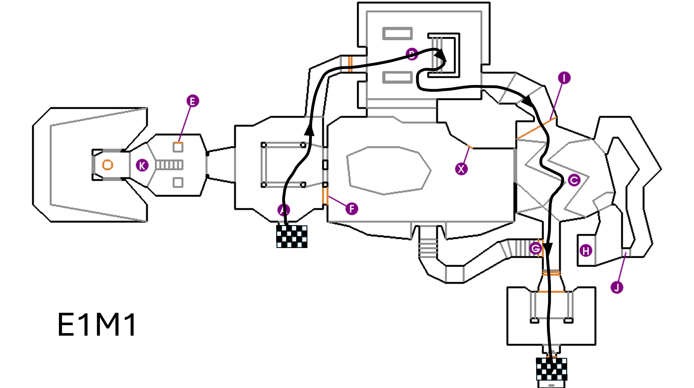
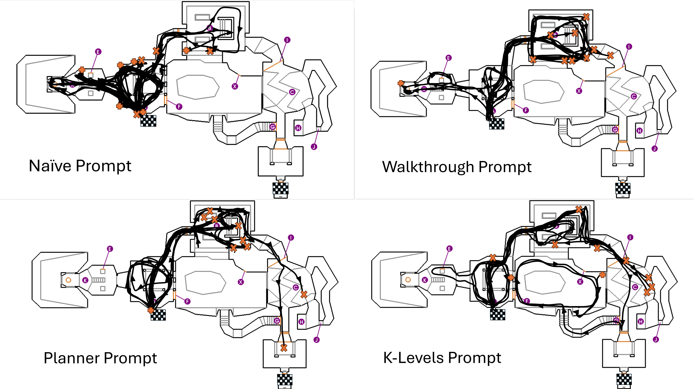

# GPT-4 是否具备运行经典游戏 DOOM 的能力？

发布时间：2024年03月08日

`Agent`

> Will GPT-4 Run DOOM?

# 摘要

> 在我们的研究中，GPT-4 所展现的卓越推理和规划能力已延伸至经典第一人称射击游戏《毁灭战士》（1993年版）。该大型语言模型仅凭少量指导和其自动生成的游戏状态文字描述（源自屏幕截图），就能参与并进行游戏。实验表明，GPT-4 在游戏中表现出了一定水平的操作技能，如开门、对抗敌人、路径规划等，并且使用多重模型调用的复杂提示策略可取得更好成果。值得注意的是，GPT-4 没有经过专门训练，完全依赖于自身强大的推理和观察力。我们希望通过这项研究拓展基于 LLM 的智能游戏代理技术边界，并在结论部分探讨了本研究的伦理意义。

> We show that GPT-4's reasoning and planning capabilities extend to the 1993 first-person shooter Doom. This large language model (LLM) is able to run and play the game with only a few instructions, plus a textual description--generated by the model itself from screenshots--about the state of the game being observed. We find that GPT-4 can play the game to a passable degree: it is able to manipulate doors, combat enemies, and perform pathing. More complex prompting strategies involving multiple model calls provide better results. While further work is required to enable the LLM to play the game as well as its classical, reinforcement learning-based counterparts, we note that GPT-4 required no training, leaning instead on its own reasoning and observational capabilities. We hope our work pushes the boundaries on intelligent, LLM-based agents in video games. We conclude by discussing the ethical implications of our work.

[Arxiv](https://arxiv.org/abs/2403.05468)