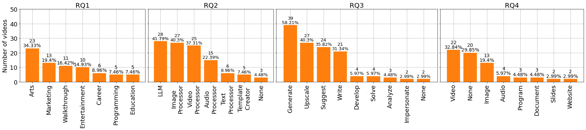
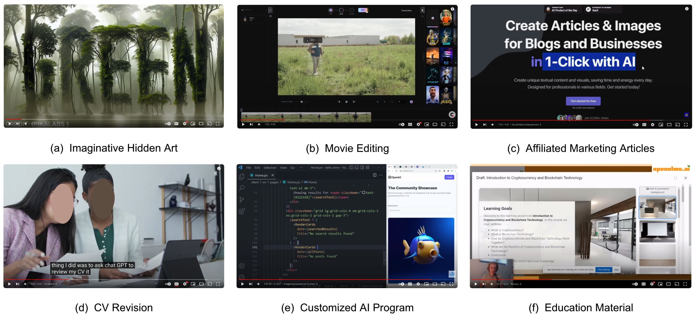

# 本研究初步探究了YouTubers在制作视频内容时运用生成式AI技术的情况

发布时间：2024年03月09日

`LLM应用`

> A Preliminary Exploration of YouTubers' Use of Generative-AI in Content Creation

# 摘要

> 随着Gen-AI的普及，内容创作者在各大社交平台如YouTube、TikTok、Instagram等纷纷采用大型语言模型(LLMs)创造新颖图片、AI生成视频及文章。然而，关于AI生成内容的具体应用场景及其创作过程中所采用的各种Gen-AI工具的方法策略仍有待深入探究。本研究以68个演示Gen-AI运用方式的YouTube视频为样本，通过定性分析对此新兴趋势进行了初步调研，重点关注了Gen-AI在用户原创内容中涉及的各领域、所用工具的丰富性、执行的任务类型以及由此生成的最终产品的本质特征。

> Content creators increasingly utilize generative artificial intelligence (Gen-AI) on platforms such as YouTube, TikTok, Instagram, and various blogging sites to produce imaginative images, AI-generated videos, and articles using Large Language Models (LLMs). Despite its growing popularity, there remains an underexplored area concerning the specific domains where AI-generated content is being applied, and the methodologies content creators employ with Gen-AI tools during the creation process. This study initially explores this emerging area through a qualitative analysis of 68 YouTube videos demonstrating Gen-AI usage. Our research focuses on identifying the content domains, the variety of tools used, the activities performed, and the nature of the final products generated by Gen-AI in the context of user-generated content.

[Arxiv](https://arxiv.org/abs/2403.06039)