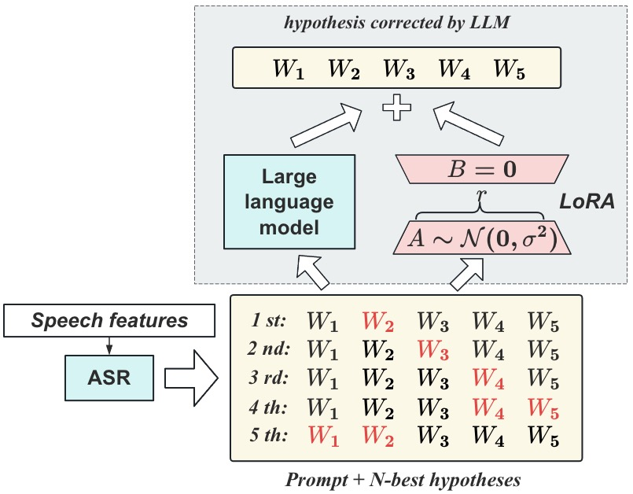
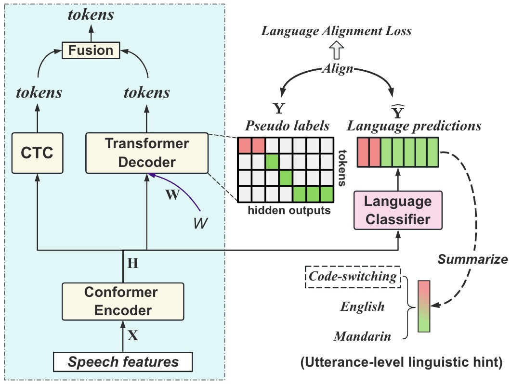
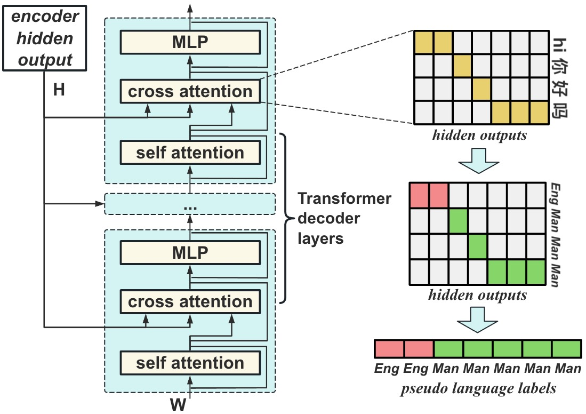
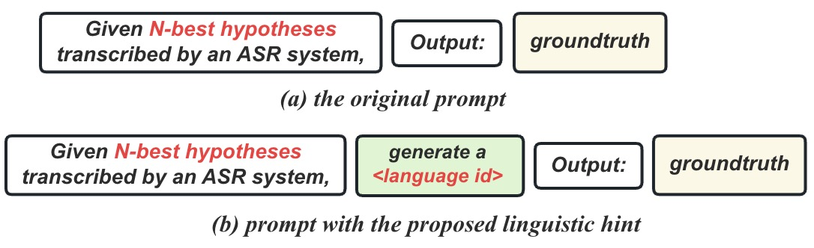
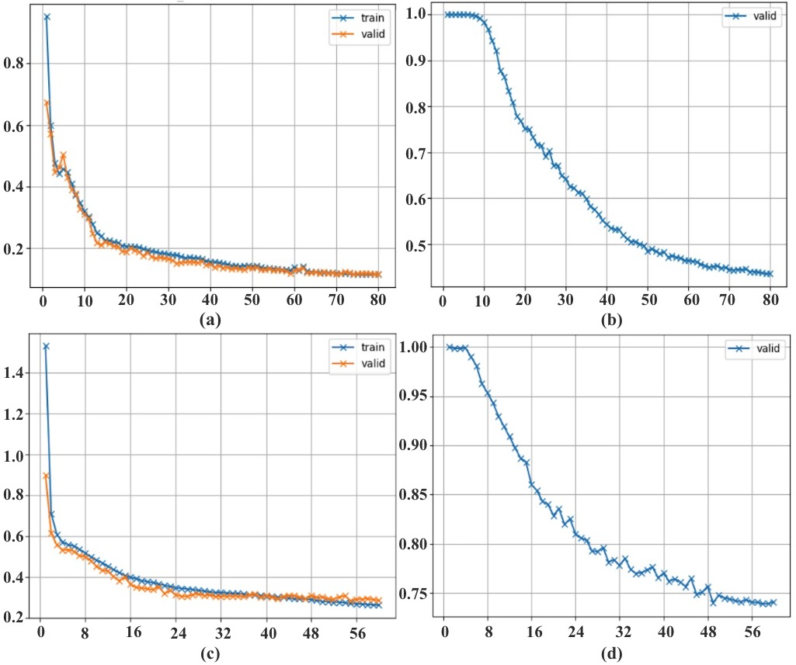

# [为优化代码切换语音识别，本研究致力于通过将语音与多种语言进行精准对齐，从而增强此类混合语种识别效果。](https://arxiv.org/abs/2403.05887)

发布时间：2024年03月09日

`Agent`

> Aligning Speech to Languages to Enhance Code-switching Speech Recognition

> 为了消除因语音信号中语言切换（即代码切换，CS）导致的自动语音识别系统困扰，我们创新性地提出了语言对齐损失机制，借助ASR解码器学习出的伪语言标签实现帧级的语言识别，无需人工逐帧标注语言类型。面对双语环境下语言模型面临的复杂词汇选择难题，我们巧妙地运用大型语言模型与生成式错误修正方法相结合的策略。并且，我们引入了蕴含语言信息（来自上述语言对齐损失及解码假设）的语言学线索，以此指导大型语言模型的智能提示输入。我们的方法在SEAME数据集及2019年ASRU普通话-英语混合语音识别挑战赛数据上得到了验证。实验结果显示，相比基线模型，融入语言对齐损失后，不仅在两个数据集上CS-ASR性能显著提升，而且参数量只增加了微乎其微的部分。特别是在训练阶段，语言对齐损失对于均衡以主语言为主的双语数据发挥了重要作用，在ASRU数据集上比基准模型取得了8.6%的相对性能提升。进一步使用大型语言模型进行性能评测时，我们发现语言学线索能够带来显著优势，分别在ASRU和SEAME数据集的测试集中提高了14.1%和5.5%的相对性能表现。

> Code-switching (CS) refers to the switching of languages within a speech signal and results in language confusion for automatic speech recognition (ASR). To address language confusion, we propose the language alignment loss that performs frame-level language identification using pseudo language labels learned from the ASR decoder. This eliminates the need for frame-level language annotations. To further tackle the complex token alternatives for language modeling in bilingual scenarios, we propose to employ large language models via a generative error correction method. A linguistic hint that incorporates language information (derived from the proposed language alignment loss and decoded hypotheses) is introduced to guide the prompting of large language models. The proposed methods are evaluated on the SEAME dataset and data from the ASRU 2019 Mandarin-English code-switching speech recognition challenge. The incorporation of the proposed language alignment loss demonstrates a higher CS-ASR performance with only a negligible increase in the number of parameters on both datasets compared to the baseline model. This work also highlights the efficacy of language alignment loss in balancing primary-language-dominant bilingual data during training, with an 8.6% relative improvement on the ASRU dataset compared to the baseline model. Performance evaluation using large language models reveals the advantage of the linguistic hint by achieving 14.1% and 5.5% relative improvement on test sets of the ASRU and SEAME datasets, respectively.

[Arxiv](https://arxiv.org/abs/2403.05887)