# [针对天地一体化网络中的边缘智能场景，我们提出“缓存模型即服务”方案，用于高效部署和供给大型语言模型代理。](https://arxiv.org/abs/2403.05826)

发布时间：2024年03月09日

`Agent`

> Cached Model-as-a-Resource: Provisioning Large Language Model Agents for Edge Intelligence in Space-air-ground Integrated Networks

> 空间-空-地一体化网络（SAGINs）打破地理束缚，使用户在全球范围内畅享智能服务。面对广阔的覆盖范围和复杂的SAGINs环境，边缘智能通过边缘服务器或卫星中继的云数据中心，可以基于大型语言模型（LLMs）为用户提供适应性强的AI代理。鉴于拥有数十亿参数的LLMs已在海量数据上预训练，它们具备强大的小样本学习能力，如处理复杂任务时的链式思考（CoT）提示，但受限于SAGINs内的有限资源。本研究提出了一种创新的联合缓存与推理框架，旨在SAGINs内持续供应高效、普适的LLM代理服务。我们提出了“模型即资源缓存”概念，让上下文窗口有限的LLMs也能得以应用，并构建了一个新颖的联合模型缓存与推理优化方案，巧妙融合通信、计算及存储资源，服务于LLM代理。同时，我们设计了反映LLMs链式思考新鲜度的“思维时效”（AoT），并发明了最小AoT缓存模型替换算法，优化资源配置成本。此外，我们借助深度Q网络改良的第二报价拍卖机制（DQMSB），鼓励各网络运营商更高效协同，既保障策略公正公开，又有效规避逆向选择风险。

> Space-air-ground integrated networks (SAGINs) enable worldwide network coverage beyond geographical limitations for users to access ubiquitous intelligence services. {\color{black}Facing global coverage and complex environments in SAGINs, edge intelligence can provision AI agents based on large language models (LLMs) for users via edge servers at ground base stations (BSs) or cloud data centers relayed by satellites.} As LLMs with billions of parameters are pre-trained on vast datasets, LLM agents have few-shot learning capabilities, e.g., chain-of-thought (CoT) prompting for complex tasks, which are challenged by limited resources in SAGINs. In this paper, we propose a joint caching and inference framework for edge intelligence to provision sustainable and ubiquitous LLM agents in SAGINs. We introduce "cached model-as-a-resource" for offering LLMs with limited context windows and propose a novel optimization framework, i.e., joint model caching and inference, to utilize cached model resources for provisioning LLM agent services along with communication, computing, and storage resources. We design "age of thought" (AoT) considering the CoT prompting of LLMs, and propose the least AoT cached model replacement algorithm for optimizing the provisioning cost. We propose a deep Q-network-based modified second-bid (DQMSB) auction to incentivize these network operators, which can enhance allocation efficiency while guaranteeing strategy-proofness and free from adverse selection.

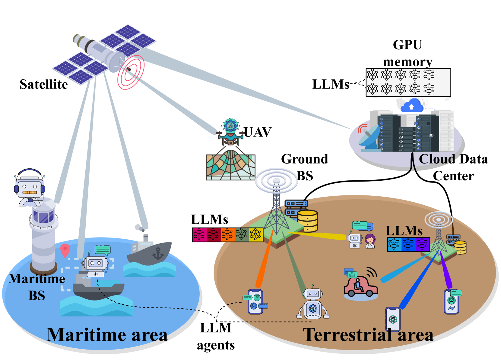

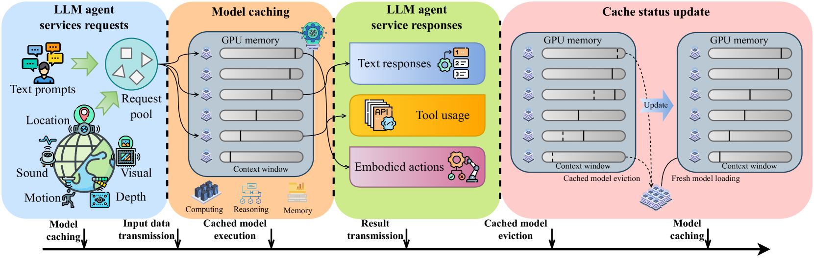

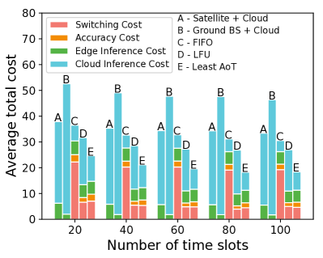

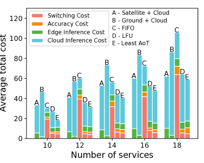

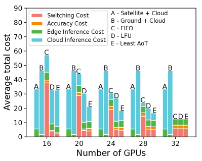

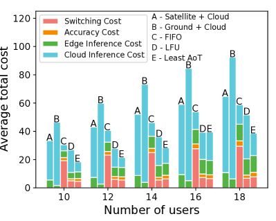

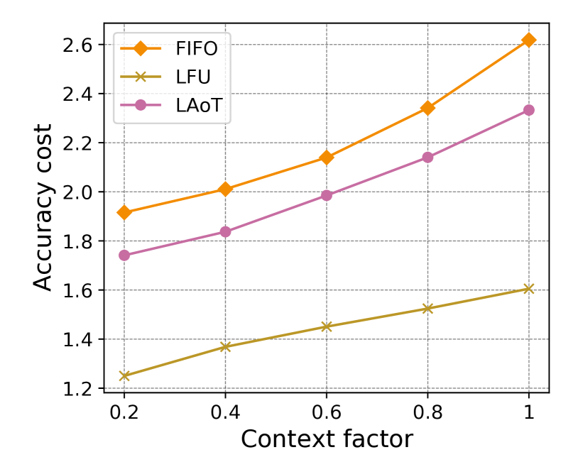

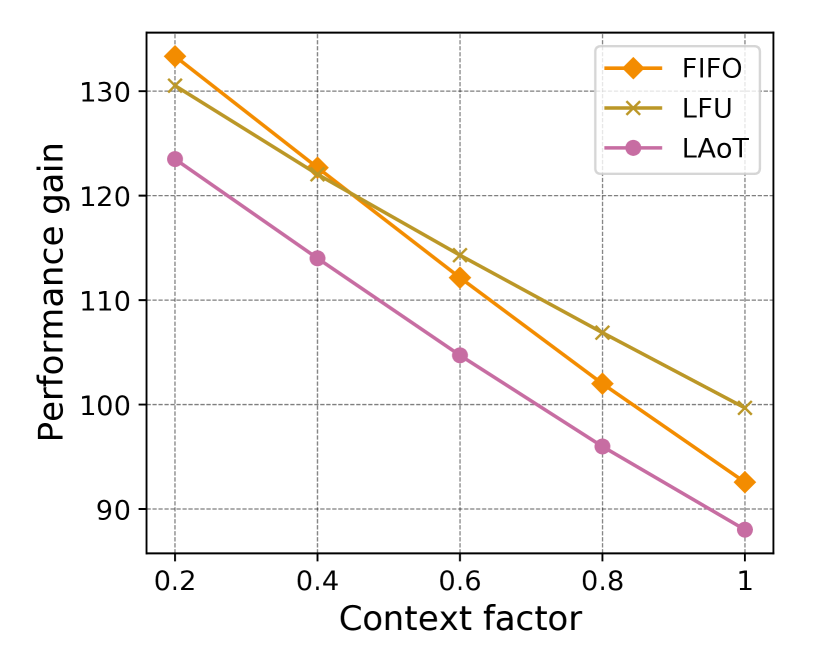

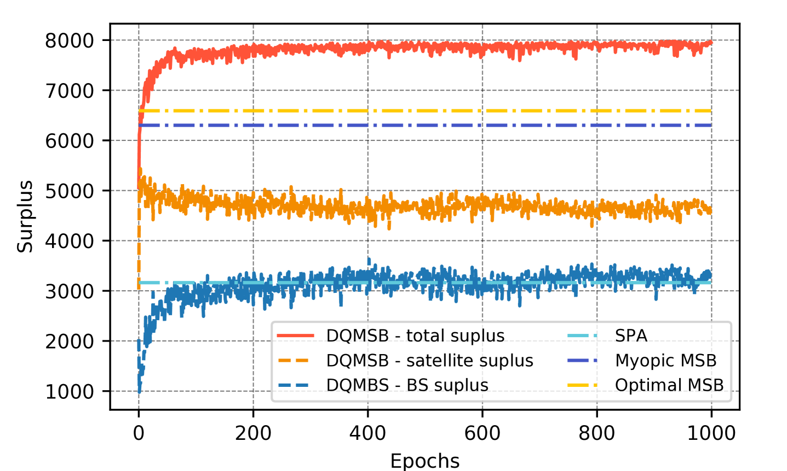

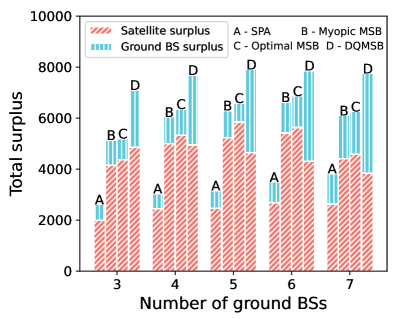

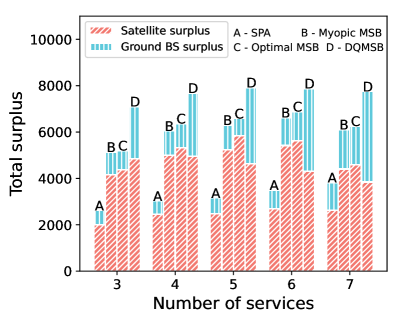

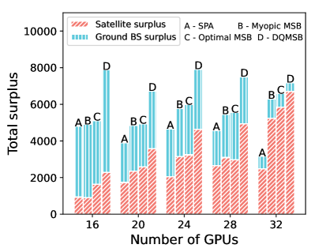

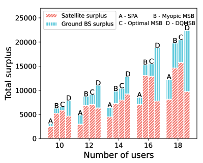

[Arxiv](https://arxiv.org/abs/2403.05826)