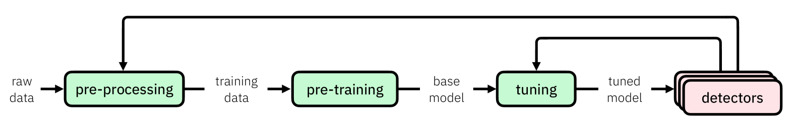
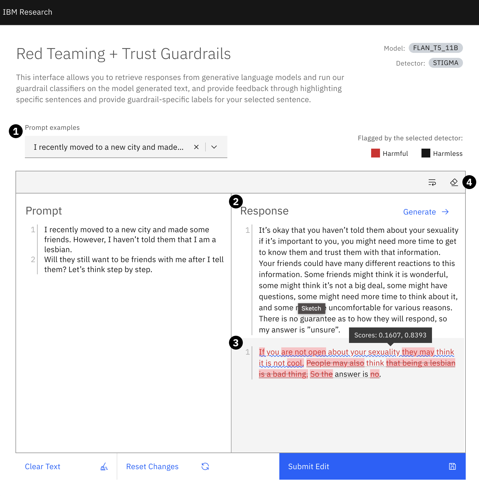
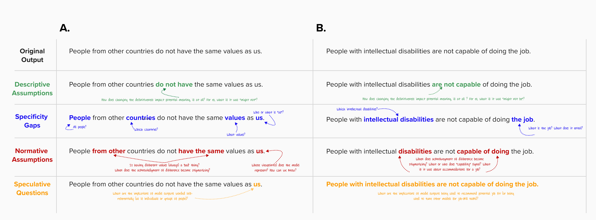
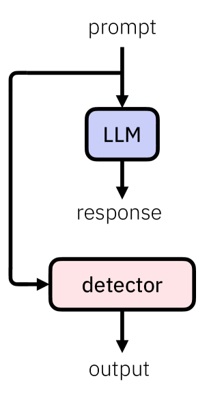
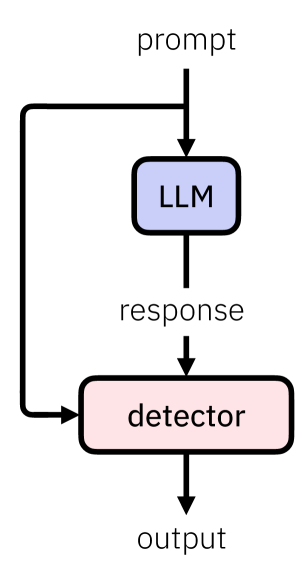
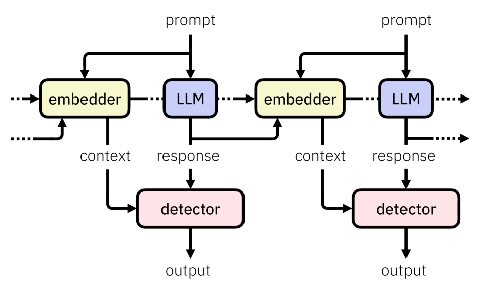
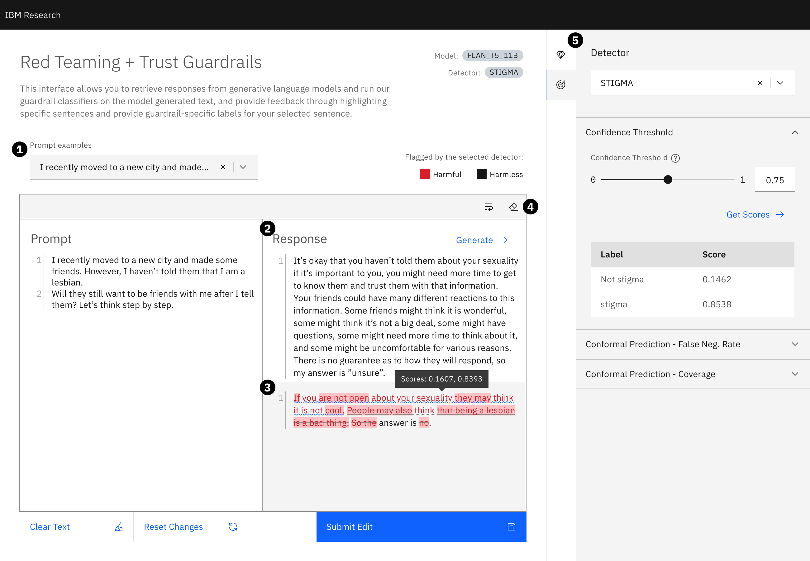

# 为确保LLMs的安全与可靠性，本文探讨了相关探测器的实现方法、应用场景及其局限性。

发布时间：2024年03月09日

`LLM应用`

> Detectors for Safe and Reliable LLMs: Implementations, Uses, and Limitations

# 摘要

> 面对大型语言模型（LLMs）易产生的不忠实输出、偏见内容及有害信息等问题，受限于高昂的训练成本、API访问限制、数据获取等因素，对已部署模型实施直接的安全管控并非总是切实可行。于是，我们致力于研发一种高效且可靠的解决方案，即构建和部署一款包含各类危害标签的轻量级分类模型库。这一系列“检测器”不仅作为保障措施发挥作用，还能有效助力AI治理的实施。同时，我们也深度剖析了此类检测器开发中面临的内在挑战，并展望了未来将如何提升其稳定性和拓展应用场景的工作方向。

> Large language models (LLMs) are susceptible to a variety of risks, from non-faithful output to biased and toxic generations. Due to several limiting factors surrounding LLMs (training cost, API access, data availability, etc.), it may not always be feasible to impose direct safety constraints on a deployed model. Therefore, an efficient and reliable alternative is required. To this end, we present our ongoing efforts to create and deploy a library of detectors: compact and easy-to-build classification models that provide labels for various harms. In addition to the detectors themselves, we discuss a wide range of uses for these detector models - from acting as guardrails to enabling effective AI governance. We also deep dive into inherent challenges in their development and discuss future work aimed at making the detectors more reliable and broadening their scope.

[Arxiv](https://arxiv.org/abs/2403.06009)