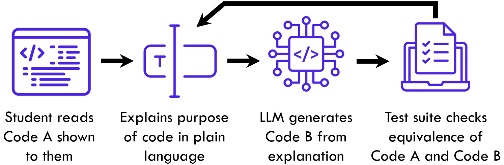
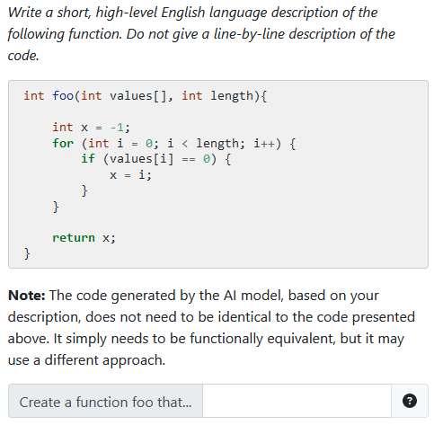
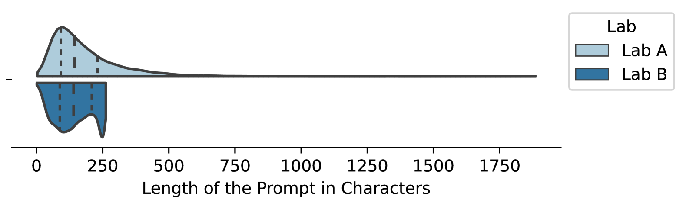
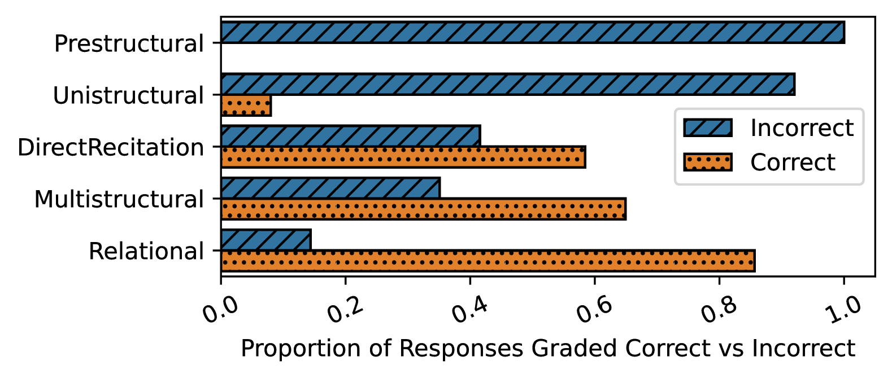
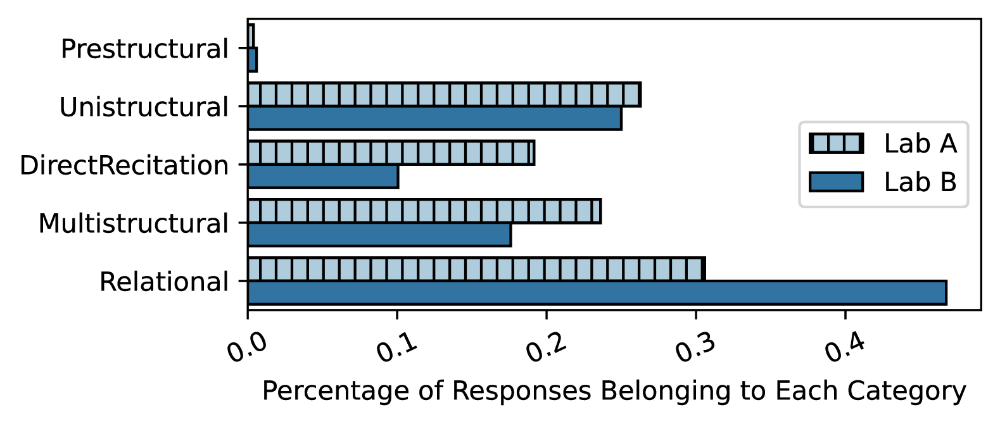

# [面向目标的代码解析：一体化方案助力提升代码理解和指令引导能力]

发布时间：2024年03月09日

`LLM应用`

> Explaining Code with a Purpose: An Integrated Approach for Developing Code Comprehension and Prompting Skills

> 历来认为阅读、理解代码和编写解释是初学者编程的关键技能，而今，随着LLMs的广泛应用，理解和评价模型生成代码的需求愈发迫切，这些基础技能的重要性不言而喻，且新技能如精准拟定能引导LLM产出目标代码的提示同样重要。为培养传统编程技能及与LLMs互动的新技能，将教育方法相结合的研究颇具吸引力。其中，“用简洁英文解释”(EiPE)问题是一种有效的培养学生代码理解力的方式，即让学生简洁阐明一小段代码的功能。但由于书面解释评判具有主观性，EiPE问题的评分向来充满挑战，这也限制了它的广泛应用。本篇论文提出了一种利用LLM解决此问题的创新思路：借助LLM基于学生对EiPE问题的回答生成代码，不仅能够自动化评估学生解答，还同步锻炼了他们的核心代码理解和提问设计技巧。我们在初级编程课程中验证了这个设想，并展示了学生如何成功制定有效提示解答EiPE问题。同时，我们深入分析了学生对此项活动的认知及其对利用LLMs辅助和评估学习方式的影响。

> Reading, understanding and explaining code have traditionally been important skills for novices learning programming. As large language models (LLMs) become prevalent, these foundational skills are more important than ever given the increasing need to understand and evaluate model-generated code. Brand new skills are also needed, such as the ability to formulate clear prompts that can elicit intended code from an LLM. Thus, there is great interest in integrating pedagogical approaches for the development of both traditional coding competencies and the novel skills required to interact with LLMs. One effective way to develop and assess code comprehension ability is with ``Explain in plain English'' (EiPE) questions, where students succinctly explain the purpose of a fragment of code. However, grading EiPE questions has always been difficult given the subjective nature of evaluating written explanations and this has stifled their uptake. In this paper, we explore a natural synergy between EiPE questions and code-generating LLMs to overcome this limitation. We propose using an LLM to generate code based on students' responses to EiPE questions -- not only enabling EiPE responses to be assessed automatically, but helping students develop essential code comprehension and prompt crafting skills in parallel. We investigate this idea in an introductory programming course and report student success in creating effective prompts for solving EiPE questions. We also examine student perceptions of this activity and how it influences their views on the use of LLMs for aiding and assessing learning.

[Arxiv](https://arxiv.org/abs/2403.06050)